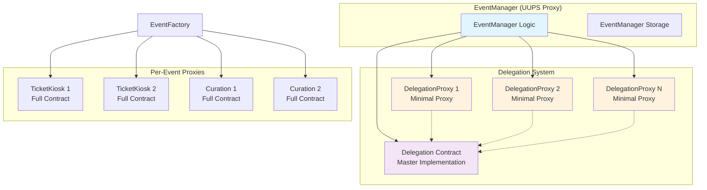
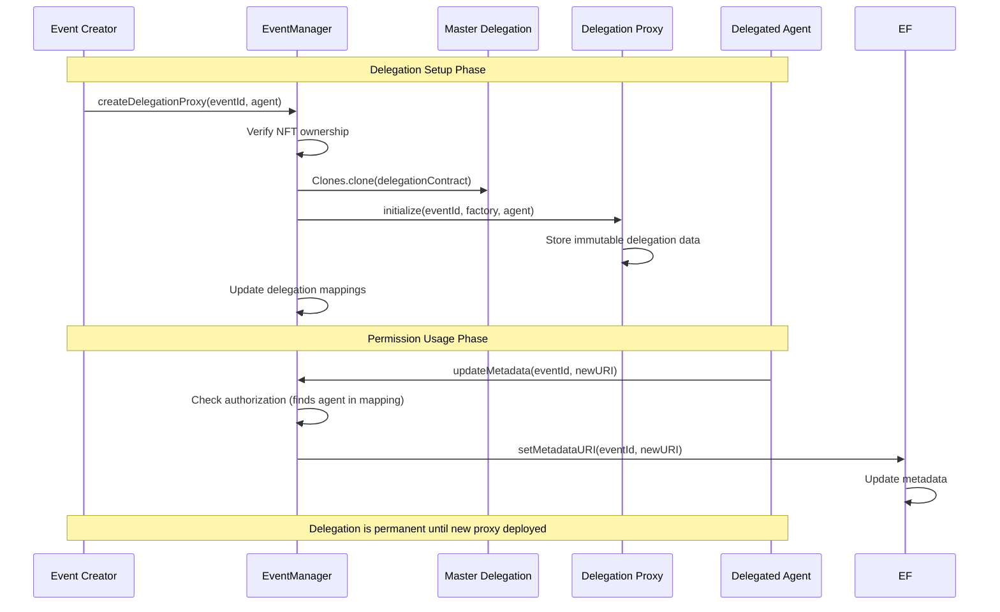

# Delegation and Proxy Patterns

The RTA protocol implements sophisticated delegation and proxy patterns to achieve gas efficiency, flexible permissions, and modular architecture. This system combines minimal proxies, master implementations, and delegation registries to provide cost-effective permission management.

## Architectural Overview



## Proxy Pattern Implementations

### 1. UUPS Upgradeable Proxies

Core protocol contracts use OpenZeppelin's UUPS (Universal Upgradeable Proxy Standard) pattern:

```solidity
contract EventManager is Initializable, OwnableUpgradeable, UUPSUpgradeable {
    function initialize(address _owner, address _eventFactoryAddress) public initializer {
        __Ownable_init(_owner);
        __UUPSUpgradeable_init();
        eventFactory = IEventFactory(_eventFactoryAddress);
        
        // Deploy master delegation implementation
        delegationContract = address(new Delegation());
    }
    
    function _authorizeUpgrade(address newImplementation) internal override onlyOwner {}
}
```

**UUPS Contracts:**
- EventManager: `0x29A34231B3c156b3556Be018e0323885b16E8962`
- LiveTipping: `0xd431284b6c5a4FFF616437f0178051af406e63E6`
- Distributor: `0xb7F59ce88DaD15b27F04F96a8508D4dFa4eC6598`
- EventStation: `0x123%` (truncated in .env)

### 2. Minimal Proxies (EIP-1167)

Delegation contracts use minimal proxies for maximum gas efficiency:

```solidity
// EventManager deployment of delegation proxy
function createDelegationProxy(uint256 eventId, address delegatee) external {
    if (eventFactory.ownerOf(eventId) != msg.sender) revert OnlyEventCreator();
    
    // Deploy 55-byte minimal proxy
    address proxy = Clones.clone(delegationContract);
    
    // Initialize with event-specific data
    Delegation(proxy).initialize(eventId, address(eventFactory), delegatee);
    
    eventDelegationProxy[eventId] = proxy;
    eventDelegates[eventId] = delegatee;
}
```

**Gas Comparison:**
| Deployment Type | Gas Cost | Bytecode Size |
|----------------|----------|---------------|
| Full Delegation Contract | ~200,000 gas | ~2,000 bytes |
| Minimal Proxy | ~40,000 gas | 55 bytes |
| **Savings** | **80% reduction** | **97% reduction** |

### 3. CREATE2 Deterministic Deployment

Per-event contracts use CREATE2 for predictable addresses:

```solidity
// EventFactoryLib.sol
function deployTicketKiosk(
    uint256 eventId,
    address factoryAddress,
    address creator,
    uint256 ticketsAmount,
    uint256 ticketPrice,
    string memory artCategory,
    address treasuryReceiver
) external returns (address) {
    bytes memory bytecode = abi.encodePacked(
        type(TicketKiosk).creationCode,
        abi.encode(eventId, factoryAddress, creator, ticketsAmount, ticketPrice, artCategory, treasuryReceiver)
    );
    
    bytes32 salt = keccak256(abi.encodePacked(eventId, "ticketkiosk"));
    return Create2.deploy(0, salt, bytecode);
}
```

## Delegation Permission Model

### Three-Tier Authorization System

The EventManager implements a comprehensive permission model:

```solidity
function _authorize(uint256 eventId) internal view {
    if (eventFactory.ownerOf(eventId) != msg.sender &&      // Tier 1: NFT Owner
        eventDelegates[eventId] != msg.sender &&           // Tier 2: Event Delegate  
        !globalWhitelist[msg.sender]) {                     // Tier 3: Global Whitelist
        revert NotAuthorized();
    }
}
```

#### Tier 1: NFT Ownership
- **Authority**: Current holder of the event NFT
- **Scope**: Full control over the specific event
- **Transferable**: Yes, through NFT transfer or tipping competition
- **Implementation**: Direct check via `eventFactory.ownerOf(eventId)`

#### Tier 2: Event-Specific Delegation
- **Authority**: Address specifically delegated for an event
- **Scope**: Same permissions as NFT owner for that event only
- **Transferable**: No, immutable once set
- **Implementation**: Minimal proxy deployment with delegation record

#### Tier 3: Global Whitelist
- **Authority**: Platform-wide authorized agents
- **Scope**: Can modify ANY event without specific delegation
- **Transferable**: No, controlled by protocol owner
- **Implementation**: Simple mapping with owner-only updates

### Delegation Proxy Lifecycle



## Proxy Implementation Details

### Minimal Proxy Bytecode Analysis

EIP-1167 minimal proxies use a 55-byte bytecode template:

```
363d3d373d3d3d363d73bebebebebebebebebebebebebebebebebebebebe5af43d82803e903d91602b57fd5bf3
```

Breaking down the proxy logic:
1. **Setup**: Copy calldata and prepare for delegatecall
2. **Delegatecall**: Forward all calls to master implementation
3. **Return**: Pass return data back to caller
4. **Fallback**: Handle failed calls appropriately

### Storage Layout Considerations

Each minimal proxy maintains its own storage context:

```solidity
contract Delegation {
    uint256 public eventId;        // Slot 0
    address public eventFactory;   // Slot 1  
    address public delegatee;      // Slot 2
    address public initializer;    // Slot 3
}
```

**Storage Properties:**
- Each proxy has independent storage
- Master implementation provides logic only
- No storage conflicts between proxies
- Gas cost: 4 SSTORE operations (~80,000 gas) during initialization

## Advanced Proxy Patterns

### Batched Proxy Deployment

CreationWrapper enables atomic event creation with delegation:

```solidity
contract CreationWrapper {
    function createEventAndDelegate(
        // Event creation parameters
        uint256 startDate, uint256 eventDuration, uint256 reservePrice,
        string calldata metadataURI, string calldata artCategory,
        uint256 ticketsAmount, uint256 ticketPrice,
        // Delegation parameter
        address delegatee
    ) external {
        // 1. Create event
        uint256 newEventId = eventFactory.createEventForCreator(
            msg.sender, startDate, eventDuration, reservePrice,
            metadataURI, artCategory, ticketsAmount, ticketPrice
        );
        
        // 2. Create delegation proxy if delegatee specified
        if (delegatee != address(0)) {
            eventManager.createDelegationProxyForUser(newEventId, msg.sender, delegatee);
        }
    }
}
```

### Global Whitelist Management

Efficient batch operations for platform-wide permissions:

```solidity
function batchSetGlobalWhitelist(address[] calldata agents, bool whitelisted) external onlyOwner {
    for (uint256 i = 0; i < agents.length; i++) {
        if (agents[i] != address(0)) {
            globalWhitelist[agents[i]] = whitelisted;
            emit GlobalWhitelistUpdated(agents[i], whitelisted);
        }
    }
}
```

## Scope-Based Agent System

The protocol includes predefined scope agents with specific permission levels:

### Deployed Scope Agents

```solidity
// From .env file - Scope agents with predefined roles
PLANNER_PROXY_ADDRESS=0xF2aC15F3db8Fd24c83494fc7B2131A74DFCAA07b    // Scope 1: 3% fee
PROMOTER_PROXY_ADDRESS=0x27B8c4E2E6AaF49527b62278D834497BA344b90D   // Scope 2: 7% fee  
PRODUCER_PROXY_ADDRESS=0xEb215ba313c12D58417674c810bAcd6C6badAD61   // Scope 3: 10% fee
```

These addresses likely have corresponding entries in the global whitelist with scope-specific permissions.

## Gas Optimization Strategies

### 1. Proxy Pattern Selection

**Minimal Proxies for Simple State:**
- Use for delegation records (immutable after creation)
- 55-byte bytecode vs full contract deployment
- Best for high-volume, lightweight contracts

**UUPS for Complex Logic:**
- Use for core protocol contracts requiring upgrades
- Slightly higher deployment cost but upgrade capability
- Best for contracts with evolving requirements

### 2. Storage Access Patterns

**Favor Direct Mappings:**
```solidity
// Efficient: Direct mapping access in EventManager
address delegatee = eventDelegates[eventId];

// Less efficient: External call to proxy
address delegatee = Delegation(proxy).delegatee();
```

**Batch Operations:**
```solidity
// Deploy multiple proxies in single transaction
function batchCreateDelegationProxies(
    uint256[] calldata eventIds,
    address[] calldata delegatees
) external {
    for (uint256 i = 0; i < eventIds.length; i++) {
        createDelegationProxy(eventIds[i], delegatees[i]);
    }
}
```

### 3. Event Filtering Optimization

Use indexed parameters for efficient event filtering:

```solidity
event DelegationProxyCreated(
    uint256 indexed eventId,        // Can filter by event
    address indexed delegatee,      // Can filter by delegatee
    address proxyAddress           // Non-indexed for gas savings
);
```

## Security Considerations

### Proxy Security Patterns

**Initialization Protection:**
```solidity
function initialize(...) external {
    if (initializer != address(0)) revert AlreadyInitialized();
    // Prevent double initialization attacks
}
```

**Master Implementation Security:**
```solidity
// Master contract should be deployed with disabled initializers
contract Delegation {
    constructor() {
        // Prevent initialization of master implementation
        initializer = address(1);
    }
}
```

### Permission Validation

**Multiple Authorization Levels:**
The three-tier system provides defense in depth:
1. NFT ownership (transferable authority)
2. Event delegation (immutable assignment)
3. Global whitelist (platform administration)

**Immutability Benefits:**
- Delegation records cannot be modified after creation
- No risk of permission escalation through delegation manipulation
- Clear audit trail of permission grants

## Design Trade-offs

### Advantages

1. **Gas Efficiency**: 80% reduction in delegation setup costs
2. **Immutable Records**: Permanent delegation history
3. **Flexible Permissions**: Three-tier authorization system
4. **Upgrade Capability**: UUPS proxies for core contracts
5. **Predictable Addresses**: CREATE2 for deterministic deployment

### Limitations

1. **Immutable Delegations**: Cannot modify or revoke specific delegations
2. **Runtime Overhead**: Delegatecall adds ~2,100 gas per proxy call
3. **Upgrade Risks**: UUPS proxies centralize upgrade authority
4. **Storage Fragmentation**: Each proxy maintains separate storage context
5. **Global Whitelist Power**: Platform-wide permissions concentrate authority

The delegation and proxy patterns in the RTA protocol represent a sophisticated balance between gas efficiency, security, and operational flexibility. The system enables cost-effective permission management while maintaining the security guarantees necessary for a financial protocol.
