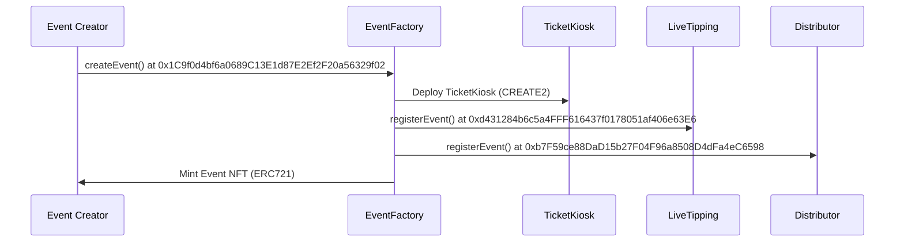
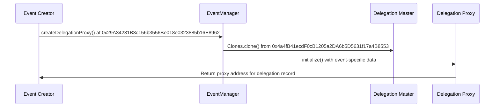

## Network Information

**Network:** Sei Testnet (Atlantic)   
**Chain ID:** `1328`  
**Block Explorer:** [SeiTrace](https://seitrace.com/?chain=atlantic-2o)

## Core Contracts

### EventFactory (Registry & NFT Factory)
```
Address: 0x1C9f0d4bf6a0689C13E1d87E2Ef2F20a56329f02
Type: Non-upgradeable ERC721 Contract
Purpose: Central registry, event NFT minting, per-event contract deployment
```

**Key Functions:**
- `createEvent()` - Create new event and mint NFT
- `deployCurationForEvent()` - Deploy optional curation contract
- `finalizeAndTransfer()` - Transfer NFT to highest tipper
- `getEvent(uint256)` - Query complete event data

### EventManager (Permission Management)
```
Address: 0x29A34231B3c156b3556Be018e0323885b16E8962
Type: UUPS Upgradeable Proxy
Purpose: Authorization, delegation proxy deployment, metadata management
```

**Key Functions:**
- `createDelegationProxy()` - Deploy event-specific delegation
- `updateMetadata()` - Authorized metadata updates
- `setGlobalWhitelist()` - Platform-wide permission management
- `finalizeRTA()` - Trigger event finalization

### LiveTipping (Real-time Competition)
```
Address: 0xd431284b6c5a4FFF616437f0178051af406e63E6
Type: UUPS Upgradeable Proxy  
Purpose: Tip collection, highest tipper tracking, reserve price validation
```

**Key Functions:**
- `sendTip()` - Submit tips with messages
- `getTotalTips()` - Query accumulated tips for event
- `getHighestTipper()` - Current leading tipper address
- `finalizeEvent()` - Complete tipping competition

### Distributor (Revenue Sharing)
```
Address: 0xb7F59ce88DaD15b27F04F96a8508D4dFa4eC6598
Type: UUPS Upgradeable Proxy
Purpose: Multi-party revenue distribution, curation integration
```

**Key Functions:**
- `distributeTips()` - Execute revenue sharing
- `enableCuration()` - Configure service provider fees
- `whitelistCurator()` - Authorize curation agents
- `getEventDistributionConfig()` - Query revenue split configuration

### Delegation (Master Implementation)
```
Address: 0x4a4fB41ecdF0cB1205a2DA6b5D5631f17a4B8553
Type: Master Implementation Contract
Purpose: Logic template for minimal delegation proxies
```

**Key Functions:**
- `initialize()` - Set proxy-specific delegation data
- `eventId()` - Query associated event ID
- `delegatee()` - Query authorized delegate address

### CreationWrapper (Utility)
```
Address: 0xB762e39b1e5a3FF0A7e159d64Ad1Ef2515B2cF08
Type: Non-upgradeable Utility Contract
Purpose: Atomic event creation with delegation setup
```

**Key Functions:**
- `createEventAndDelegate()` - Batch event creation and delegation

### ProxyAdmin (Upgrade Management)
```
Address: 0x304aC33609f8364eb09209913D7c8Fcfdb04EbAb
Type: ProxyAdmin Contract
Purpose: Manage UUPS proxy upgrades for protocol contracts
```

## Scope-Based Service Agents

The protocol includes pre-deployed addresses for different service provider tiers:

### Planner Agent (Scope 1 - 3% Fee)
```
Address: 0xF2aC15F3db8Fd24c83494fc7B2131A74DFCAA07b
Service: Event planning & Iterations
Fee Rate: 3% of tip revenue
```

### Promoter Agent (Scope 2 - 7% Fee)
```
Address: 0x27B8c4E2E6AaF49527b62278D834497BA344b90D
Service Level: Content Marketing and Promotion
Fee Rate: 7% of tip revenue
```

### Producer Agent (Scope 3 - 10% Fee)
```
Address: 0xEb215ba313c12D58417674c810bAcd6C6badAD61
Service Level: Live & Post Event video and quality enhancements
Fee Rate: 10% of tip revenue
```

## Treasury Configuration

### Treasury Receiver
```
Address: 0x058271e764154c322F3D3dDC18aF44F7d91B1c80
Purpose: Protocol fee collection and treasury management
Revenue Share: 15% of all tip revenue, 20% of ticket sales
```

## Contract Interaction Patterns

### Event Creation Flow


### Permission Delegation Flow



# Core Contract Addresses  
NEXT_PUBLIC_EVENT_FACTORY=0x1C9f0d4bf6a0689C13E1d87E2Ef2F20a56329f02
NEXT_PUBLIC_EVENT_MANAGER=0x29A34231B3c156b3556Be018e0323885b16E8962
NEXT_PUBLIC_LIVE_TIPPING=0xd431284b6c5a4FFF616437f0178051af406e63E6
NEXT_PUBLIC_DISTRIBUTOR=0xb7F59ce88DaD15b27F04F96a8508D4dFa4eC6598
NEXT_PUBLIC_DELEGATION=0x4a4fB41ecdF0cB1205a2DA6b5D5631f17a4B8553
NEXT_PUBLIC_CREATION_WRAPPER=0xB762e39b1e5a3FF0A7e159d64Ad1Ef2515B2cF08
NEXT_PUBLIC_PROXY_ADMIN=0x304aC33609f8364eb09209913D7c8Fcfdb04EbAb
```
