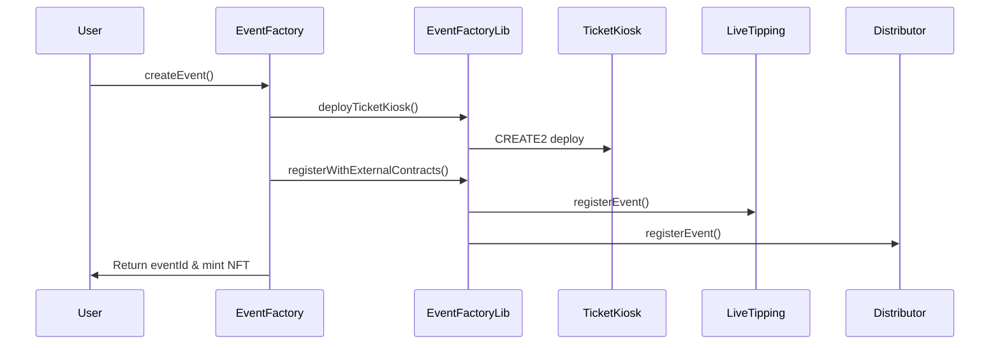

# EventFactory

The EventFactory serves as the central hub of the RTA protocol, functioning as both an ERC721 NFT factory and the primary registry for all events. It manages event creation, per-event contract deployment, and serves as the single source of truth for event ownership and metadata.

## Core Functionality

### Event NFT Management
EventFactory mints unique ERC721 tokens for each event, where ownership determines control rights:

```solidity
function createEvent(
    uint256 startDate,
    uint256 eventDuration,
    uint256 reservePrice,
    string calldata metadataURI,
    string calldata artCategory,
    uint256 ticketsAmount,
    uint256 ticketPrice
) external returns (uint256 eventId)
```

Each event NFT represents a live performance asset that can be transferred through tipping competition.

### Per-Event Contract Deployment

The factory deploys dedicated contracts for each event using CREATE2 for deterministic addresses:



## Storage Optimization

The contract uses optimized storage packing to minimize gas costs:

```solidity
struct EventData {
    address creator;        // 20 bytes (slot 0)
    address KioskAddress;   // 20 bytes (slot 1)
    address curationAddress; // 20 bytes (slot 2)
    uint96 startDate;       // 12 bytes (packed with creator)
    uint96 eventDuration;   // 12 bytes (packed with KioskAddress)
    uint96 reservePrice;    // 12 bytes (packed with curationAddress)
    bool finalized;         // 1 byte (packed with reservePrice)
    string metadataURI;     // separate slot
    string artCategory;     // separate slot
}
```

This packing reduces storage from 9 slots to 5 slots per event, saving approximately 80,000 gas per event creation.

## Permission Architecture

### Access Control Model
The EventFactory implements a permission delegation system through the EventManager:

- **Event Creator**: Original NFT holder, full control
- **EventManager**: Authorized contract for metadata and price updates
- **Delegated Addresses**: Granted specific permissions through delegation proxies

### Authorized Operations

Only the EventManager can call restricted functions:

```solidity
function setMetadataURI(uint256 eventId, string memory newMetadataURI) external {
    if (msg.sender != eventManagerContract) revert OnlyEventManager();
    if (events[eventId].finalized) revert EventAlreadyFinalized();
    
    events[eventId].metadataURI = newMetadataURI;
    _setTokenURI(eventId, newMetadataURI);
    
    emit MetadataUpdated(eventId, newMetadataURI);
}
```

## Event Finalization Logic

The factory handles the complex logic for transferring NFTs based on tipping results:

```solidity
function finalizeAndTransfer(uint256 eventId) external {
    if (msg.sender != eventManagerContract) revert OnlyEventManager();
    
    EventData storage eventData = events[eventId];
    
    // Verify event has ended
    uint256 eventEndTime = eventData.startDate + (eventData.eventDuration * 60);
    if (block.timestamp <= eventEndTime) revert EventNotEndedYet();
    
    // Check reserve price through LiveTipping
    ILiveTipping tippingContract = ILiveTipping(liveTippingContract);
    uint256 totalTips = tippingContract.getTotalTips(eventId);
    
    if (totalTips < eventData.reservePrice) revert ReservePriceNotMet();
    
    address highestTipper = tippingContract.getHighestTipper(eventId);
    if (highestTipper == address(0)) revert NoTippers();
    
    // Transfer NFT to highest tipper
    eventData.finalized = true;
    _transfer(eventData.creator, highestTipper, eventId);
    
    emit EventFinalizedAndTransferred(eventId, highestTipper);
}
```

## Curation Integration

EventFactory provides optional curation contract deployment:

```solidity
function deployCurationForEvent(
    uint256 eventId,
    uint256 scope,
    string calldata description
) external returns (address curationAddress) {
    require(events[eventId].creator == msg.sender, "Only event creator");
    require(events[eventId].curationAddress == address(0), "Already deployed");
    require(scope >= 1 && scope <= 3, "Invalid scope");

    // Deploy using CREATE2 for deterministic address
    curationAddress = EventFactoryLib.deployCuration(
        eventId, address(this), msg.sender, scope, description, distributorContract
    );
    
    events[eventId].curationAddress = curationAddress;
    
    // Auto-register with Distributor
    EventFactoryLib.registerCurationWithDistributor(
        eventId, curationAddress, distributorContract
    );
    
    emit CurationDeployed(eventId, msg.sender, curationAddress, scope);
}
```

## Gas Optimization Features

### Deterministic Contract Deployment
Using CREATE2 enables predictable addresses and reduces lookup costs:

```solidity
// TicketKiosk deployment
bytes32 salt = keccak256(abi.encodePacked(eventId, "ticketkiosk"));
address ticketKioskAddress = Create2.deploy(0, salt, bytecode);

// Curation deployment  
bytes32 salt = keccak256(abi.encodePacked(eventId, "curation"));
address curationAddress = Create2.deploy(0, salt, bytecode);
```

### Library Separation
EventFactoryLib contains deployment logic to keep the main contract under the 24KB limit:

```solidity
library EventFactoryLib {
    function deployTicketKiosk(...) external returns (address) {
        bytes memory bytecode = abi.encodePacked(
            type(TicketKiosk).creationCode,
            abi.encode(eventId, factoryAddress, creator, ...)
        );
        return Create2.deploy(0, salt, bytecode);
    }
}
```

## Integration Points

### External Contract Registration
During event creation, the factory automatically registers with dependent contracts:

```solidity
function registerWithExternalContracts(
    uint256 eventId,
    address creator,
    uint256 startDate,
    uint256 eventDuration,
    uint256 reservePrice,
    address distributorContract,
    address liveTippingContract
) external {
    // Register for revenue distribution
    IDistributor(distributorContract).registerEvent(eventId, creator);
    
    // Register for tipping competition
    ILiveTipping(liveTippingContract).registerEvent(
        eventId, creator, startDate, eventDuration, reservePrice
    );
}
```

### Query Interface
The factory provides comprehensive view functions for frontend integration:

```solidity
// Get complete event data
function getEvent(uint256 eventId) external view returns (EventData memory);

// Get creator's events
function getCreatorEvents(address creator) external view returns (uint256[] memory);

// Get all deployed kiosks
function getAllTicketKiosks() external view returns (uint256[] memory, address[] memory);
```

## Design Advantages

1. **Single Source of Truth**: All event data flows through one contract
2. **Automatic Integration**: Contract registration handled during creation
3. **Gas Efficient**: Storage packing and CREATE2 deployment optimization
4. **Flexible Metadata**: Dynamic URI updates through authorized managers
5. **Creator-Friendly**: Simple interface with complex logic handled internally

## Testnet Considerations

### Centralization
- Owner controls treasury receiver and can update contract addresses, this will be decentralized through multi-sig on main net.
- EventManager authorization is binary - either full access or none - this will be improved through dynamic, deterministic proxies.

### Technical Limitations
- 96-bit limitations on dates and prices may become insufficient over time, storage will be expanded before main net release, after additional bytecode size optimizations (read below).
- String storage for metadata and categories is not gas-optimized - this will substantially reduce EventFactory's size, allowing further improvements (see storage limitation above)
- No batch operations for multiple event management. This can be improved in a v2/v3, once implemented app-wide account abstraction.

As it is at its first release, current EventFactory's design prioritizes flexibility - this allows us to iterate and scale faster before landing to a more stable, governance-led release of the protocol.