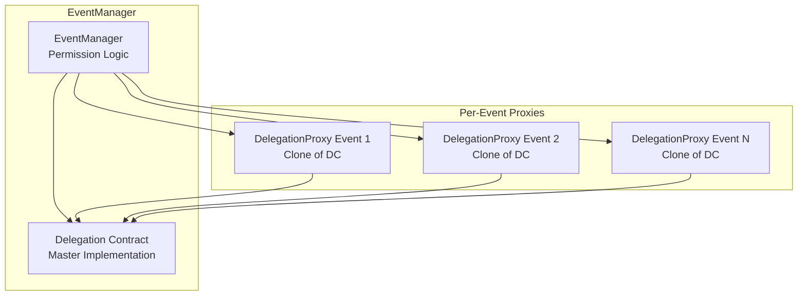
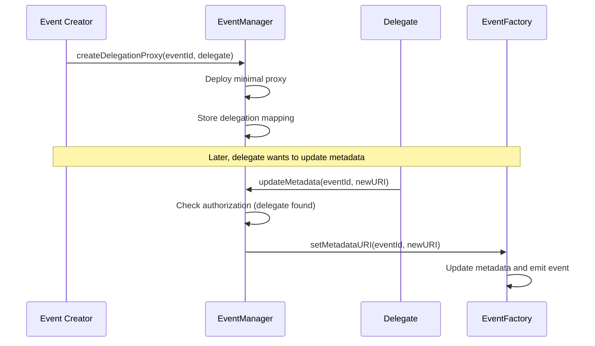
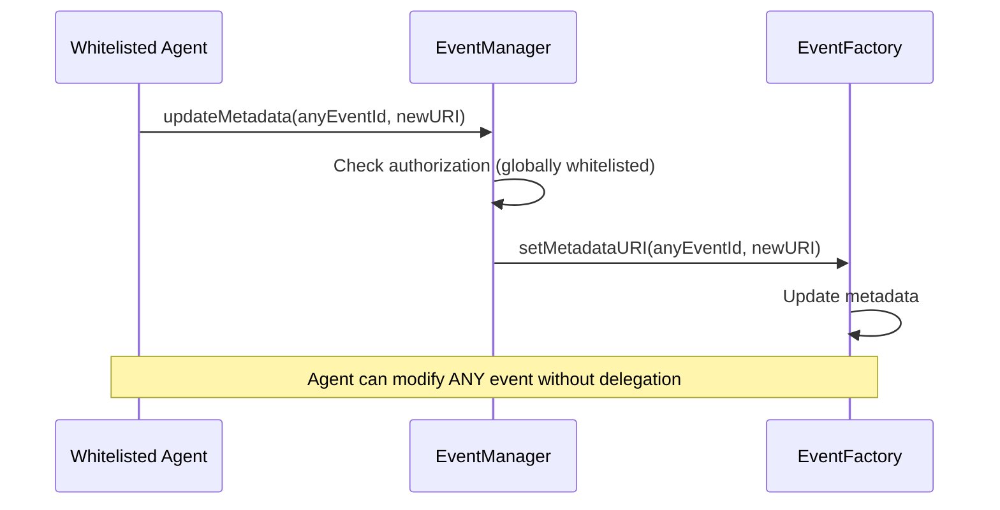

# EventManager

The EventManager is an upgradeable contract that handles post-creation operations and permission management for RTA events. It acts as the sole authorized caller for EventFactory's restricted functions and implements a sophisticated delegation system using minimal proxy patterns.

## Core Responsibilities

### Permission Validation
EventManager centralizes all authorization logic for event operations:

```solidity
function _authorize(uint256 eventId) internal view {
    if (eventFactory.ownerOf(eventId) != msg.sender && 
        eventDelegates[eventId] != msg.sender && 
        !globalWhitelist[msg.sender]) {
        revert NotAuthorized();
    }
}
```

Three authorization levels exist:
1. **NFT Owner**: Current holder of the event NFT
2. **Event Delegate**: Address specifically authorized for the event
3. **Global Whitelist**: Platform-wide authorized agents

### Delegation Proxy System

EventManager deploys lightweight proxy contracts for event-specific delegation:



## Delegation Implementation

### Proxy Deployment
The system uses OpenZeppelin's Clones library for gas-efficient proxy deployment:

```solidity
function createDelegationProxy(uint256 eventId, address delegatee) external {
    // Authorization: Only NFT owner can create delegation
    if (eventFactory.ownerOf(eventId) != msg.sender) {
        revert OnlyEventCreator();
    }
    
    // Deploy minimal proxy pointing to master implementation
    address proxy = Clones.clone(delegationContract);
    
    // Initialize proxy with event-specific data
    Delegation(proxy).initialize(eventId, address(eventFactory), delegatee);
    
    // Store mapping for authorization checks
    eventDelegationProxy[eventId] = proxy;
    eventDelegates[eventId] = delegatee;
    
    emit DelegationProxyCreated(eventId, proxy, delegatee);
}
```

### Master Implementation
The Delegation contract serves as a simple stateful record:

```solidity
contract Delegation is IDelegation {
    uint256 public eventId;
    address public eventFactory;
    address public delegatee;
    address public initializer;

    function initialize(uint256 _eventId, address _factory, address _delegatee) external override {
        if (initializer != address(0)) revert AlreadyInitialized();
        
        eventId = _eventId;
        eventFactory = _factory;
        delegatee = _delegatee;
        initializer = msg.sender; // EventManager that deployed this clone
    }
}
```

## Authorized Operations

### Metadata Management
EventManager provides controlled access to event metadata updates:

```solidity
function updateMetadata(uint256 eventId, string memory newMetadataURI) external {
    // Check authorization against all three permission levels
    if (eventFactory.ownerOf(eventId) != msg.sender && 
        eventDelegates[eventId] != msg.sender && 
        !globalWhitelist[msg.sender]) {
        revert NotAuthorized();
    }
    
    // Authorized call to EventFactory
    eventFactory.setMetadataURI(eventId, newMetadataURI);
}
```

### Reserve Price Updates
Price modifications are allowed only before event start:

```solidity
function updateReservePrice(uint256 eventId, uint256 newReservePrice) external {
    // Same authorization check as metadata
    _authorize(eventId);
    
    // EventFactory validates timing constraints
    eventFactory.setReservePrice(eventId, newReservePrice);
}
```

### Event Finalization
The manager handles the complex finalization process:

```solidity
function finalizeRTA(uint256 eventId) external {
    _authorize(eventId);
    
    // Get event data to validate timing
    IEventFactory.EventData memory eventData = eventFactory.getEvent(eventId);
    
    // Verify event has ended
    uint256 eventEndTime = eventData.startDate + (eventData.eventDuration * 60);
    if (block.timestamp <= eventEndTime) {
        revert("Event has not ended yet");
    }
    
    // Trigger finalization and NFT transfer
    eventFactory.finalizeAndTransfer(eventId);
}
```

## Global Whitelist System

### Platform-Wide Permissions
EventManager maintains a global whitelist for trusted operators:

```solidity
function setGlobalWhitelist(address agent, bool whitelisted) external onlyOwner {
    if (agent == address(0)) revert InvalidAddress();
    
    globalWhitelist[agent] = whitelisted;
    emit GlobalWhitelistUpdated(agent, whitelisted);
}

function batchSetGlobalWhitelist(address[] calldata agents, bool whitelisted) external onlyOwner {
    for (uint256 i = 0; i < agents.length; i++) {
        if (agents[i] != address(0)) {
            globalWhitelist[agents[i]] = whitelisted;
            emit GlobalWhitelistUpdated(agents[i], whitelisted);
        }
    }
}
```

Global whitelist addresses can modify ANY event without per-event delegation, enabling platform operators and automated systems.

## CreationWrapper Integration

### Batched Operations
EventManager works with CreationWrapper for atomic event creation and delegation:

```solidity
function createDelegationProxyForUser(
    uint256 eventId, 
    address eventCreator, 
    address delegatee
) external {
    // Only CreationWrapper can call this function
    if (msg.sender != creationWrapper) revert OnlyCreationWrapper();
    
    // Verify ownership before creating proxy
    if (eventFactory.ownerOf(eventId) != eventCreator) revert OnlyEventCreator();
    
    // Same deployment logic as regular createDelegationProxy
    address proxy = Clones.clone(delegationContract);
    Delegation(proxy).initialize(eventId, address(eventFactory), delegatee);
    
    eventDelegationProxy[eventId] = proxy;
    eventDelegates[eventId] = delegatee;
    
    emit DelegationProxyCreated(eventId, proxy, delegatee);
}
```

## Upgradeability Pattern

### UUPS Implementation
EventManager uses OpenZeppelin's UUPSUpgradeable pattern:

```solidity
contract EventManager is Initializable, OwnableUpgradeable, UUPSUpgradeable {
    function initialize(address _owner, address _eventFactoryAddress) public initializer {
        __Ownable_init(_owner);
        __UUPSUpgradeable_init();
        eventFactory = IEventFactory(_eventFactoryAddress);
        
        // Deploy master delegation implementation once
        delegationContract = address(new Delegation());
    }
    
    function _authorizeUpgrade(address newImplementation) internal override onlyOwner {}
}
```

### Upgrade Considerations
- Delegation proxies continue working with new EventManager versions
- Storage layout must be preserved between upgrades
- Owner controls all upgrade decisions

## Permission Flow Examples

### Standard Delegation Flow


### Global Whitelist Flow


## Gas Optimization

### Minimal Proxy Pattern
Using Clones instead of full contract deployment saves significant gas:

- Full Delegation contract deployment: ~200,000 gas
- Minimal proxy deployment: ~40,000 gas
- **Gas savings: ~80% per delegation setup**

### Storage Layout
Efficient mapping structure minimizes storage reads:

```solidity
mapping(uint256 => address) public eventDelegationProxy;  // eventId => proxy address
mapping(uint256 => address) public eventDelegates;       // eventId => delegate address
mapping(address => bool) public globalWhitelist;         // address => authorized
```

## Design Advantages

1. **Separation of Concerns**: Permission logic separated from core event functionality
2. **Gas Efficient**: Minimal proxies reduce delegation setup costs by 80%
3. **Flexible Authorization**: Three-tier permission system accommodates different use cases
4. **Upgradeable**: UUPS pattern allows for permission system improvements
5. **Platform Integration**: Global whitelist enables automated platform operations

## Risk Considerations

### Upgrade Risks
- UUPS upgrades could introduce bugs affecting all events, this will be fixed easily on main net through community-led dispute resolution and multi-sigs. In testnet, in case of upgrade-specific bugs or disputes, can be mitigated by swapping the upgrade-proxy with the base implementation.
- Owner has unilateral upgrade authority without timelock, this will be decentralized through community governance on main net.

### Authorization Risks
- Global whitelist provides extensive power over all events to Curation Agents. This will be improved in a V2/V3 release by dockerizing agents in TEE environment with contract registration on a per-worker/per-instance basis.

### Trust assumptions
- Creator must trust delegate-agent not to perform malicious actions. The TEE<>per-worker-registration<>dynamic-address pattern can ensure action-specific confinment for the multi-agent system.
- No built-in dispute resolution for delegation conflicts, this will be resolved with the UUPS pattern described above.

The EventManager design prioritizes flexibility and gas efficiency while maintaining security through centralized permission validation. The upgrade capability allows for future improvements but introduces governance risks that will be fixed in future iterations preceding main net deployment.
