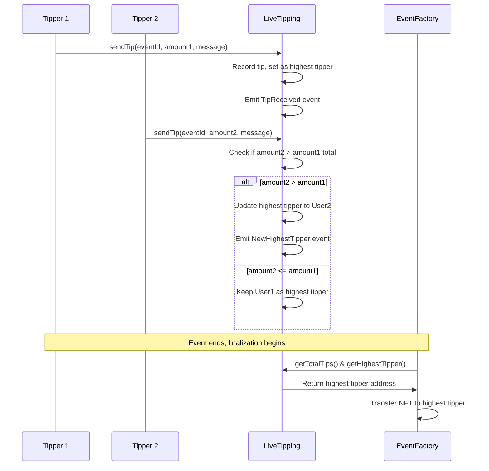
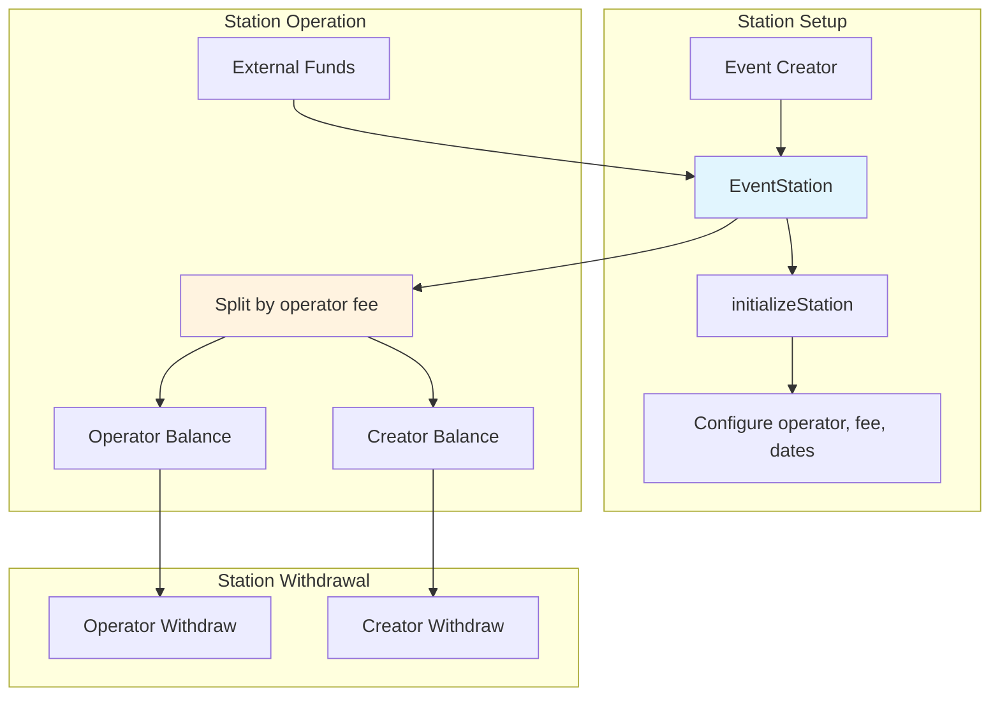
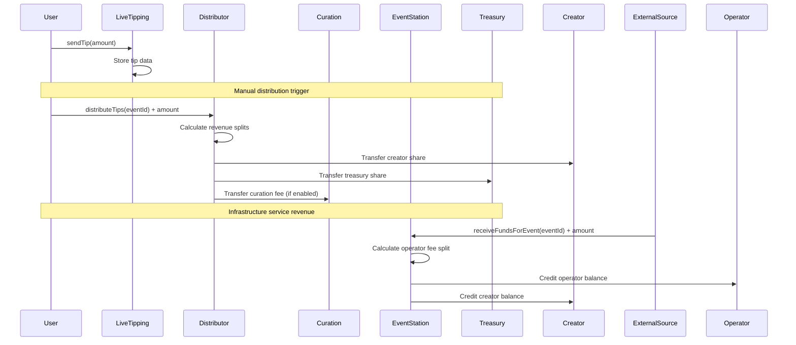

# Other Contracts

The RTA protocol includes several supporting contracts that handle specialized functions beyond the core event management system. These contracts provide real-time tipping, revenue distribution, infrastructure services, and utility functions.

## LiveTipping Contract

### Real-Time Payment Processing
LiveTipping manages the competitive tipping mechanism that determines NFT ownership:

```solidity
contract LiveTipping is Initializable, OwnableUpgradeable, UUPSUpgradeable, 
                       ReentrancyGuardUpgradeable, PausableUpgradeable {
    
    struct EventTippingData {
        address creator;
        uint256 startDate;
        uint256 endDate;
        uint256 reservePrice;
        uint256 totalTips;
        address highestTipper;
        uint256 highestTip;
        bool finalized;
        mapping(address => uint256) tips;
        mapping(address => uint256) tipCounts;
        address[] tippers;
    }
}
```

### Tipping Competition Mechanics



### Tip Processing Logic

```solidity
function sendTip(uint256 eventId, string memory message) 
    external payable eventExists(eventId) eventInProgress(eventId) 
    nonReentrant whenNotPaused 
{
    if (msg.value == 0) revert InvalidTipAmount();
    
    EventTippingData storage eventData = eventTipping[eventId];
    
    // Record individual tip
    uint256 tipId = eventTips[eventId].length;
    eventTips[eventId].push(TipData({
        tipper: msg.sender,
        amount: msg.value,
        timestamp: block.timestamp,
        message: message
    }));
    
    // Update tipper's total
    if (eventData.tips[msg.sender] == 0) {
        eventData.tippers.push(msg.sender);
    }
    eventData.tips[msg.sender] += msg.value;
    eventData.totalTips += msg.value;
    
    // Check for new highest tipper
    if (eventData.tips[msg.sender] > eventData.highestTip) {
        address previousHighest = eventData.highestTipper;
        eventData.highestTipper = msg.sender;
        eventData.highestTip = eventData.tips[msg.sender];
        
        emit NewHighestTipper(eventId, previousHighest, msg.sender, eventData.tips[msg.sender]);
    }
    
    emit TipReceived(eventId, msg.sender, msg.value, message, tipId);
}
```

### Reserve Price Validation

LiveTipping enforces reserve price requirements for NFT transfers:

```solidity
function finalizeEvent(uint256 eventId) 
    external eventExists(eventId) onlyEventCreator(eventId) nonReentrant 
    returns (address highestTipper, uint256 totalTips, bool reservePriceMet) 
{
    EventTippingData storage eventData = eventTipping[eventId];
    
    if (block.timestamp < eventData.endDate) revert EventNotEnded();
    
    totalTips = eventData.totalTips;
    reservePriceMet = totalTips >= eventData.reservePrice;
    
    // If reserve price not met, NFT stays with creator
    highestTipper = reservePriceMet ? eventData.highestTipper : eventData.creator;
    
    eventData.finalized = true;
    emit EventFinalized(eventId, highestTipper, totalTips, reservePriceMet);
}
```

## Distributor Contract

### Revenue Sharing Engine
The Distributor manages complex revenue distribution across multiple stakeholders:

```solidity
contract Distributor is Initializable, OwnableUpgradeable, UUPSUpgradeable,
                       ReentrancyGuardUpgradeable, PausableUpgradeable {
    
    enum CurationScope {
        NONE,       // 0% - No curation
        SCOPE_1,    // 3% - Planner  
        SCOPE_2,    // 7% - Promoter
        SCOPE_3     // 10% - Producer
    }
    
    struct EventDistributionConfig {
        uint256 creatorShare;   // 8500 (85%) - base creator share
        uint256 treasuryShare;  // 1500 (15%) - fixed treasury share
        uint256 curationFee;    // 0-1000 (0-10%) - from creator portion
        CurationScope curationScope;
        address curator;
        bool curationEnabled;
    }
}
```

### Distribution Algorithm

```solidity
function distributeTips(uint256 eventId) 
    external payable eventExists(eventId) nonReentrant whenNotPaused 
{
    EventDistributionConfig storage config = eventConfigs[eventId];
    uint256 amountToDistribute = msg.value;
    
    // Calculate base distribution (85% creator, 15% treasury)
    uint256 creatorAmount = (amountToDistribute * 8500) / 10000;
    uint256 treasuryAmount = amountToDistribute - creatorAmount;
    uint256 curationAmount = 0;
    
    // Apply curation if enabled (deducted from treasury portion)
    if (config.curationEnabled && config.curationFee > 0) {
        curationAmount = (amountToDistribute * config.curationFee) / 10000;
        treasuryAmount -= curationAmount;
    }
    
    // Execute distributions
    IEventFactory.EventData memory eventData = IEventFactory(eventFactoryAddress).getEvent(eventId);
    address eventOwner = eventData.creator;
    
    _distributeFunds(eventId, eventOwner, creatorAmount, "creator");
    _distributeFunds(eventId, treasury, treasuryAmount, "treasury");
    
    if (curationAmount > 0) {
        _distributeFunds(eventId, config.curator, curationAmount, "curation");
    }
}
```

### Curation Integration

The Distributor automatically configures curation based on deployed Curation contracts:

```solidity
function enableCurationFromContract(
    uint256 eventId,
    address _curationContract
) external onlyEventFactory {
    ICurationMinimal curation = ICurationMinimal(_curationContract);
    uint256 scope = curation.getCurationScope();
    uint256 fee = curation.getCuratorFee();
    address curator = curation.getCurator();
    
    // Map scope to standardized fee rates
    CurationScope curationScope;
    if (scope == 1) curationScope = CurationScope.SCOPE_1;      // 3%
    else if (scope == 2) curationScope = CurationScope.SCOPE_2; // 7%
    else if (scope == 3) curationScope = CurationScope.SCOPE_3; // 10%
    
    EventDistributionConfig storage config = eventConfigs[eventId];
    config.curationFee = fee;
    config.curationScope = curationScope;
    config.curator = curator;
    config.curationEnabled = true;
}
```

## EventStation Contract

### Infrastructure Service Management
EventStation provides a framework for managing infrastructure services across events:

```solidity
contract EventStation is Initializable, OwnableUpgradeable, UUPSUpgradeable,
                        ReentrancyGuardUpgradeable {
    
    struct StationData {
        address operator;
        bool active;
        uint256 totalFundsReceived;
        uint256 totalFundsWithdrawn;
        uint256 operatorFee;  // Percentage fee (1-20)
        string description;
        uint256 startDate;
        uint256 endDate;
    }
    
    mapping(uint256 => StationData) public eventStations;
    mapping(address => uint256[]) public operatorEvents;
    mapping(uint256 => mapping(address => uint256)) public pendingBalances;
}
```

### Station Lifecycle Management



### Fee Distribution Model

```solidity
function receiveFundsForEvent(uint256 eventId) external payable stationActive(eventId) {
    address operator = eventStations[eventId].operator;
    
    // Calculate fee split
    uint256 operatorAmount = (msg.value * eventStations[eventId].operatorFee) / 100;
    uint256 remainingAmount = msg.value - operatorAmount;
    
    // Update balances
    if (operatorAmount > 0) {
        pendingBalances[eventId][operator] += operatorAmount;
    }
    if (remainingAmount > 0) {
        IEventFactory.EventData memory eventData = IEventFactory(eventFactoryAddress).getEvent(eventId);
        pendingBalances[eventId][eventData.creator] += remainingAmount;
    }
    
    eventStations[eventId].totalFundsReceived += msg.value;
    emit FundsReceived(eventId, operator, msg.value);
}
```

## CreationWrapper Contract

### Atomic Operations Utility
CreationWrapper enables batched operations for improved user experience:

```solidity
contract CreationWrapper {
    IEventFactory public immutable eventFactory;
    IEventManager public immutable eventManager;

    function createEventAndDelegate(
        // Event creation parameters
        uint256 startDate, uint256 eventDuration, uint256 reservePrice,
        string calldata metadataURI, string calldata artCategory,
        uint256 ticketsAmount, uint256 ticketPrice,
        // Delegation parameter
        address delegatee
    ) external {
        // 1. Create event
        uint256 newEventId = eventFactory.createEventForCreator(
            msg.sender, startDate, eventDuration, reservePrice,
            metadataURI, artCategory, ticketsAmount, ticketPrice
        );
        
        // 2. Setup delegation if specified
        if (delegatee != address(0)) {
            eventManager.createDelegationProxyForUser(newEventId, msg.sender, delegatee);
        }
    }
}
```

**Gas Savings:**
- Combines two transactions into one
- Reduces total gas costs by ~21,000 (one transaction overhead)
- Improves UX by eliminating intermediate transaction confirmations

## EventFactoryLib Library

### Deployment Logic Separation
EventFactoryLib contains CREATE2 deployment functions to keep EventFactory under size limits:

```solidity
library EventFactoryLib {
    function deployTicketKiosk(...) external returns (address) {
        bytes memory bytecode = abi.encodePacked(
            type(TicketKiosk).creationCode,
            abi.encode(eventId, factoryAddress, creator, ticketsAmount, ticketPrice, artCategory, treasuryReceiver)
        );
        bytes32 salt = keccak256(abi.encodePacked(eventId, "ticketkiosk"));
        return Create2.deploy(0, salt, bytecode);
    }
    
    function deployCuration(...) external returns (address) {
        bytes memory bytecode = abi.encodePacked(
            type(Curation).creationCode,
            abi.encode(eventId, factoryAddress, creator, creator, defaultFee, scope, description, distributorContract)
        );
        bytes32 salt = keccak256(abi.encodePacked(eventId, "curation"));
        return Create2.deploy(0, salt, bytecode);
    }
    
    function registerWithExternalContracts(...) external {
        IDistributor(distributorContract).registerEvent(eventId, creator);
        ILiveTipping(liveTippingContract).registerEvent(eventId, creator, startDate, eventDuration, reservePrice);
    }
}
```

## Integration Patterns

### Cross-Contract Communication



### Event State Synchronization

All contracts maintain synchronized event state through EventFactory queries:

```solidity
// Common pattern across all supporting contracts
function validateEvent(uint256 eventId) internal view {
    IEventFactory.EventData memory eventData = IEventFactory(eventFactoryAddress).getEvent(eventId);
    require(eventData.creator != address(0), "Event not registered");
}
```

## Gas Optimization Features

### Batch Operations

**LiveTipping:**
```solidity
// Theoretical batch tipping function
function batchSendTips(
    uint256[] calldata eventIds,
    string[] calldata messages
) external payable {
    require(eventIds.length == messages.length && eventIds.length == amounts.length);
    
    for (uint256 i = 0; i < eventIds.length; i++) {
        // Process individual tips
    }
}
```

**EventStation:**
```solidity
function withdrawAllBalances() external nonReentrant {
    uint256[] memory events = operatorEvents[msg.sender];
    uint256 totalAmount = 0;
    
    for (uint256 i = 0; i < events.length; i++) {
        uint256 amount = pendingBalances[events[i]][msg.sender];
        if (amount > 0) {
            totalAmount += amount;
            pendingBalances[events[i]][msg.sender] = 0;
        }
    }
    
    (bool success, ) = msg.sender.call{value: totalAmount}("");
    require(success, "Transfer failed");
}
```

### Storage Optimization

**Packed Structs:**
```solidity
// Optimized EventTippingData storage layout
struct EventTippingData {
    address creator;        // 20 bytes (slot 0)
    uint96 reservePrice;    // 12 bytes (slot 0)
    uint128 startDate;      // 16 bytes (slot 1)
    uint128 endDate;        // 16 bytes (slot 1)
    uint256 totalTips;      // 32 bytes (slot 2)
    address highestTipper;  // 20 bytes (slot 3)
    uint96 highestTip;      // 12 bytes (slot 3)
    bool finalized;         // 1 byte (slot 3)
    // 3 storage slots saved per event
}
```

## Design Advantages

### Specialized Functionality
1. **LiveTipping**: Optimized for high-frequency, small-value transactions
2. **Distributor**: Handles complex revenue calculations and multi-party payments
3. **EventStation**: Provides infrastructure service monetization framework
4. **CreationWrapper**: Improves user experience through transaction batching

### Modular Integration
1. **Loose Coupling**: Contracts can be upgraded independently
2. **Clear Interfaces**: Well-defined interaction patterns
3. **Fallback Safety**: Graceful degradation when optional contracts unavailable
4. **Event-Driven**: Comprehensive event logging for off-chain integration

### Upgrade Flexibility
1. **UUPS Pattern**: Core contracts can evolve with protocol needs
2. **Interface Stability**: External integrations remain compatible
3. **Migration Support**: Old contract state can be preserved during upgrades
4. **Emergency Controls**: Pause and emergency withdrawal capabilities

## Risk Considerations

### Economic Risks
- **MEV Opportunities**: Last-second tip submissions could be front-run
- **Revenue Leakage**: Complex distribution logic increases error risk
- **Fee Stacking**: Multiple fee layers reduce net creator revenue

### Technical Risks  
- **Oracle Dependencies**: Reserve price validation relies on accurate tip tracking
- **Upgrade Coordination**: Multiple UUPS contracts require synchronized upgrades
- **Gas Price Volatility**: High gas costs could make small tips uneconomical

### Operational Risks
- **Operator Dependency**: EventStation relies on external operator reliability
- **Withdrawal Coordination**: Manual distribution triggers create UX friction
- **State Consistency**: Cross-contract state synchronization complexity

The supporting contracts in the RTA protocol provide essential specialized functionality while maintaining the modular architecture's flexibility and upgrade capabilities.
