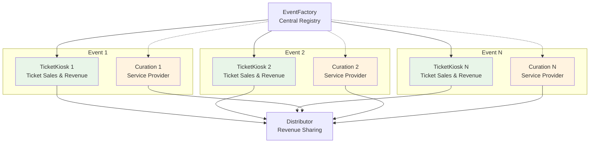
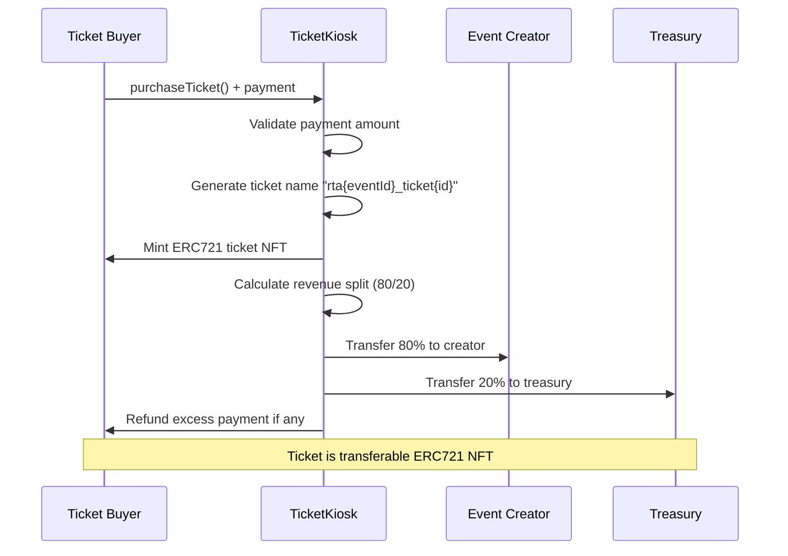
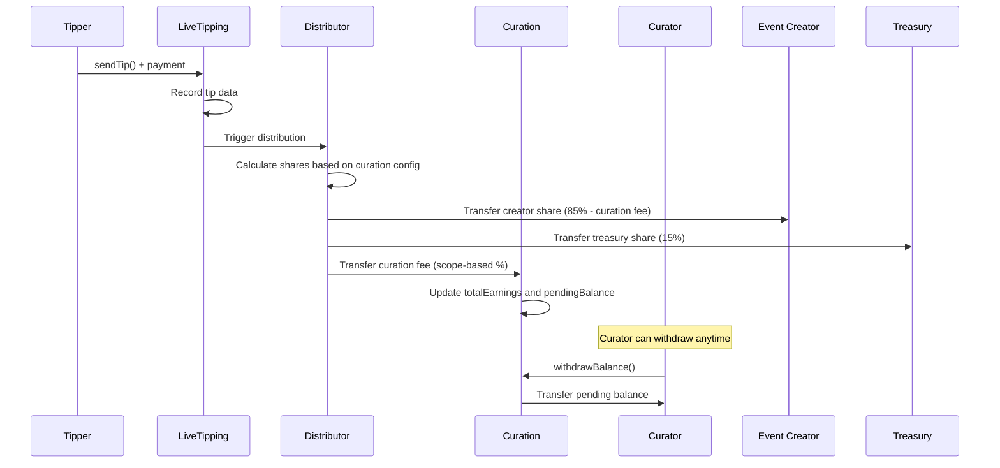

## Architecture Overview



## TicketKiosk Contract

### Primary Functionality
Each TicketKiosk manages ERC721 ticket sales for its specific event:

```solidity
contract TicketKiosk is ERC721, ERC721URIStorage, ReentrancyGuard, Ownable {
    struct TicketData {
        uint256 eventId;
        uint256 ticketId;
        address originalOwner;
        uint256 purchasePrice;
        uint256 purchaseTimestamp;
        string name;         // e.g., "rta5_ticket34"
        string artCategory;
        uint256 ticketNumber;    // Sequential ticket number
        uint256 totalTickets;    // Total tickets for event
    }
}
```

### Deployment Process
TicketKiosks are deployed using CREATE2 for deterministic addresses:

```solidity
// EventFactoryLib.sol
function deployTicketKiosk(
    uint256 eventId,
    address factoryAddress,
    address creator,
    uint256 ticketsAmount,
    uint256 ticketPrice,
    string memory artCategory,
    address treasuryReceiver
) external returns (address) {
    bytes memory bytecode = abi.encodePacked(
        type(TicketKiosk).creationCode,
        abi.encode(eventId, factoryAddress, creator, ticketsAmount, ticketPrice, artCategory, treasuryReceiver)
    );
    
    bytes32 salt = keccak256(abi.encodePacked(eventId, "ticketkiosk"));
    return Create2.deploy(0, salt, bytecode);
}
```

### Ticket Purchase Flow



### Revenue Distribution Model

TicketKiosk implements immediate revenue distribution on purchase:

```solidity
function purchaseTicket() external payable nonReentrant returns (uint256 ticketId) {
    require(ticketsSold < ticketsAmount, "All tickets sold");
    require(msg.value >= ticketPrice, "Insufficient payment");
    
    // Mint ticket NFT
    ticketId = currentTicketId++;
    _mint(msg.sender, ticketId);
    
    // Immediate revenue distribution: 80% creator, 20% treasury
    uint256 totalRevenue = ticketPrice;
    uint256 creatorShare = (totalRevenue * 80) / 100;
    uint256 treasuryShare = totalRevenue - creatorShare;
    
    // Execute transfers
    (bool creatorSuccess, ) = payable(creator).call{value: creatorShare}("");
    (bool treasurySuccess, ) = payable(treasuryReceiver).call{value: treasuryShare}("");
    
    require(creatorSuccess && treasurySuccess, "Transfer failed");
    
    // Refund excess
    if (msg.value > ticketPrice) {
        payable(msg.sender).transfer(msg.value - ticketPrice);
    }
}
```

### Ticket Naming Convention

Tickets follow a standardized naming pattern for easy identification:

```solidity
string memory ticketName = string(abi.encodePacked(
    "rta",                    // Protocol prefix
    _toString(eventId),       // Event identifier
    "_ticket",               // Separator
    _toString(ticketId)      // Unique ticket ID
));
// Result: "rta5_ticket34"
```

### Metadata Synchronization

TicketKiosks maintain synchronization with their parent event's metadata:

```solidity
function updateMetadata(string memory newMetadataURI) external {
    require(
        msg.sender == eventFactoryAddress || msg.sender == owner(),
        "Only EventFactory or owner can update metadata"
    );
    
    eventMetadataURI = newMetadataURI;
    
    // Update all existing tickets with new metadata
    for (uint256 i = 1; i < currentTicketId; i++) {
        if (_ownerOf(i) != address(0)) {
            _setTokenURI(i, newMetadataURI);
        }
    }
}
```

## Curation Contract

### Service Provider Integration
Curation contracts enable third-party service providers to monetize event support:

```solidity
contract Curation is Ownable, ReentrancyGuard {
    uint256 public eventId;
    address public curator;
    uint256 public curatorFee;      // Percentage fee (1-10)
    uint256 public scope;           // Curation scope (1-3)
    string public description;
    bool public active;
    uint256 public totalEarnings;
    uint256 public pendingBalance;
    
    address public distributorContract;
    address public eventCreator;
}
```

### Scope-Based Fee Structure

Curation fees are determined by service scope:

| Scope | Role | Fee Rate | Description |
|-------|------|----------|-------------|
| **1** | Planner | 3% | Event planning and coordination |
| **2** | Promoter | 7% | Marketing and audience development |
| **3** | Producer | 10% | Full production and technical support |

### Deployment and Registration

```solidity
// EventFactoryLib.sol - Automatic curation deployment
function deployCuration(
    uint256 eventId,
    address factoryAddress,
    address creator,
    uint256 scope,
    string memory description,
    address distributorContract
) external returns (address) {
    uint256 defaultFee = 3; // Base fee, overridden by scope
    
    bytes memory bytecode = abi.encodePacked(
        type(Curation).creationCode,
        abi.encode(
            eventId, factoryAddress, creator,
            creator, // curator = creator initially
            defaultFee, scope, description, distributorContract
        )
    );
    
    bytes32 salt = keccak256(abi.encodePacked(eventId, "curation"));
    return Create2.deploy(0, salt, bytecode);
}
```

### Revenue Flow Integration



### Curation Configuration Management

Event creators can configure curation parameters before the event starts:

```solidity
function updateCuration(
    uint256 _curatorFee,
    uint256 _scope
) external onlyEventCreator curationActive {
    if (block.timestamp >= startDate) revert InvalidInput();
    if (_curatorFee < 1 || _curatorFee > 10) revert InvalidCuratorFee();
    if (_scope < 1 || _scope > 3) revert InvalidScope();

    curatorFee = _curatorFee;
    scope = _scope;

    emit CurationUpdated(eventId, _curatorFee, _scope);
}
```

## Deterministic Address Generation

### CREATE2 Implementation Benefits

Both TicketKiosk and Curation contracts use CREATE2 deployment:

**Advantages:**
1. **Predictable Addresses**: Frontend can compute addresses before deployment
2. **Gas Efficiency**: No need for registry lookups
3. **Consistency**: Same salt formula across all deployments
4. **Security**: Prevents address manipulation attacks

**Address Computation:**
```solidity
// TicketKiosk address computation
bytes32 salt = keccak256(abi.encodePacked(eventId, "ticketkiosk"));
address predictedAddress = Create2.computeAddress(salt, bytecodeHash, factoryAddress);

// Curation address computation  
bytes32 salt = keccak256(abi.encodePacked(eventId, "curation"));
address predictedAddress = Create2.computeAddress(salt, bytecodeHash, factoryAddress);
```

## Event-Specific State Management

### Isolated Storage Context

Each per-event contract maintains independent state:

**TicketKiosk State:**
- Ticket inventory and sales tracking
- Revenue distribution history  
- Event-specific metadata cache
- User ticket ownership mapping

**Curation State:**
- Service provider configuration
- Earnings and withdrawal tracking
- Scope and fee parameters
- Service activation status

### Cross-Contract Communication

Per-event contracts integrate with the protocol ecosystem:

```solidity
// TicketKiosk checks event metadata from EventFactory
function _getEventMetadata() internal view returns (string memory) {
    (bool success, bytes memory data) = eventFactoryAddress.staticcall(
        abi.encodeWithSignature("tokenURI(uint256)", eventId)
    );
    
    if (success && data.length > 0) {
        return abi.decode(data, (string));
    }
    return "";
}

// Curation integrates with Distributor for revenue sharing
function receiveFunds() external payable {
    if (msg.sender != distributorContract) revert OnlyEventFactory();
    
    totalEarnings += msg.value;
    pendingBalance += msg.value;
    
    emit FundsReceived(eventId, curator, msg.value);
}
```

## Gas Optimization Strategies

### Deployment Cost Analysis

| Contract Type | Deployment Gas | Runtime Gas/Call | Use Case |
|---------------|----------------|------------------|----------|
| **TicketKiosk** | ~2,500,000 gas | Standard | Always deployed |
| **Curation** | ~1,800,000 gas | Standard | Optional deployment |
| **Total per Event** | ~4,300,000 gas | - | Full feature set |

### Storage Optimization

**TicketKiosk Packing:**
```solidity
struct TicketData {
    uint256 eventId;           // 32 bytes (slot 0)
    uint256 ticketId;          // 32 bytes (slot 1)
    address originalOwner;     // 20 bytes (slot 2)
    uint256 purchasePrice;     // 32 bytes (slot 3)
    uint256 purchaseTimestamp; // 32 bytes (slot 4)
    string name;               // Dynamic (separate slots)
    string artCategory;        // Dynamic (separate slots)
    uint256 ticketNumber;      // 32 bytes (slot 5)
    uint256 totalTickets;      // 32 bytes (slot 6)
}
```

**Optimization Opportunity:** Pack smaller values to reduce storage slots:
```solidity
struct OptimizedTicketData {
    uint256 eventId;           // 32 bytes (slot 0)
    uint256 ticketId;          // 32 bytes (slot 1)
    address originalOwner;     // 20 bytes (slot 2, start)
    uint96 purchasePrice;      // 12 bytes (slot 2, end)
    uint128 purchaseTimestamp; // 16 bytes (slot 3, start)
    uint64 ticketNumber;       // 8 bytes (slot 3, middle)
    uint64 totalTickets;       // 8 bytes (slot 3, end)
    // Saves 2 storage slots per ticket
}
```

## Design Advantages

### Per-Event Isolation

1. **Independent Lifecycle**: Each event manages its own state
2. **Customizable Parameters**: Event-specific configurations
3. **Isolated Risk**: Problems in one event don't affect others
4. **Parallel Processing**: Multiple events can operate simultaneously
5. **Clear Ownership**: Each contract has a single responsible creator

### Modular Revenue Streams

1. **Immediate Distribution**: Ticket sales distribute funds instantly
2. **Deferred Distribution**: Tips accumulate for later distribution
3. **Service Integration**: Curation provides third-party monetization
4. **Transparent Tracking**: All revenue flows are recorded on-chain
5. **Flexible Fee Structures**: Different rates for different service levels

## Limitations

- CREATE2 deployment requires salt management.
- Failed deployments waste gas, deployment script needs refinement.
- Difficult to upgrade individual event contracts, altough modular, contracts are strictly interdependent.
- No mechanism for dispute resolution in service provider conflicts, as mentioned elsewhere, this will be resolved through protocol-wide, enforceable governance (community-led dispute resolution and multi-sigs).

Currently, the per-event contract architecture provides the modularity and customization necessary for diverse event types while maintaining integration with the broader protocol ecosystem. This design choice prioritizes event creator autonomy and service provider flexibility over protocol-wide optimization.