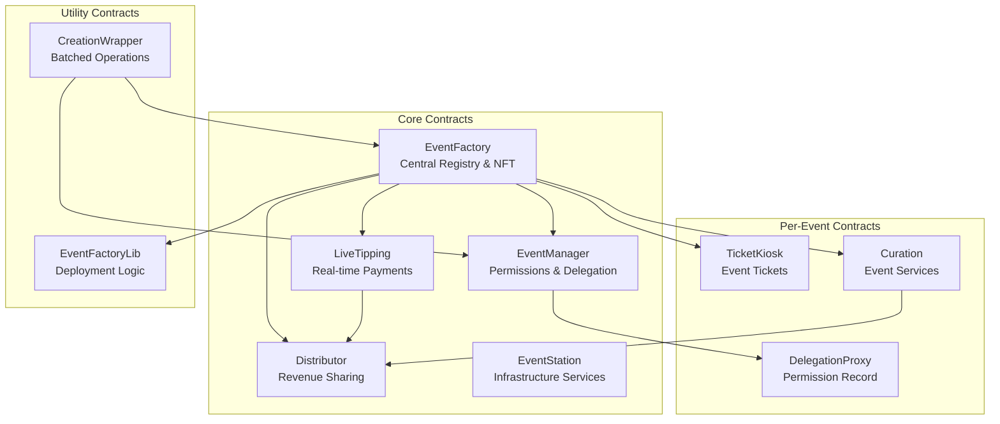
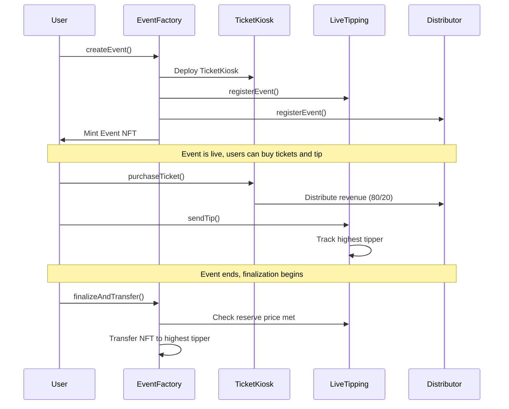

## Core Design Principles

The protocol is built around three key principles:

1. **Modularity**: Each contract has a single responsibility, reducing complexity and gas costs
2. **Upgradeability**: Critical contracts use UUPS proxy patterns for future improvements
3. **Gas Efficiency**: Optimized storage layouts and minimal proxy patterns reduce operational costs

## Contract Overview



## System Components

### Core Infrastructure

| Contract | Purpose | Upgradeability |
|----------|---------|----------------|
| **EventFactory** | Central registry, NFT management, per-event contract deployment | No |
| **EventManager** | Permission management, delegation system | UUPS |
| **LiveTipping** | Real-time payment processing, competition mechanics | UUPS |
| **Distributor** | Revenue distribution, curation integration | UUPS |
| **EventStation** | Infrastructure service management | UUPS |

### Per-Event Contracts

Each event deploys its own instances of:

- **TicketKiosk**: ERC721 ticket sales with deterministic addressing
- **Curation**: Optional service provider integration
- **DelegationProxy**: Minimal proxy for permission delegation

## Event Lifecycle



## Gas Optimization Strategies

The protocol implements several gas optimization techniques:

### Storage Packing
EventFactory uses optimized struct packing to minimize storage slots:

```solidity
struct EventData {
    address creator;        // 20 bytes
    address KioskAddress;   // 20 bytes (slot 1)
    address curationAddress; // 20 bytes (slot 2)
    uint96 startDate;       // 12 bytes (packed with creator)
    uint96 eventDuration;   // 12 bytes (packed with KioskAddress)
    uint96 reservePrice;    // 12 bytes (packed with curationAddress)
    bool finalized;         // 1 byte (packed with reservePrice)
    string metadataURI;     // separate slot
    string artCategory;     // separate slot
}
```

### Minimal Proxies
The delegation system uses OpenZeppelin's Clones library for cheap proxy deployment:

```solidity
// Deploy lightweight proxy pointing to master implementation
address proxy = Clones.clone(delegationContract);
Delegation(proxy).initialize(eventId, address(eventFactory), delegatee);
```

### Library Pattern
EventFactoryLib separates deployment logic to keep the main contract under size limits while maintaining identical functionality.

## Revenue Distribution Model

The protocol implements a tiered revenue sharing system:

| Revenue Source | Creator Share | Treasury Share | Curation Share |
|----------------|---------------|----------------|----------------|
| **Ticket Sales** | 80% | 20% | 0% |
| **Tips** | 85% (base) | 15% | 0-10% (from creator share) |

### Curation Tiers

When curation is enabled, fees are deducted from the creator's share:

- **Scope 1 (Planner)**: 3% curation fee
- **Scope 2 (Promoter)**: 7% curation fee  
- **Scope 3 (Producer)**: 10% curation fee

## Security Considerations

### Access Control
- EventFactory is the single source of truth for event ownership
- EventManager provides centralized permission validation
- Global whitelist system for trusted operators

### Reentrancy Protection
All payment-handling contracts implement ReentrancyGuard:

```solidity
function sendTip(uint256 eventId, string memory message) 
    external 
    payable 
    eventExists(eventId) 
    eventInProgress(eventId) 
    nonReentrant 
    whenNotPaused 
{
    // Safe payment processing
}
```

### Emergency Controls
- Pausable pattern on critical contracts
- Owner-only upgrade authorization
- Emergency withdrawal functions

## Competitive Advantages

1. **Real-time Ownership Transfer**: Unique mechanism where NFT ownership changes based on live tipping
2. **Modular Curation System**: Flexible service provider integration with automated revenue sharing
3. **Gas-Optimized Design**: Strategic use of storage packing and minimal proxies
4. **Deterministic Addressing**: CREATE2 deployment for predictable contract addresses
5. **Comprehensive Permission System**: Granular delegation without compromising security
