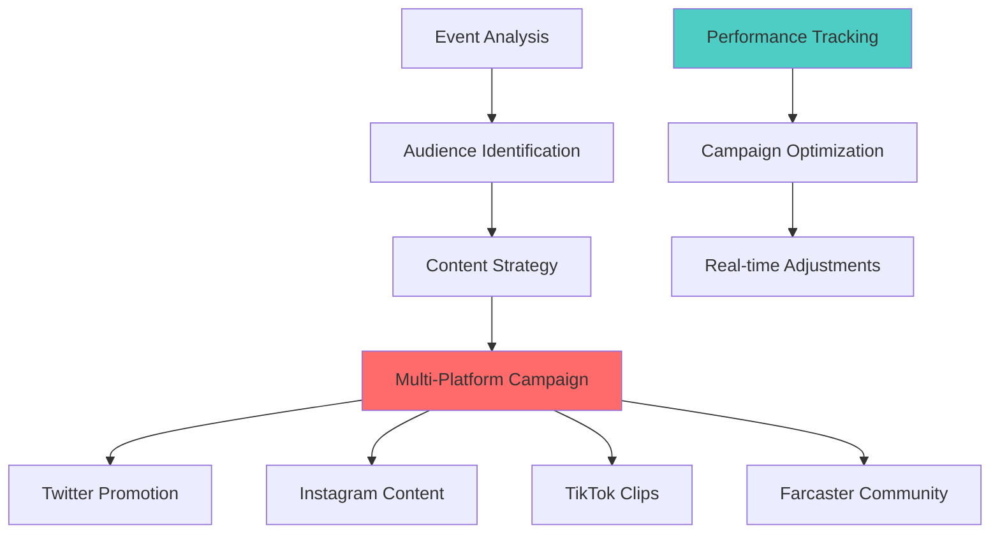
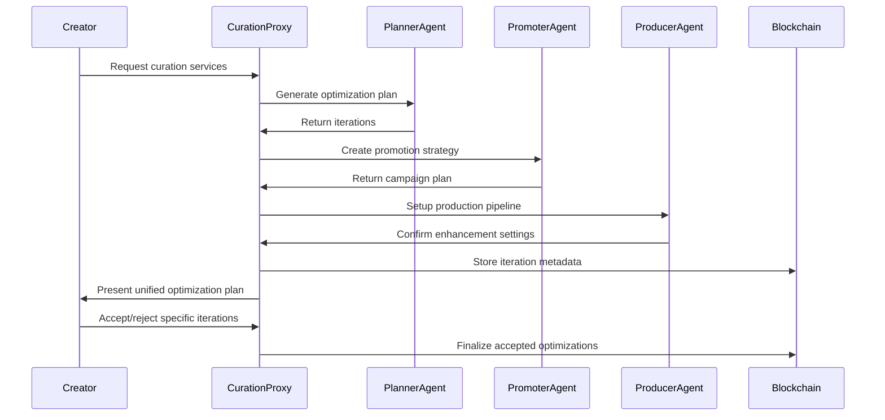

The Autonomous Curation Agency represents the first of its kind: a fully autonomous talent representation system that provides comprehensive event optimization services from planning through post-production.

Built using advanced proxy patterns and on-chain iteration systems, it offers creators professional-grade optimization services without traditional agency overhead.

## Agency Overview

### Service Philosophy

The Curation Agency operates on three core principles:

1. **Creator sovereignty**: Artists maintain full control and ownership
2. **Transparent optimization**: All suggestions and changes are visible and reversible
3. **Economic alignment**: Agency success tied directly to creator success

**Key Innovation**: Unlike traditional agencies that take ongoing percentages, the Curation Agency charges only for specific optimization services (3-4% fee) and allows creators to accept or reject all suggestions.

## Curation Scopes

### 1. Planner Scope (3% fee)

**Services Provided**:
- Enhanced event descriptions with engagement optimization
- Optimal scheduling recommendations based on audience data
- Reserve price optimization for maximum community participation
- Custom banner generation using AI art tools

**Technical Implementation**:
```typescript
// Planner agent workflow
async function generatePlannerOptimizations(eventData: EventData) {
  const optimizations = {
    description: await optimizeDescription(eventData),
    schedule: await analyzeOptimalTiming(eventData),
    pricing: await calculateOptimalPricing(eventData),
    banner: await generateCustomBanner(eventData)
  }
  
  return createIterationPlan(optimizations)
}
```

### 2. Promoter Scope (3% fee)

**Services Provided**:
- Comprehensive promotional campaign development
- Social media content creation and scheduling
- Cross-platform promotion (Twitter, Instagram, TikTok, Farcaster)
- Community building and audience development strategies

**Campaign Architecture**:


### 3. Producer Scope (4% fee)

**Services Provided**:
- No-compression video storage for maximum quality preservation
- AI-powered video enhancement and post-processing
- Comprehensive event highlight reels and documentation
- Professional-grade metadata compilation and presentation

**Production Pipeline**:
- **Raw storage**: Uncompressed video preservation
- **Enhancement**: AI upscaling, noise reduction, color correction
- **Documentation**: Automated highlight generation
- **Distribution**: Multi-format optimization for different platforms

## Technical Architecture

### Proxy Pattern Implementation

The curation system uses a sophisticated proxy pattern for efficient agent coordination:



## Economic Model

### Fee Structure

**Transparent Pricing**:
- **Planner**: 3% of total event revenue
- **Promoter**: 7% of total event revenue  
- **Producer**: 10% of total event revenue
- **Combined**: Maximum 10% total fee across all services

**Revenue Distribution** (with full curation):
- **Creator**: 70% of gross revenue
- **Platform**: 20% of gross revenue
- **Curation Services**: 10% of gross revenue

### Value Proposition

**Creator Benefits**:
- **Professional optimization** without upfront costs
- **Performance-based pricing** aligned with success
- **Full creative control** with selective implementation
- **Transparent process** with visible iteration history

## Future Development

### Expanded Services

**Additional Scope Options**:
- **Collaboration Facilitation**: Connect creators for joint events
- **Merchandise Integration**: NFT and physical product optimization
- **Community Management**: Long-term audience relationship building

## Getting Started

### Service Selection

1. **Create your event** using the standard Factory process
2. **Review curation suggestions** automatically generated for your event
3. **Select optimization scopes** based on your needs and budget
4. **Review and refine** suggested improvements iteratively
5. **Accept final optimizations** and launch enhanced event

### Best Practices

**Maximizing Value**:
- **Start early**: Begin curation process 1-2 weeks before event
- **Be specific**: Provide detailed feedback for better refinements
- **Stay engaged**: Monitor suggestions and provide prompt responses
- **Measure results**: Track improvements for future optimization

## Related Documentation

- [Factory](/core/factory) - How to create events that can be curated
- [Performance Types](/core/performance-types) - Category-specific optimization strategies
- [Contracts](/contracts/delegation-and-proxy-patterns) - Technical implementation of proxy patterns
