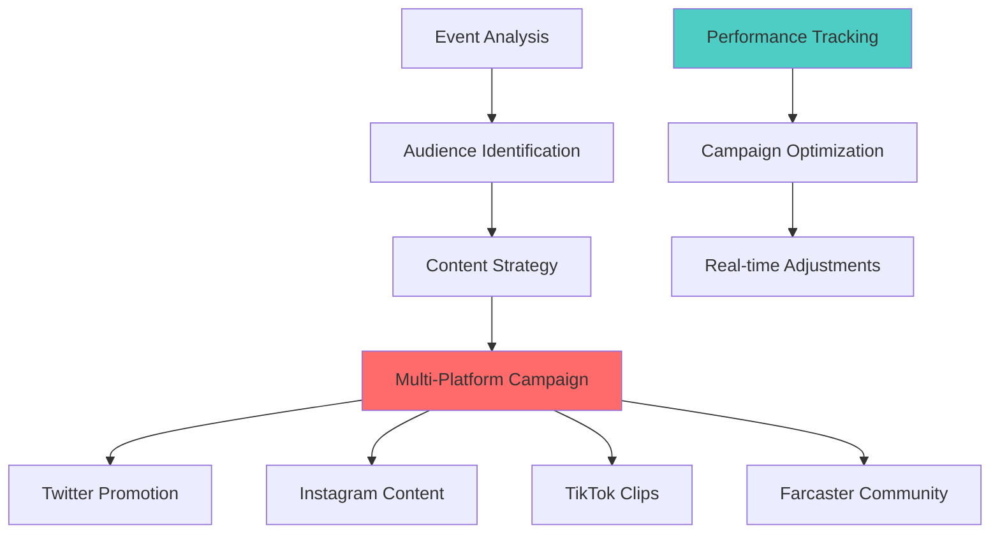
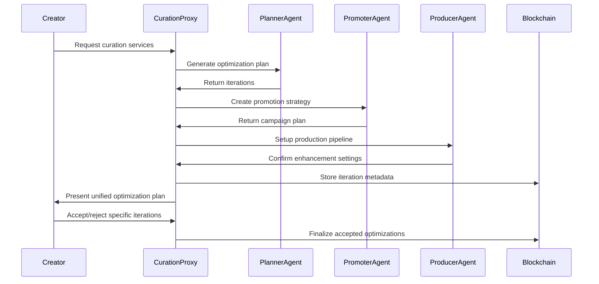

The Autonomous Curation Agency represents the first of its kind: a fully autonomous talent representation system that provides comprehensive event optimization services from planning through post-production.

Built using advanced proxy patterns and on-chain iteration systems, it offers creators professional-grade optimization services without traditional agency overhead.

## Agency Overview

### Service Philosophy

The Curation Agency operates on three core principles:

1. **Creator sovereignty**: Artists maintain full control and ownership
2. **Transparent optimization**: All suggestions and changes are visible and reversible
3. **Economic alignment**: Agency success tied directly to creator success

**Key Innovation**: Unlike traditional agencies that take ongoing percentages, the Curation Agency charges only for specific optimization services (3-4% fee) and allows creators to accept or reject all suggestions.

## Curation Scopes

### 1. Planner Scope (3% fee)

**Services Provided**:
- Enhanced event descriptions with engagement optimization
- Optimal scheduling recommendations based on audience data
- Reserve price optimization for maximum community participation
- Custom banner generation using AI art tools

**Technical Implementation**:
```typescript
// Planner agent workflow
async function generatePlannerOptimizations(eventData: EventData) {
  const optimizations = {
    description: await optimizeDescription(eventData),
    schedule: await analyzeOptimalTiming(eventData),
    pricing: await calculateOptimalPricing(eventData),
    banner: await generateCustomBanner(eventData)
  }
  
  return createIterationPlan(optimizations)
}
```

### 2. Promoter Scope (3% fee)

**Services Provided**:
- Comprehensive promotional campaign development
- Social media content creation and scheduling
- Cross-platform promotion (Twitter, Instagram, TikTok, Farcaster)
- Community building and audience development strategies

**Campaign Architecture**:


### 3. Producer Scope (4% fee)

**Services Provided**:
- No-compression video storage for maximum quality preservation
- AI-powered video enhancement and post-processing
- Comprehensive event highlight reels and documentation
- Professional-grade metadata compilation and presentation

**Production Pipeline**:
- **Raw storage**: Uncompressed video preservation
- **Enhancement**: AI upscaling, noise reduction, color correction
- **Documentation**: Automated highlight generation
- **Distribution**: Multi-format optimization for different platforms

## Technical Architecture

### Proxy Pattern Implementation

The curation system uses a sophisticated proxy pattern for efficient agent coordination:



### On-Chain Iteration System

**Iteration Storage Pattern**:
```typescript
interface CurationIteration {
  aspect: 'description' | 'pricing' | 'schedule' | 'banner' | 'promotion'
  iterationNumber: number
  originalValue: any
  proposedValue: any
  rationale: string
  confidence: number
  estimatedImpact: {
    audienceGrowth: number
    revenueIncrease: number
    engagement: number
  }
}
```

**Blockchain Integration**:
All curation iterations are stored on-chain via IPFS metadata updates:

```typescript
async function storeCurationIterations(
  eventId: string,
  iterations: CurationIteration[]
) {
  // Get current event metadata
  const currentMetadata = await fetchEventMetadata(eventId)
  
  // Add iterations to metadata
  const updatedMetadata = {
    ...currentMetadata,
    iterations: {
      description: iterations.filter(i => i.aspect === 'description'),
      pricing: iterations.filter(i => i.aspect === 'pricing'),
      schedule: iterations.filter(i => i.aspect === 'schedule'),
      banner: iterations.filter(i => i.aspect === 'banner'),
      promotion: iterations.filter(i => i.aspect === 'promotion')
    },
    curationStatus: 'plan_ready',
    generatedAt: new Date().toISOString()
  }
  
  // Upload to IPFS and update on-chain reference
  const metadataURI = await uploadToIPFS(updatedMetadata)
  await updateEventMetadata(eventId, metadataURI)
}
```

## Optimization Process

### Event Analysis Phase

**Data Collection**:
```typescript
async function analyzeEventForOptimization(eventData: EventData) {
  const analysis = {
    // Creator profile analysis
    creatorHistory: await getCreatorMetrics(eventData.creator),
    
    // Category-specific insights
    categoryBenchmarks: await getCategoryAnalytics(eventData.category),
    
    // Market timing analysis
    competitionAnalysis: await analyzeMarketTiming(eventData.date),
    
    // Audience potential
    audiencePotential: await estimateAudienceSize(eventData)
  }
  
  return generateOptimizationPlan(analysis)
}
```

**Performance Prediction**:
The system uses machine learning models trained on successful events to predict optimization impact:

```typescript
interface OptimizationPrediction {
  baselineMetrics: {
    expectedAttendance: number
    estimatedRevenue: number
    engagementScore: number
  }
  optimizedMetrics: {
    improvedAttendance: number
    increasedRevenue: number
    enhancedEngagement: number
  }
  confidenceInterval: {
    low: number
    high: number
  }
}
```

### Interactive Refinement

**Creator Feedback Loop**:
```typescript
async function requestAspectRefinement(
  eventId: string,
  aspect: string,
  feedback: string,
  userAddress: string
) {
  // Process creator feedback
  const refinedIteration = await processCreatorFeedback(
    aspect,
    feedback,
    previousIterations
  )
  
  // Generate new optimization based on feedback
  const newIteration = await generateRefinedSuggestion(
    refinedIteration,
    eventData
  )
  
  // Store iteration on-chain
  await storeIteration(eventId, newIteration)
  
  return {
    iterationNumber: newIteration.number,
    proposedChanges: newIteration.changes,
    rationale: newIteration.reasoning
  }
}
```

### Acceptance and Implementation

**Selective Implementation**:
Creators can accept specific iterations while rejecting others:

```typescript
async function acceptCurationProposal(
  eventId: string,
  selectedIterations: Record<string, number>,
  userAddress: string
) {
  // Compile accepted iterations
  const finalOptimizations = await compileSelectedIterations(
    eventId,
    selectedIterations
  )
  
  // Apply optimizations to event metadata
  const optimizedMetadata = await applyOptimizations(
    eventId,
    finalOptimizations
  )
  
  // Update on-chain metadata (removes iterations, keeps final state)
  const finalMetadataURI = await uploadOptimizedMetadata(optimizedMetadata)
  await updateEventMetadata(eventId, finalMetadataURI)
  
  // Initialize selected scope services
  await initializeScopeServices(eventId, selectedIterations)
  
  return {
    success: true,
    optimizedEvent: optimizedMetadata,
    activeServices: getActiveServices(selectedIterations)
  }
}
```

## Service Integration

### Planner Integration

**Description Optimization**:
- **Engagement analysis**: A/B test successful description patterns
- **Keyword optimization**: Improve discoverability
- **Emotional resonance**: Enhance connection with target audience
- **Call-to-action**: Optimize conversion from interest to ticket purchase

**Pricing Strategy**:
- **Market analysis**: Compare with similar events and creators
- **Demand prediction**: Estimate optimal price points
- **Psychology-based**: Leverage pricing psychology for conversion
- **Dynamic adjustment**: Suggest real-time pricing modifications

### Promoter Integration

**Multi-Platform Campaign**:
```typescript
interface PromotionCampaign {
  platforms: {
    twitter: TwitterCampaign
    instagram: InstagramCampaign
    tiktok: TikTokCampaign
    farcaster: FarcasterCampaign
  }
  timeline: PromotionSchedule
  content: ContentPlan
  targeting: AudienceStrategy
}

// Example Twitter campaign
const twitterCampaign = {
  teaserTweets: [
    "Something special brewing for next week 🎭 #StandupComedy",
    "Behind the scenes of my newest material... thoughts? 🤔"
  ],
  announcementTweet: {
    text: "🎤 LIVE COMEDY SET - Tuesday 8PM\n\nTesting new material + taking audience suggestions\n\nTickets: [link]\n\n#LiveComedy #Web3 #haus25",
    media: "generated_banner.jpg",
    scheduledTime: "24_hours_before_event"
  },
  reminderTweets: [
    "6_hours_before": "Going live in 6 hours! Last chance for tickets 🎟️",
    "30_minutes_before": "Starting soon! Join us in the haus 🏠"
  ]
}
```

### Producer Integration

**Enhancement Pipeline**:
```typescript
const productionEnhancements = {
  videoQuality: {
    upscaling: "AI_4K_enhancement",
    denoising: "advanced_noise_reduction",
    colorCorrection: "automatic_color_grading",
    stabilization: "motion_smoothing"
  },
  
  audioQuality: {
    enhancement: "speech_clarity_boost",
    backgroundNoise: "intelligent_noise_gate",
    normalization: "dynamic_range_optimization",
    effects: "room_tone_simulation"
  },
  
  contentAnalysis: {
    highlightDetection: "audience_reaction_analysis",
    chapterGeneration: "topic_segmentation",
    thumbnailGeneration: "optimal_frame_selection",
    metadataEnrichment: "automated_tagging"
  }
}
```

## Economic Model

### Fee Structure

**Transparent Pricing**:
- **Planner**: 3% of total event revenue
- **Promoter**: 3% of total event revenue  
- **Producer**: 4% of total event revenue
- **Combined**: Maximum 10% total fee across all services

**Revenue Distribution** (with full curation):
- **Creator**: 70% of gross revenue
- **Platform**: 20% of gross revenue
- **Curation Services**: 10% of gross revenue

### Value Proposition

**Creator Benefits**:
- **Professional optimization** without upfront costs
- **Performance-based pricing** aligned with success
- **Full creative control** with selective implementation
- **Transparent process** with visible iteration history

**ROI Analysis**:
Historical data shows curated events achieve:
- **25-40% higher attendance** than baseline
- **30-50% increased engagement** during live events
- **20-35% improved revenue** per participant
- **60-80% better retention** for future events

## Quality Assurance

### Optimization Validation

**A/B Testing Framework**:
```typescript
interface OptimizationTest {
  control: EventConfiguration
  variant: EventConfiguration
  metrics: PerformanceMetrics
  duration: number
  confidence: number
}

async function validateOptimization(
  optimizationType: string,
  testData: OptimizationTest[]
) {
  const results = await runABTest(testData)
  
  return {
    effectSize: results.meanDifference,
    significance: results.pValue,
    confidence: results.confidenceInterval,
    recommendation: results.effectSize > 0.1 ? 'implement' : 'iterate'
  }
}
```

### Continuous Improvement

**Learning Loop**:
1. **Deploy optimizations** across test events
2. **Measure performance** against control groups
3. **Update models** based on real-world results
4. **Refine suggestions** for future events

**Feedback Integration**:
- **Creator satisfaction** surveys and ratings
- **Audience engagement** metrics and retention
- **Revenue performance** compared to projections
- **Long-term creator success** and platform loyalty

## Future Development

### Enhanced Intelligence

**Advanced AI Integration**:
- **Computer vision** analysis of successful performance styles
- **Natural language processing** for description optimization
- **Predictive analytics** for audience behavior modeling
- **Collaborative filtering** for cross-creator recommendations

### Expanded Services

**Additional Scope Options**:
- **Collaboration Facilitation**: Connect creators for joint events
- **Merchandise Integration**: NFT and physical product optimization
- **Community Management**: Long-term audience relationship building
- **Legal and Business**: Contract negotiation and business development

## Getting Started

### Service Selection

1. **Create your event** using the standard Factory process
2. **Review curation suggestions** automatically generated for your event
3. **Select optimization scopes** based on your needs and budget
4. **Review and refine** suggested improvements iteratively
5. **Accept final optimizations** and launch enhanced event

### Best Practices

**Maximizing Value**:
- **Start early**: Begin curation process 1-2 weeks before event
- **Be specific**: Provide detailed feedback for better refinements
- **Stay engaged**: Monitor suggestions and provide prompt responses
- **Measure results**: Track improvements for future optimization

## Related Documentation

- [Factory](/core/factory) - How to create events that can be curated
- [Performance Types](/core/performance-types) - Category-specific optimization strategies
- [Contracts](/contracts/delegation-and-proxy-patterns) - Technical implementation of proxy patterns
