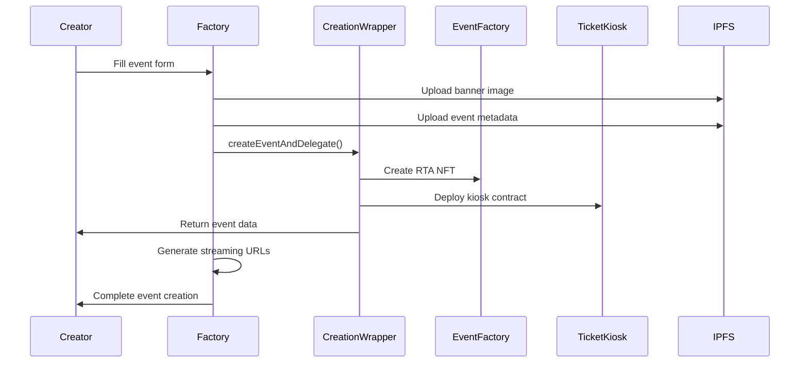

The Factory is where creators mint new Real-Time Asset events. It handles the complete event creation process, from metadata upload to smart contract deployment to streaming URL generation.

## Event Creation Process

### 1. Event Details

**Required Information**:
- **Title**: Event name (appears in kiosk listings)
- **Description**: Detailed event information for potential attendees
- **Category**: Select from supported [performance types](/core/performance-types)
- **Banner Image**: Visual representation (optional, uploaded to IPFS)

**Category Selection**:
The Factory supports six performance categories, each with distinct audience expectations and monetization patterns:

- `standup-comedy` - Live comedy performances
- `poetry-slam` - Spoken word and poetry
- `performance-art` - Contemporary dance and experimental art
- `improv` - Improvisational theater and comedy
- `live-streaming` - Real-time art creation and workshops
- `podcasting` - Live conversations and interviews

### 2. Event Scheduling

**Date & Time Configuration**:
- Date selection via calendar widget
- Time specification in 24-hour format
- Timezone automatically detected from user browser

**Duration Options**:
- **15 minutes**: Quick performances, poetry readings
- **30 minutes**: Standard sets, workshops
- **60 minutes**: Full shows, comprehensive content

Duration affects default pricing calculations (`duration / 5` SEI).

### 3. Monetization Settings

**Reserve Price**:
- **Default calculation**: Event duration ÷ 5 (e.g., 30 min = 6 SEI)
- **Custom pricing**: Override with specific reserve price
- **Purpose**: Minimum value threshold for RTA finalization

**Ticket Configuration**:
- **Ticket price**: Access fee for live event (defaults to reserve price)
- **Ticket quantity**: Maximum attendees (default: 100)
- **No cap option**: Unlimited ticket sales

**Revenue Distribution**:
- **Without curation**: 80% creator, 20% platform
- **With curation**: 70% creator, 30% platform + curation services

## Technical Implementation

### Smart Contract Flow



### CreationWrapper Contract

The Factory uses the `CreationWrapper` contract to perform multiple operations atomically:

```solidity
function createEventAndDelegate(
    uint256 startDate,        // Unix timestamp
    uint256 eventDuration,    // Duration in minutes
    uint256 reservePrice,     // Reserve price in wei
    string metadataURI,       // IPFS metadata hash
    string artCategory,       // Performance category
    uint256 ticketsAmount,    // Maximum tickets
    uint256 ticketPrice,      // Ticket price in wei
    address delegatee         // Usually creator address
) external
```

This single transaction:
1. Mints RTA NFT in EventFactory
2. Deploys dedicated TicketKiosk contract
3. Configures revenue distribution (80% creator, 20% treasury)
4. Sets event timing and pricing parameters

### Metadata Structure

Event metadata follows a standardized format uploaded to IPFS:

```json
{
  "name": "Event Title",
  "description": "Event description text",
  "image": "ipfs://banner-image-hash",
  "category": "standup-comedy",
  "duration": 30,
  "chunks": [],
  "attributes": [
    {
      "trait_type": "Category",
      "value": "Standup Comedy"
    },
    {
      "trait_type": "Duration", 
      "value": 30
    },
    {
      "trait_type": "Reserve Price",
      "value": 6
    },
    {
      "trait_type": "Ticket Price",
      "value": 6
    },
    {
      "trait_type": "Max Tickets", 
      "value": 100
    }
  ]
}
```

This approach eliminates backend dependencies while ensuring reliable streaming infrastructure.

## Creation Progress Tracking

### Multi-Step Process

The Factory provides real-time feedback during event creation:

1. **Image Upload**: Banner upload to Pinata IPFS (if provided)
2. **Metadata Upload**: Structured event data to IPFS
3. **Contract Simulation**: Validate transaction before execution
4. **Transaction Execution**: Submit to blockchain
5. **Confirmation**: Wait for transaction mining
6. **Verification**: Confirm event creation and kiosk deployment
7. **URL Generation**: Create streaming and room URLs

### Error Handling

Common failure points and recovery:

- **IPFS Upload Failures**: Retry with exponential backoff
- **Gas Estimation Errors**: Suggest gas price adjustment
- **Transaction Reversion**: Parse contract error messages for user guidance
- **Network Issues**: Detect and suggest network switching

### Success Verification

After successful creation, the Factory verifies:

- **Event data** retrieved from EventFactory contract
- **TicketKiosk deployment** at returned address
- **Metadata accessibility** via IPFS gateway
- **Streaming URLs** generated correctly

## User Experience Flow

### Form Validation

Real-time validation prevents common errors:

- **Date validation**: Must be future date
- **Time validation**: Reasonable scheduling (not too far future)
- **Price validation**: Positive numbers, reasonable ranges
- **Image validation**: File size and format restrictions

### Default Value Logic

Smart defaults reduce friction:

- **Pricing**: Automatic calculation based on duration
- **Timing**: Default to 7 PM local time
- **Tickets**: 100 ticket default with unlimited option
- **Duration**: 30-minute default for most categories

### Progress Indicators

Visual feedback throughout creation:
- Progress bar with step completion
- Real-time status messages
- Transaction hash display for blockchain tracking
- Success page with event links

## Integration with Other Services

### Curation System

Events can optionally integrate with [autonomous curation](/core/autonomous-curation-agency):

- **Automatic detection**: System identifies events that could benefit from curation
- **Scope selection**: Choose from Planner, Promoter, or Producer services
- **Revenue adjustment**: Curation fees deducted from creator percentage

### Streaming Infrastructure

Factory coordinates with streaming infrastructure:

- **URL reservation**: Pre-generate streaming endpoints
- **Timing validation**: Ensure events are scheduled appropriately
- **Capacity planning**: Consider concurrent event limitations

### Chat System

XMTP group creation for event communities:

- **Group initialization**: Create optimistic groups at event creation
- **Access control**: Link group membership to ticket ownership
- **Creator management**: Grant creators group administration rights

## Best Practices

### Event Planning

**Scheduling**:
- Allow sufficient promotion time (1-7 days advance notice)
- Consider time zone implications for target audience
- Avoid scheduling conflicts with major events

**Pricing Strategy**:
- Start with default pricing for first events
- Adjust based on audience response and engagement
- Consider value relative to similar offline events

**Content Preparation**:
- Plan performance structure for chosen duration
- Prepare backup content in case of technical issues
- Test streaming setup before live event

### Technical Considerations

**Banner Images**:
- Optimal size: 1200x630 pixels (Facebook cover format)
- File formats: JPG, PNG, WebP
- File size: Under 2MB for fast loading

**Metadata**:
- Clear, engaging event descriptions
- Accurate category selection for proper discovery
- Honest duration estimates for audience planning

## Next Steps

After creating an event:

1. **Share your event** link to build audience
2. **Prepare your performance** content and setup
3. **Test streaming** before going live
4. **Engage with your community** through social channels
5. **Go live** in your [event room](/core/room) at scheduled time

## Related Documentation

- [Performance Types](/core/performance-types) - Choose the right category
- [Room](/core/room) - Understand live event experience  
- [Autonomous Curation](/core/autonomous-curation-agency) - Enhance events with AI services
