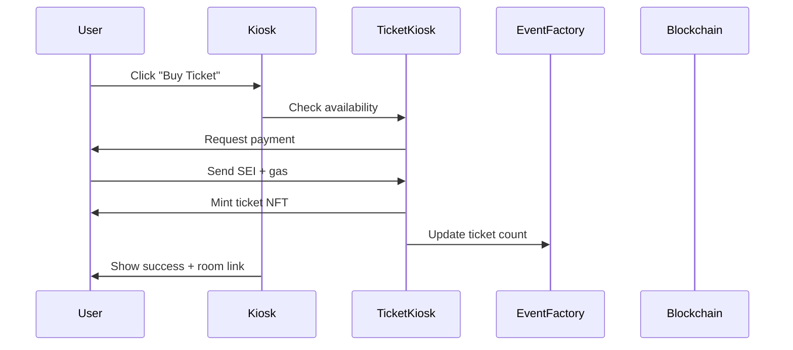

The Kiosk is the primary discovery interface where audiences browse upcoming events, purchase tickets, and explore the platform's live performance ecosystem.

All events created through the [Factory](/core/factory) become available in the Kiosk for ticket sales and community building.

## Event Discovery

### Event Listings

The Kiosk displays events in a grid layout with essential information:

- **Event banner** (or generated placeholder)
- **Event title** and creator information
- **Performance category** with visual icons
- **Event timing** (date, duration, time until start)
- **Pricing** (ticket price, current tip total)
- **Capacity** (tickets sold vs. available)

### Filtering & Search

**Category Filters**:
Filter by specific performance types:
- Standup Comedy
- Poetry Slam  
- Performance Art
- Improv
- Live Streaming
- Podcasting

**Search Functionality**:
- Text search across event titles and descriptions
- Creator name searching
- Real-time results with highlighting

**Sort Options**:
- **Date (Earliest)**: Upcoming events first
- **Date (Latest)**: Future events first  
- **Price (Low to High)**: Most affordable first
- **Price (High to Low)**: Premium events first

**Additional Filters**:
- **Price range slider**: Filter by ticket price (0-50 SEI)
- **Show past events**: View completed events for reference

### Event Status Indicators

Events display different states:

- **Upcoming**: Scheduled for future, tickets available
- **Live**: Currently streaming, may still accept viewers
- **Completed**: Event finished, NFT may be available
- **Sold Out**: No tickets remaining

## Ticket Purchase Flow

### Access Requirements

To purchase tickets, users must:

1. **Connect wallet** (MetaMask or WalletConnect)
2. **Switch to Sei network** (automatic prompt if needed)
3. **Have sufficient SEI balance** for ticket price + gas fees

### Purchase Process



### Ticket Verification

Each ticket purchase:

1. **Mints NFT ticket** with unique ID
2. **Updates event capacity** in real-time
3. **Grants access rights** to event room and chat
4. **Stores ownership** on-chain for verification

### Purchase States

Users see different button states based on context:

- **"Buy Ticket"**: Standard purchase flow
- **"Sold Out"**: No tickets available
- **"You Own Ticket"**: Already purchased, show room link
- **"Event Started"**: May still allow late entry
- **"Event Ended"**: Ticket sales closed

## Event Detail Views

### Expanded Event Information

Clicking events reveals detailed views:

- **Full description** from creator
- **Creator profile** information and past events
- **Event timeline** (creation date, start time, duration)
- **Ticket sales progress** (sold vs. available)
- **Current tip totals** (if event is live)
- **Community engagement** metrics

### Curation Status

Events may display curation indicators:

- **Curated events**: Show curation scope (Planner/Promoter/Producer)
- **Optimization suggestions**: Enhanced descriptions, pricing, scheduling
- **Community engagement**: Improved promotional reach

### Real-time Updates

Event cards update automatically:

- **Ticket counts** decrease as sales occur
- **Tip totals** increase during live events
- **Status changes** (upcoming → live → completed)
- **Price adjustments** if creators modify settings

## User Account Integration

### Ticket History

The Kiosk tracks user activity:

- **Owned tickets** highlighted across all events
- **Past attendance** history with event records
- **Upcoming events** with reminder capabilities
- **Creator following** for notification preferences

### Personalization

Regular users experience:

- **Recommended events** based on past attendance
- **Category preferences** from viewing history
- **Price range suggestions** based on spending patterns
- **Creator notifications** for followed performers

## Technical Implementation

### Event Data Fetching

The Kiosk loads event data from multiple sources:

```typescript
// Simplified data flow
async function loadEvents() {
  // 1. Get events from EventFactory contract
  const totalEvents = await eventFactory.totalEvents()
  
  // 2. Load each event's details
  for (let i = 0; i < totalEvents; i++) {
    const eventData = await eventFactory.getEvent(i)
    const kioskData = await ticketKiosk.getSalesInfo()
    const metadata = await fetchFromIPFS(eventData.metadataURI)
    
    // 3. Combine on-chain and IPFS data
    const enrichedEvent = {
      ...eventData,
      ...kioskData, 
      ...metadata,
      status: determineEventStatus(eventData)
    }
  }
}
```

### Real-time Synchronization

The Kiosk maintains current state through:

- **Contract event listening**: Watch for new events and ticket sales
- **Periodic polling**: Refresh event data every 30 seconds
- **User action updates**: Immediate state updates after purchases
- **WebSocket connections**: Real-time tip updates during live events

### Performance Optimization

Large event sets are handled efficiently:

- **Lazy loading**: Load additional events as users scroll
- **Image optimization**: Responsive images with fallbacks
- **Caching**: IPFS metadata cached locally
- **Pagination**: Server-side pagination for historical events

## Integration Points

### Room Access

Successful ticket purchases:

1. **Generate room URLs** for event access
2. **Initialize XMTP chat** group membership
3. **Enable tipping permissions** during live events
4. **Provide streaming access** to WebRTC endpoints

### Creator Dashboard

Creators see enhanced views:

- **Their events highlighted** with management options
- **Real-time analytics** for their events
- **Revenue tracking** across all events
- **Audience engagement** metrics

### Curation Workflow

Events may trigger curation flows:

- **Automatic detection** of events that could benefit from optimization
- **Scope recommendations** based on event characteristics
- **Integration with agent services** for enhanced promotion

## Error Handling

### Common Issues

**Insufficient Balance**:
- Clear error messages with current balance display
- Gas fee estimation and total cost breakdown
- Links to exchanges or faucets for acquiring SEI

**Network Issues**:
- Automatic network detection and switching prompts
- Fallback RPC endpoints for reliability
- Retry mechanisms for failed transactions

**Sold Out Events**:
- Real-time capacity updates to prevent overselling
- Waitlist functionality for high-demand events
- Alternative event recommendations

### Transaction Failures

Failed purchases receive:
- **Clear error explanations** in user-friendly language
- **Recovery suggestions** (retry, check balance, contact support)
- **Transaction hash** for blockchain debugging
- **Support contact** information for persistent issues

## Mobile Experience

### Responsive Design

The Kiosk adapts to mobile devices:

- **Touch-optimized** card interactions
- **Simplified filtering** with mobile-friendly controls
- **Optimized images** for various screen sizes
- **Streamlined purchase** flow for smaller screens

### Performance Considerations

Mobile optimization includes:
- **Reduced data usage** with compressed images
- **Faster loading** with lazy-loaded content
- **Offline capability** for previously viewed events
- **Progressive web app** features for native-like experience

## Next Steps

After purchasing tickets:

1. **Join the event room** at scheduled time
2. **Participate in pre-event chat** to connect with community
3. **Prepare for live interaction** through tips and messages
4. **Share the event** to support creators

## Related Documentation

- [Factory](/core/factory) - How events are created
- [Room](/core/room) - Live event experience
- [Performance Types](/core/performance-types) - Understanding categories
