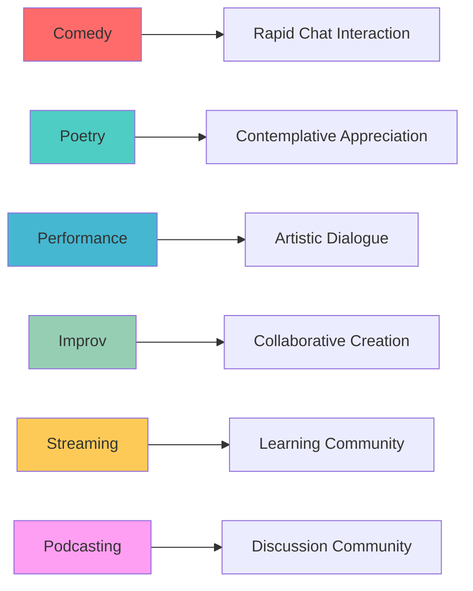

haus²⁵ is specifically designed for live performance art categories that benefit from real-time audience interaction and community building.

Each category has been carefully considered for its compatibility with livestreaming, tipping dynamics, and NFT collectibility.

## Supported Categories

### Standup Comedy

**Perfect for**: Professional comedians, open mic performers, comedy show producers

**Platform benefits**:
- Live audience feedback through tipping and chat
- Build fan communities around comedy personas
- Monetize both live performances and recorded content
- Test new material with engaged audiences

**Typical events**:
- 15-30 minute comedy sets
- Open mic nights with multiple performers
- Comedy workshops and Q&A sessions

### Poetry Slam

**Perfect for**: Spoken word artists, poets, literary performers

**Platform benefits**:
- Intimate connection with poetry audiences
- Real-time appreciation through tips during performances
- Preserve ephemeral spoken word art as permanent NFTs
- Cross-cultural poetry exchange and community

**Typical events**:
- Individual poetry performances (15-30 minutes)
- Multi-poet slam competitions
- Poetry workshops and collaborative writing

### Performance Art

**Perfect for**: Contemporary dancers, experimental artists, multimedia performers

**Platform benefits**:
- Document process-based art that's typically ephemeral
- Global reach for experimental work
- Real-time audience participation in art creation
- Bridge physical and digital art spaces

**Typical events**:
- Dance performances and movement pieces
- Experimental art happenings
- Collaborative audience-artist experiences

### Improv

**Perfect for**: Improvisational theater groups, solo improvisers, comedy teams

**Platform benefits**:
- Audience suggestions through chat integration
- Real-time feedback shapes performance direction
- Build communities around specific improv formats
- Preserve spontaneous creative moments

**Typical events**:
- Interactive improv shows with audience participation
- Improv training and workshops
- Long-form narrative improvisation

### Live Streaming

**Perfect for**: Visual artists, makers, creators documenting their process

**Platform benefits**:
- Monetize the creative process, not just final products
- Build audiences around artistic practice
- Real-time Q&A and technique sharing
- Educational content with direct creator support

**Typical events**:
- Painting, drawing, or sculpture creation sessions
- Craft and making tutorials
- Artist studio visits and process documentation

### Podcasting

**Perfect for**: Independent podcasters, interview shows, live conversations

**Platform benefits**:
- Direct listener support through real-time tipping
- Premium live episodes for ticket holders
- Build stronger connections with podcast communities
- Preserve special live episodes as collectible content

**Typical events**:
- Live podcast recordings with audience participation
- Author interviews and book discussions
- Topic-specific deep dives and conversations

## Event Duration Guidelines

### 15-Minute Events
- **Best for**: Quick sets, poetry readings, short performances
- **Default pricing**: 3 SEI reserve price, 3 SEI ticket price
- **Target audience**: Casual attendees, lunch-break entertainment

### 30-Minute Events  
- **Best for**: Standard comedy sets, workshop sessions, interviews
- **Default pricing**: 6 SEI reserve price, 6 SEI ticket price
- **Target audience**: Engaged fans, skill-learning audiences

### 60-Minute Events
- **Best for**: Full shows, multi-act performances, comprehensive workshops
- **Default pricing**: 12 SEI reserve price, 12 SEI ticket price
- **Target audience**: Dedicated supporters, premium content consumers

## Category-Specific Features

### Ticketing Strategy

**Comedy & Improv**: Higher ticket volumes, community building focus
**Poetry & Performance**: Smaller, intimate audiences, higher per-ticket value
**Streaming & Podcasting**: Mixed model with both free and premium content

### Tipping Patterns

**Live interaction categories** (Comedy, Improv): More frequent small tips
**Artistic process categories** (Streaming, Performance): Fewer, larger appreciation tips
**Educational categories** (Podcasting): Tips often after valuable insights

### Community Dynamics

Each category develops distinct community patterns:

## Why These Categories?

### Live Performance Focus
haus²⁵ prioritizes categories where the live experience adds significant value over recorded content:

- **Real-time interaction** enhances the performance
- **Audience participation** becomes part of the creative process
- **Spontaneity and improvisation** create unique, unrepeatable moments
- **Community building** around shared live experiences

### Underserved by Traditional Platforms

These categories often struggle on traditional streaming platforms:

- **YouTube/Twitch**: Optimized for gaming and vlogging, poor discovery for performance art
- **TikTok/Instagram**: Short-form only, difficult monetization for longer performances
- **Patreon**: Subscription model doesn't match live event economics
- **OnlyFans**: Content restrictions limit artistic expression

### Web3 Native Benefits

Performance art categories benefit uniquely from blockchain integration:

- **NFT preservation** of ephemeral art forms
- **Direct creator monetization** without platform middlemen  
- **Global accessibility** without traditional venue limitations
- **Transparent value exchange** between creators and audiences

## Getting Started

1. **Choose your category** based on your artistic practice
2. **Plan event duration** using the guidelines above
3. **Set pricing** using default suggestions or custom amounts
4. **Create your first event** in the [Factory](/core/factory)
5. **Build your community** through consistent scheduling and engagement

## Next Steps

- Learn about [event creation](/core/factory) process
- Explore [room dynamics](/core/room) during live events
- Understand [monetization strategies](/core/autonomous-curation-agency) with curation
