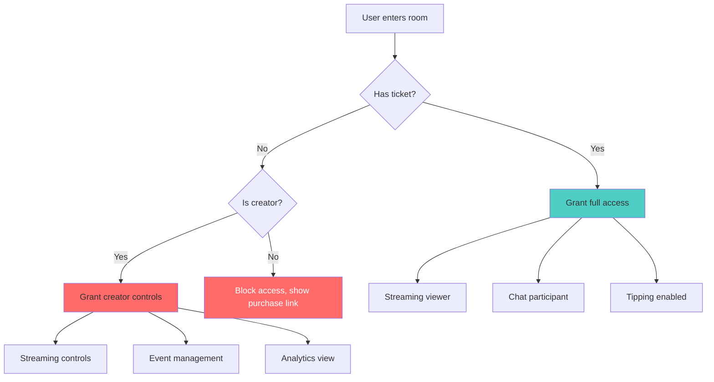
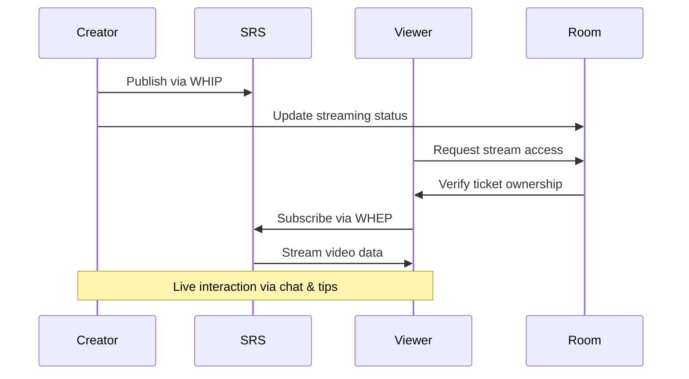
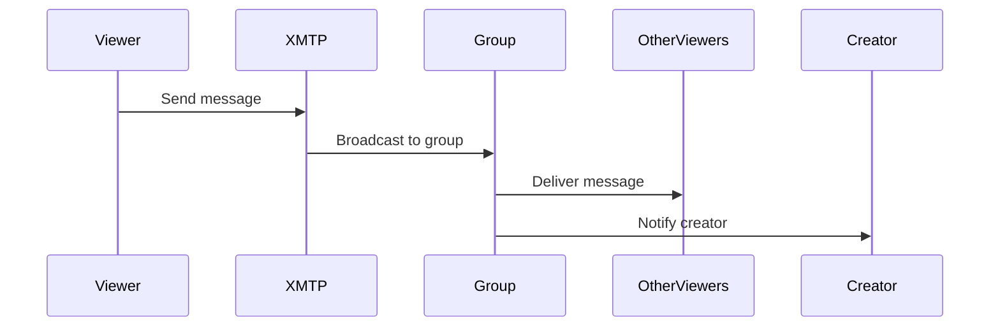

The Room is where live events happen. It combines WebRTC streaming, real-time chat, live tipping, and community interaction into a unified experience for both creators and audiences.

Each event gets a dedicated room accessible only to ticket holders and creators.

## Room Architecture

### Access Control

Room entry requires verification:

- **Creators**: Full control over streaming and event management
- **Ticket holders**: Verified access through on-chain ticket ownership
- **Non-ticket holders**: Blocked with purchase prompts



### Event Timing

Rooms respect blockchain-defined event schedules:

- **Pre-event**: Access granted, chat available, streaming inactive
- **Live event**: Full functionality active
- **Post-event**: Viewing completed content, tipping disabled

Event timing validation uses on-chain data:

```typescript
async function validateEventTiming(eventId: number) {
  const eventDetails = await eventFactory.getEvent(eventId)
  const now = Date.now()
  const startTime = Number(eventDetails.startDate) * 1000
  const endTime = startTime + (Number(eventDetails.eventDuration) * 60 * 1000)
  
  if (now < startTime) return 'upcoming'
  if (now <= endTime) return 'live'
  return 'ended'
}
```

## Streaming System

### Creator Controls

**Stream Management**:
- **Start/Stop streaming** with WebRTC publishing
- **Camera toggle** for video on/off
- **Microphone toggle** for audio control
- **Quality settings** for bandwidth optimization

**Visual Feedback**:
- **Live indicator**: Red "LIVE" badge when streaming
- **Viewer count**: Real-time audience size
- **Connection status**: WebRTC connection health
- **Duration tracking**: Time elapsed since stream start

### Viewer Experience

**Stream Display**:
- **Full-screen video** with overlay controls
- **Responsive sizing** for different screen sizes
- **Loading states** while connecting to stream
- **Error recovery** for connection issues

**Quality Adaptation**:
- **Automatic bitrate** adjustment based on connection
- **Manual quality** selection when available
- **Fallback options** for poor connections

### Technical Implementation

**WebRTC Flow**:



**URL Generation**:
Streaming URLs are generated deterministically:

```typescript
function generateStreamUrls(eventId: string) {
  return {
    // Creator publishing
    whipUrl: `https://room.haus25.live/rtc/v1/whip/?app=live&stream=${eventId}`,
    // Viewer subscription  
    whepUrl: `https://room.haus25.live/rtc/v1/whep/?app=live&stream=${eventId}`,
    // Fallback options
    streamUrl: `rtmp://room.haus25.live:1935/live/${eventId}`,
    playUrl: `https://room.haus25.live:8080/live/${eventId}.flv`
  }
}
```

## Chat Integration

### XMTP Implementation

Real-time chat uses XMTP protocol:

**Group Creation** (Creator only):
- **Optimistic groups** created at event creation
- **Participant addition** when tickets are purchased
- **Access control** through blockchain verification

**Message Flow**:



### Chat Features

**Message Types**:
- **Text messages**: Standard chat functionality
- **Reactions**: Quick emotional responses  
- **System messages**: Tip notifications, user joins
- **Moderation**: Creator controls for disruptive users

**User Experience**:
- **Real-time updates** with message streaming
- **User identification** through wallet addresses
- **Message history** loading for late joiners
- **Mobile-optimized** touch interfaces

## Live Tipping System

### Tipping Mechanics

**Access Requirements**:
- **Ticket ownership**: Verified on-chain
- **Event timing**: Only during live streaming
- **Sufficient balance**: SEI balance + gas fees

**Tipping Flow**:

```typescript
async function sendTip(eventId: string, amount: string, message: string) {
  // 1. Validate event is tippable
  const isTippable = await liveTipping.isEventTippable(eventId)
  if (!isTippable) throw new Error('Event not accepting tips')
  
  // 2. Send tip transaction
  const tx = await liveTipping.sendTip(eventId, message, {
    value: parseEther(amount)
  })
  
  // 3. Wait for confirmation
  await tx.wait()
  
  // 4. Update UI with new tip
  updateTipDisplay(eventId, amount, message)
}
```

### Tip Display

**Real-time Updates**:
- **Individual tips** shown in chat with amounts
- **Running total** displayed prominently
- **Reserve progress** toward minimum payout
- **Highest tipper** recognition

**Visual Feedback**:
- **Animation effects** for incoming tips
- **Sound notifications** for tip events (optional)
- **Leaderboard** showing top contributors
- **Progress bars** toward reserve price thresholds

## Creator Experience

### Event Management

**Pre-Event Setup**:
- **Test streaming** connection before going live
- **Chat monitoring** for early arrivals and questions
- **Technical checks** for audio/video quality
- **Audience engagement** building anticipation

**Live Management**:
- **Stream controls** accessible without interrupting performance
- **Real-time analytics** showing engagement metrics
- **Chat moderation** for community management
- **Tip acknowledgment** during natural breaks

### Analytics Dashboard

**Real-time Metrics**:
- **Viewer count** with join/leave tracking
- **Tip totals** with individual contribution breakdown
- **Chat activity** showing engagement levels
- **Technical metrics** (connection quality, stream health)

**Performance Tracking**:
- **Revenue accumulation** toward reserve price
- **Audience retention** throughout event duration
- **Peak concurrent viewers** and optimal timing
- **Community growth** with new vs. returning attendees

## Viewer Experience

### Engagement Options

**Participation Methods**:
- **Live chat** for community interaction
- **Tipping** to show appreciation and support
- **Reactions** for quick feedback
- **Social sharing** to promote events

**Viewing Controls**:
- **Video quality** selection when available
- **Volume control** independent from device
- **Fullscreen mode** for immersive experience
- **Picture-in-picture** for multitasking

### Community Features

**Social Elements**:
- **User recognition** for frequent attendees
- **Tip leaderboards** showing community support
- **Creator interaction** through direct responses
- **Event memories** preserved as NFT ownership

**Cross-Event Community**:
- **Creator following** for event notifications
- **Community building** across multiple events
- **Network effects** through shared attendance
- **Reputation building** through consistent participation

## Mobile Optimization

### Touch Interface

**Gesture Controls**:
- **Tap to show/hide** overlay controls
- **Pinch to zoom** on video content
- **Swipe gestures** for chat navigation
- **Long press** for additional options

**Mobile-Specific Features**:
- **Portrait mode** optimization
- **Reduced data usage** options
- **Background audio** for multitasking
- **Native sharing** integration

## Error Handling & Recovery

### Common Issues

**Connection Problems**:
- **Automatic reconnection** for temporary disruptions
- **Quality downgrade** for bandwidth issues
- **Alternative endpoints** for routing problems
- **Clear error messages** with recovery instructions

**Access Issues**:
- **Real-time verification** of ticket ownership
- **Network switching** prompts for wrong blockchain
- **Balance checking** before tip attempts
- **Support contact** for persistent problems

### Graceful Degradation

**Fallback Options**:
- **Audio-only mode** for video connection issues
- **Chat-only experience** if streaming fails
- **Delayed content** for post-event access
- **Mobile web** alternatives to app issues

## Integration with Storage

### Content Preservation

**Automatic Recording**:
- **60-second chunks** uploaded to Filecoin during streaming
- **Metadata compilation** for complete event records
- **PDP verification** for storage proof
- **CDN distribution** for fast retrieval

**Post-Event Access**:
- **Permanent URLs** for recorded content
- **Chapter navigation** through video chunks
- **Download options** for ticket holders
- **NFT integration** with final content

## Next Steps

After experiencing a room:

1. **Follow creators** for future event notifications
2. **Share experiences** to build community
3. **Explore other events** in similar categories
4. **Consider creating** your own events

## Related Documentation

- [Factory](/core/factory) - How to create events that generate rooms
- [Kiosk](/core/kiosk) - Discovering and accessing events
- [Streaming Infrastructure](/infra/srs) - Technical details behind live streaming
