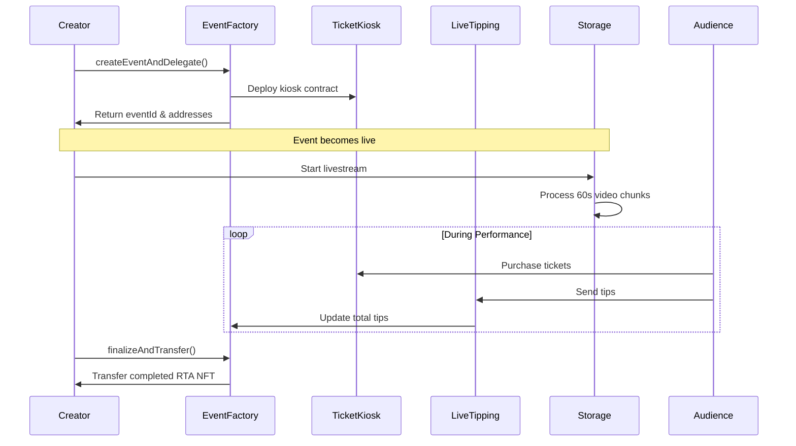

The Real-Time Asset (RTA) protocol introduces a new asset class: **assets that acquire value in real-time** while live performances are being created.

Unlike traditional NFTs that represent static content, RTAs evolve dynamically during live events, with their market value gets determined by real-time audience participation and tipping.

## What are Real-Time Assets?

Real-Time Assets are video NFTs that:

1. **Start as empty containers** when events are created
2. **Accumulate content** during live performances (60-second video chunks)
3. **Acquire value** through live tipping and audience engagement
4. **Become finalized** as complete video NFTs after events end

### Dynamic Value Acquisition

RTAs introduce a new mechanism for price discovery:

- **Initial state**: Event creation sets a reserve price
- **Real-time growth**: Live tipping increases the asset's market value
- **Community-driven**: Audience participation determines final worth
- **Transparent process**: All value changes visible on-chain

## Technical Implementation

### Contract Architecture



### Data Flow

The RTA protocol coordinates several on-chain and off-chain systems:

- **EventFactory**: Creates events, manages RTAs, handles finalization
- **TicketKiosk**: Per-event ticket sales and access control
- **LiveTipping**: Real-time value accumulation during performances
- **Storage Service**: Video chunk processing and Filecoin storage
- **XMTP**: Real-time chat and community interaction

### Delegation Pattern

Events use a delegation pattern for efficiency:

1. **Initial ownership**: Creator owns the RTA during creation and performance
2. **Dynamic period**: RTA accumulates value and content while delegated and livestreamed
3. **Finalization**: `finalizeAndTransfer()` makes the RTA complete (can no longer be modified) and transferable
4. **Post-delegation**: RTA becomes a standard NFT that can be traded or reproduced in playback in traditional streaming platform for royalties

This pattern ensures RTAs remain dynamic during performances while providing clear ownership transfer after completion.

## Value Mechanics

### Reserve Price Discovery

Events start with a reserve price based on:
- Event duration
- Category-specific factors
- Creator's pricing strategy
- Curators advice

### Live Tipping Integration

During performances, tips directly increase RTA value:

```typescript
function sendTip(eventId, amount) {
  // Tips accumulate in LiveTipping contract
  totalTips += amount
  
  // Updates RTA market value in real-time
  updateEventValue(eventId, totalTips)
}
```

### Revenue Distribution

The protocol distributes revenue efficiently:

- **70-80%** to creators (depending on curation level)
- **20%** to platform 
- **0-10%** to curation services

## Content Preservation

### Decentralized Storage

RTAs preserve performance content permanently:

1. **Live streaming** via WebRTC to SRS server
2. **Chunk processing** into 60-second video segments
3. **Filecoin upload** via Storacha for permanent storage
4. **Metadata compilation** with chunk references
5. **IPFS backup** for metadata and manifests

### Video Chunk Structure

Each RTA contains a collection of video chunks:

```json
{
  "chunks": [
    {
      "chunkId": "event_123_chunk_001",
      "cid": "bafybeifoo...",
      "duration": 60,
      "filcdnUrl": "https://w3s.link/ipfs/...",
      "pdpVerified": true
    }
  ]
}
```

## Comparison with Traditional NFTs

| Aspect | Traditional NFTs | Real-Time Assets |
|--------|------------------|-------------------|
| **Creation** | Static at mint | Dynamic during performance |
| **Value** | Fixed or market-driven | Real-time audience participation |
| **Content** | Complete at mint | Accumulated during event |
| **Ownership** | Immediate transfer | Delegated until finalization |
| **Utility** | Static representation | Live participation + final asset |

## Use Cases

### For Stand-up Comedians
- Create ticketed comedy shows
- Monetize through live audience tipping
- Build recurring revenue with fan community
- Provable ownership & continuous royalties for your performances

### For Slam Poets
- Host exclusive poetry events
- Engage audiences during performances
- Create collectible spoken word content
- Build community around artistic practice
- Provable ownership & continuous royalties for your performances


### For Performance Artists
- Experiment with live digital art
- Real-time audience interaction and feedback
- Document and monetize creative process
- Bridge physical and digital art spaces
- Provable ownership & continuous royalties for your performances

## Next Steps

- Explore [event creation](/core/factory) to create your first RTA
- Learn about [autonomous curation](/core/autonomous-curation-agency) services
- Understand the [technical infrastructure](/infra/srs) behind RTAs
