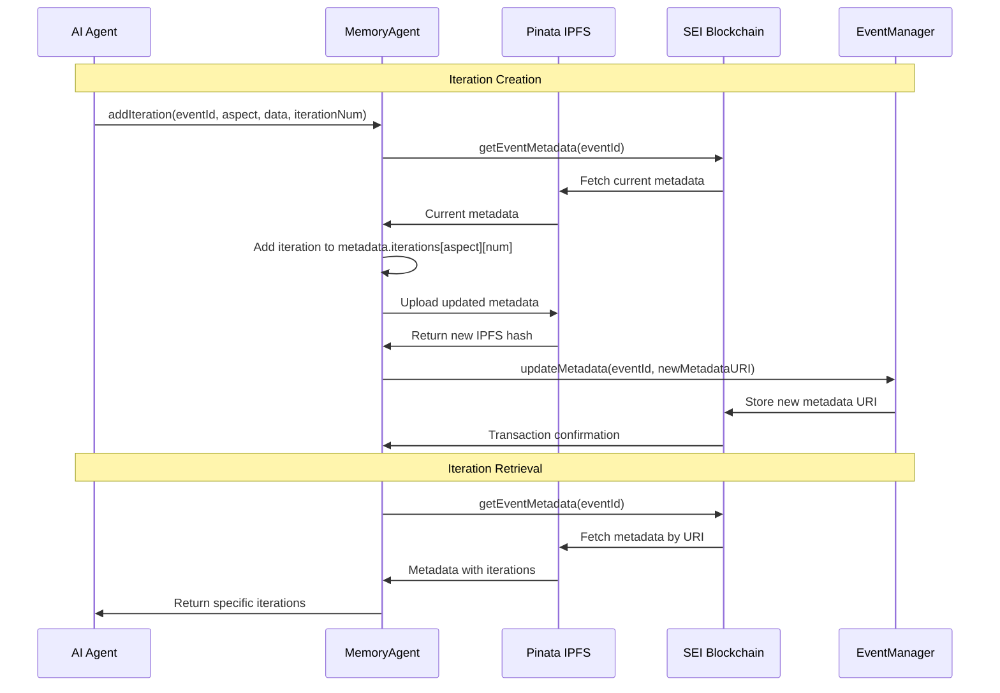

The on-chain iteration system represents a fundamental breakthrough in AI agent memory management. Unlike traditional agentic frameworks that rely on expensive vector databases or inconsistent local storage, haus²⁵ implements the first production-ready on-chain iteration system for AI memory and RAG operations.

## Technical Innovation

### Traditional AI Memory Problems

**Vector Database Costs**:
- Pinecone: $70/month for 10M vectors
- Weaviate: $25/month for basic plans
- ChromaDB: $0.20/hour for cloud hosting
- **Annual cost**: $300-840 per agent system

**Consistency Issues**:
- Cache invalidation across deployments
- Local storage conflicts between clients
- Memory loss during container restarts
- Inconsistent state between frontend and backend

**Scalability Limitations**:
- Database connection limits
- Vector search performance degradation
- Complex backup and recovery procedures
- Vendor lock-in risks

### haus²⁵ On-Chain Solution

**Cost Reduction**:
- **IPFS storage**: $0.10/GB via Pinata (one-time)
- **SEI transactions**: ~$0.001 per metadata update
- **Total cost**: **sub-$5/year** for 1000 events
- **Savings**: **100x cost reduction** vs traditional vector storage

**Consistency Guarantees**:
- **Immutable blockchain storage** as single source of truth
- **Content-addressed IPFS** ensures data integrity
- **Persistent across all deployments** eliminates cache issues
- **Universal access** from any client or service

**Scalability Advantages**:
- **No database connection limits**
- **Decentralized storage** improves global access
- **Built-in redundancy** through IPFS network
- **No vendor lock-in** with open protocols

## Implementation Architecture

### Memory Agent Structure
**Core Components**: SEI blockchain client with proxy account, Pinata JWT authentication, IPFS gateway configuration. Initializes with planner proxy private key and global whitelist permissions via createWalletClient with seiTestnet and publicActions extension.

```typescript
export class MemoryAgent {
  private client: any;           // SEI blockchain client
  private account: any;          // Proxy account with global whitelist
  private pinataJWT: string;     // IPFS storage authentication
  private pinataGateway: string; // IPFS retrieval endpoint

  constructor() {
    // Initialize with planner proxy private key
    const privateKey = process.env.PLANNER_PROXY_PRIVATE_KEY!;
    this.account = privateKeyToAccount(formattedKey as `0x${string}`);
    
    this.client = createWalletClient({
      account: this.account,
      chain: seiTestnet,
      transport: http(process.env.SEI_TESTNET_RPC!)
    }).extend(publicActions);
  }
}
```

### Iteration Storage Pattern
**Data Structure**: CurationIteration interface with aspect type, iteration number, original/proposed values, AI rationale, confidence score, timestamp, and source. EventMetadata extends standard NFT metadata with iterations object, status tracking, and curation scope identification.

**Data Structure**:
```typescript
interface CurationIteration {
  aspect: 'description' | 'pricing' | 'schedule' | 'banner' | 'title'
  iterationNumber: number        // Sequential iteration tracking
  originalValue: any            // Creator's original input (iteration #0)
  proposedValue: any           // AI-generated improvement
  rationale: string           // AI reasoning for changes
  confidence: number         // AI confidence score (0-1)
  timestamp: string         // ISO timestamp
  source: 'creator' | 'ai_plan' | 'feedback'
  feedback?: string        // User feedback that triggered iteration
}

// On-chain metadata structure
interface EventMetadata {
  // Standard NFT metadata
  name: string
  description: string  
  image: string
  attributes: Array<{trait_type: string, value: any}>
  
  // Curation-specific fields
  iterations?: {
    [aspect: string]: {
      [iterationNumber: number]: CurationIteration
    }
  }
  status: 'planning' | 'plan_ready' | 'accepted'
  curationScope?: 'planner' | 'promoter' | 'producer'
  acceptedAt?: string
}
```

### Storage Flow



## Key Implementation Details

### Iteration Numbering System

**Iteration #0**: Original creator input automatically stored when first iteration is added with source 'creator'.

**Iteration #1**: Initial AI plan generated by planner supervisor during /plan endpoint with source 'ai_plan'.

**Iteration #2+**: Feedback-driven refinements generated via /iterate endpoint with source 'feedback' and user feedback included.

### Metadata Updates via EventManager

**Smart Contract Integration**: EventManager updateMetadata function with onlyAuthorized modifier, _setTokenURI call, and MetadataUpdated event emission. MemoryAgent uses writeContract with global whitelist permission and transaction receipt confirmation.

### IPFS Storage Optimization

**Upload Pattern**: JSON metadata conversion to Blob, FormData construction with file and pinataMetadata (name, keyvalues, cidVersion), POST to Pinata pinning API with Bearer token authentication, returns IPFS hash with ipfs:// prefix.

## Advanced Features

### Iteration Lifecycle Management

**Adding Iterations**: Retrieves current metadata, initializes iterations structure if needed, stores original creator data as iteration #0, adds new iteration with timestamp and source classification, uploads to Pinata and updates on-chain.

**Retrieving Iterations**: Fetches event metadata and returns iterations for specified aspect or empty object if none exist.

### Plan Acceptance and Cleanup

**Selective Implementation**: Retrieves current metadata, applies selected iterations to main metadata fields (title→name, description, banner→image, pricing/schedule→attributes), sets status to 'accepted', removes iterations object, uploads final metadata and returns URI.

## Performance Characteristics

### Latency Analysis

**Operation Times**:
- **Read metadata**: 200-500ms (IPFS gateway)
- **Add iteration**: 2-4 seconds (IPFS upload + blockchain tx)
- **Accept plan**: 3-6 seconds (metadata compilation + storage)

**Optimization Strategies**: Parallel metadata operations using Promise.all for concurrent metadata retrieval and user history indexing. Future batch iteration updates to apply multiple iterations in single IPFS upload and blockchain transaction.

### Cost Analysis

**Per-Event Costs**:
- **IPFS storage**: $0.10/GB (typically <1MB per event = $0.0001)
- **SEI transactions**: ~$0.001 per update (5-10 updates per event)
- **Total per event**: **$0.005-0.01** for complete curation lifecycle

**Comparison with Traditional Approaches**:
| Method | Setup Cost | Per-Event Cost | Annual Cost (1000 events) |
|--------|------------|----------------|---------------------------|
| **Pinecone** | $70/month | $0.10 | $840 |
| **Weaviate** | $25/month | $0.05 | $350 |
| **ChromaDB** | $144/month | $0.20 | $1728 |
| **haus²⁵ On-Chain** | $0 | $0.01 | **$10** |

## Error Handling and Recovery

### Robust Error Patterns

**IPFS Upload Failures**: Retry logic with exponential backoff (3 attempts), error logging, and graceful failure handling.

**Blockchain Transaction Failures**: writeContract with 30-second timeout using Promise.race, transaction receipt validation, and comprehensive error logging.

### Graceful Degradation

**Fallback for Non-Numeric Event IDs**: Mock metadata generation for test events with non-numeric IDs, graceful handling with placeholder values and planning status.

## Future Enhancements

### Planned Optimizations

**Compression for Large Iterations**: Planned gzip compression for iteration data exceeding 10KB with compressed flag and content compression.

**Multi-Chain Support**:
- Polygon for lower costs
- Ethereum for maximum decentralization
- Arbitrum for faster finality

**Enhanced Caching**:
- Local SQLite cache for frequent reads
- Redis cache for shared server instances
- Content-addressed caching for IPFS content

## Related Documentation

- [Shared Agents](/curation/shared-agents) - How Memory Agent integrates with other agents
- [System Overview](/curation/system-overview) - Overall architecture context
- [Delegation and Proxy Patterns](/contracts/delegation-and-proxy-patterns) - Blockchain permission system
