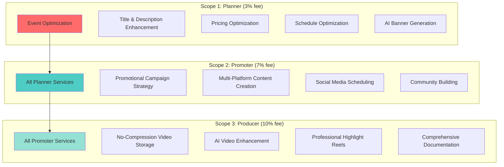

The haus²⁵ autonomous curation system offers three distinct service scopes, each providing increasing levels of AI-powered event optimization and promotional support. Each scope inherits capabilities from lower tiers while adding specialized agents and services.

## Scope Overview

## Service Progression

### Inheritance Model

Each scope builds upon the previous, providing cumulative value:

**Planner → Promoter**: Adds promotional expertise to optimized event foundations
**Promoter → Producer**: Adds post-production excellence to comprehensive promotion

### Fee Structure Rationale

- **3% fee (Planner)**: Core event optimization with minimal overhead
- **7% fee (Promoter)**: Includes promotional campaign development and execution
- **10% fee (Producer)**: Complete end-to-end service with premium post-production

## Technical Architecture

### Agent Distribution

**Shared Agents** (available to all scopes):
- RAG Agent: User history and contextual preferences
- Research Agent: Market intelligence and trend analysis  
- Memory Agent: On-chain iteration storage and retrieval
- Blockchain Agent: SEI integration and proxy management
- Trends Agent: Social media trend analysis
- Social Knowledge Agent: Platform specifications

**Scope-Specific Agents**:
- **Planner**: Title, Description, Pricing, Schedule, Banner agents
- **Promoter**: Content Manager, X, EventBrite, Facebook, Instagram agents
- **Producer**: Enhancement, Highlight, Documentation agents (planned)

### Proxy Management

Each scope operates through dedicated proxy addresses with global whitelist permissions:

- **Planner Proxy**: `0xF2aC15F3db8Fd24c83494fc7B2131A74DFCAA07b`
- **Promoter Proxy**: `0x27B8c4E2E6AaF49527b62278D834497BA344b90D`
- **Producer Proxy**: `0xEb215ba313c12D58417674c810bAcd6C6badAD61`

## Cost Analysis

### Per-Event Token Usage

**Planner**: ~3,700 tokens

**Promoter**: ~6,200 tokens  
- Estimated cost: $0.110
- Services: All Planner + promotional content

### Value Proposition

Traditional platforms (YouTube, Twitch) typically take 70-80% of creator revenue. haus²⁵ creators retain 90-97% while receiving professional AI curation services.

## Implementation Status

### Currently Available
- **Planner Scope**: Full implementation with all specialized agents
- **Promoter Scope**: Full implementation with promotional agents

### In Development
- **Producer Scope**: Architecture designed

## Related Documentation

- [Planner Scope](/curation/scopes/planner)
- [Promoter Scope](/curation/scopes/promoter)
- [Producer Scope](/curation/scopes/producer)
