The shared agents form the foundational layer of the haus²⁵ curation system, providing essential services that all specialized agents depend on. These agents implement advanced LangChainJS patterns and cost optimization strategies to ensure efficient operation across the entire multi-agent system.

## Agent Architecture

```mermaid
graph TB
    subgraph "Shared Agent Layer"
        RAG[RAG Agent<br/>GoogleEmbeddings + MemoryVectorStore]
        RES[Research Agent<br/>Multi-API + Gemini Analysis]
        MEM[Memory Agent<br/>On-Chain IPFS Storage]
        BC[Blockchain Agent<br/>SEI Integration + Proxy Management]
        TR[Trends Agent<br/>Apify + LangChain Summarization]
        SK[Social Knowledge Agent<br/>Platform Specifications]
    end
    
    subgraph "Data Sources"
        IPFS[Pinata IPFS<br/>User History Storage]
        GOOGLE[Google APIs<br/>Search + YouTube]
        YOUTUBE[YouTube Data API<br/>Video Trends]
        APIFY[Apify Platform<br/>Social Media Scraping]
        SEI[SEI Blockchain<br/>Event Data]
        PLATFORMS[Platform APIs<br/>Social Media Specs]
    end
    
    subgraph "LangChain Modules"
        EMB[GoogleGenerativeAIEmbeddings<br/>text-embedding-004]
        VS[MemoryVectorStore<br/>In-Memory Vector Search]
        SUM[LoadSummarizationChain<br/>Token Reduction]
        SPLIT[TokenTextSplitter<br/>Document Processing]
    end
    
    RAG --> EMB & VS & IPFS
    RES --> GOOGLE & YOUTUBE
    MEM --> IPFS & SEI
    BC --> SEI
    TR --> APIFY & SUM & SPLIT
    SK --> PLATFORMS
    
    style RAG fill:#ff9999
    style MEM fill:#99ff99
    style TR fill:#9999ff
    style BC fill:#ffff99
```

## RAG Agent

The RAG Agent provides contextual user history and preferences using LangChain's vector storage capabilities with significant cost optimizations.

### Technical Implementation

**Core Architecture**: GoogleGenerativeAIEmbeddings with text-embedding-004 model, MemoryVectorStore for in-memory operations, and file-based document persistence.

### User History Indexing

**Blockchain Data Integration**: Fetches creator events from EventFactory contract, retrieves metadata from IPFS via Pinata gateway, creates Document objects with event content and metadata, adds to vector store with deduplication checking.

### Cost Optimization Features

**Document Deduplication**:
- Checks existing cache before adding new documents
- Prevents redundant embeddings generation
- Reduces API calls to Google Embeddings

**File-Based Persistence**:
- Avoids expensive vector database costs
- Maintains state across service restarts
- Enables quick startup with cached embeddings

## Research Agent

The Research Agent provides market intelligence and trend analysis using multiple data sources with intelligent caching and cost reduction through LangChain summarization.

### Multi-Source Data Collection

**Google Custom Search Integration**: Category-specific trend research with 6-month date restriction, intelligent caching to avoid redundant API calls.

**YouTube Data API Integration**: Recent video analysis for performance trends and audience insights.

**Intelligent Analysis**: Gemini-powered insights generation with length constraints and JSON structure for pricing, timing, audience, trends, and keywords optimized for RTA events.

## Memory Agent

The Memory Agent implements the on-chain iteration system, providing persistent, cost-effective AI memory storage.

### On-Chain Storage Pattern

**EventManager Integration**: Planner proxy private key with global whitelist permissions, SEI testnet wallet client with public actions extension for contract interactions.

### Advantages Over Traditional Storage

**Cost Comparison**:
- **Traditional vector DB**: $300-840/year
- **On-chain storage**: sub-$10/year for 1000 events
- **Cost reduction**: 100x savings

**Consistency Benefits**:
- Single source of truth on blockchain
- No cache invalidation issues
- Persistent across all deployments
- Universal access from any client

## Blockchain Agent

The Blockchain Agent manages SEI testnet integration and proxy delegation patterns for secure contract interactions.

### Proxy Management

**Scope-Specific Initialization**: Dynamic private key selection based on curation scope (planner, promoter, producer) with fallback to planner proxy for unknown scopes.

## Trends Agent

The Trends Agent provides advanced social media trend analysis using Apify for data collection and LangChain summarization chains for cost optimization.

### Multi-Platform Scraping

**Apify Integration**: Dynamic client initialization with token authentication, cached results with timestamp tracking for efficiency.

### LangChain Summarization

**Token Reduction Strategy**: Document creation from Twitter content, TokenTextSplitter with 3000 chunk size and 200 overlap, LoadSummarizationChain with "refine" type for cost-effective processing of large social media datasets.

## Social Knowledge Agent

The Social Knowledge Agent maintains up-to-date platform specifications and requirements for multi-platform content optimization.

### Platform Specifications

**Comprehensive Platform Support**: Text limits, image specifications, video requirements, and optimal posting strategies for X/Twitter, Facebook, Instagram, and EventBrite platforms.

## Integration Patterns

### Shared Context Preparation

**Coordinated Data Collection**: Parallel execution of user history indexing, category research, and trends analysis to avoid redundant API calls across supervisors.

### Performance Monitoring

**Cost Tracking**: Token estimation across RAG embeddings (500), research analysis (1500), trends analysis (2000), and memory operations (100) for total ~4100 tokens per event.

## Related Documentation

- [System Overview](/curation/system-overview) - How shared agents fit into the overall architecture
- [On-Chain Iteration System](/curation/on-chain-iteration-system) - Memory Agent implementation details
- [StateGraph Pattern](/curation/stategraph-pattern) - Agent coordination patterns
