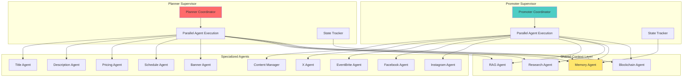

The haus²⁵ curation system implements LangGraphJS StateGraph patterns adapted for production efficiency and cost optimization. While inspired by LangGraph's hierarchical multi-agent coordination, the implementation prioritizes practical deployment needs over complex graph compilation.

## LangGraphJS Foundation

### StateGraph Inspiration

The system draws from LangGraphJS StateGraph concepts but simplifies implementation for production requirements:

**Traditional LangGraphJS Pattern**: StateGraph import, createSupervisor with agents array and LLM model, workflow compilation with MemorySaver checkpointer and InMemoryStore.

**haus²⁵ Adapted Pattern**: Direct PlannerSupervisor class with shared agents (RAG, Research, Memory, Blockchain) and specialized agents (Title, Description, Pricing, Schedule, Banner), simplified coordination without compilation overhead.

## Supervisor Orchestration Pattern

### Hierarchical Coordination



### Coordination Implementation

**Context Preparation Phase**:
```typescript
// Phase 1: Shared context preparation (LangGraph state management)
private async prepareSharedContext(eventData: any, userAddress: string) {
  const [userContext, researchData] = await Promise.all([
    this.rag.indexUserHistory(userAddress),
    this.research.researchCategory(eventData.category)
  ]);
  
  return { userContext, researchData };
}
```

**Agent Coordination Phase**:
```typescript
// Phase 2: Parallel agent execution with shared context
private async orchestratePlan(eventData: any, userAddress: string) {
  const sharedContext = await this.prepareSharedContext(eventData, userAddress);
  
  // LangGraph-inspired parallel agent execution
  const [title, description, pricing, schedule, banner] = await Promise.all([
    this.titleAgent.generateTitle(eventData, undefined, sharedContext.researchData),
    this.descriptionAgent.generateDescription(eventData, undefined, sharedContext.researchData),
    this.pricingAgent.generatePricing(eventData, undefined, sharedContext.researchData),
    this.scheduleAgent.generateSchedule(eventData, undefined, sharedContext.researchData),
    this.bannerAgent.generateBanner(eventData, undefined, sharedContext.researchData)
  ]);
  
  return this.structurePlan(title, description, pricing, schedule, banner);
}
```

## Simplified Graph Compilation

### No-Compilation Approach

Unlike LangGraphJS which requires explicit graph compilation, haus²⁵ uses direct method orchestration:

**LangGraphJS Approach**: createSupervisor compilation with checkpointer and store, runtime execution via compiledApp.invoke with messages array.

**haus²⁵ Simplified Approach**: Direct PlannerSupervisor with generatePlan method, orchestratePlan execution, state tracking, and error handling without compilation overhead.

## Multi-Level Hierarchy

### Scope-Based Supervision

**CurationCoordinator**: Top-level coordination with three supervisors (Planner, Promoter, Producer). Scope-based routing where Promoter inherits Planner capabilities plus promotional content, Producer includes full pipeline coordination.

## Memory Management Pattern

### LangGraph-Inspired Persistence

**Short-Term Memory** (equivalent to LangGraph checkpointer): ShortTermMemory class with sessionCache Map, setAgentState and getAgentState methods using session:agent keys with timestamps.

**Long-Term Memory** (equivalent to LangGraph store): LongTermMemory class with MemoryAgent integration, persistPlanState and retrievePlanHistory methods using on-chain iteration system.

## Performance Optimizations

### Context Efficiency

**Context Optimization**: ContextOptimizedSupervisor with contextCache Map, 5-minute cache expiry, userAddress:category cache keys, and fallback to fresh context preparation when cache misses.

### Cost Reduction Strategies

**Token Optimization**:
- **Shared context preparation**: Single research call shared across all agents
- **Model selection by task**: Gemini Flash for creative, Gemini Lite for analytical
- **Result caching**: 12-hour cache for category research data
- **Context filtering**: Agent-specific data extraction to reduce token usage

## Related Documentation

- [System Overview](/curation/system-overview) - Overall multi-agent architecture
- [Shared Agents](/curation/shared-agents) - Foundation agents used by supervisors
- [On-Chain Iteration System](/curation/on-chain-iteration-system) - State persistence implementation
