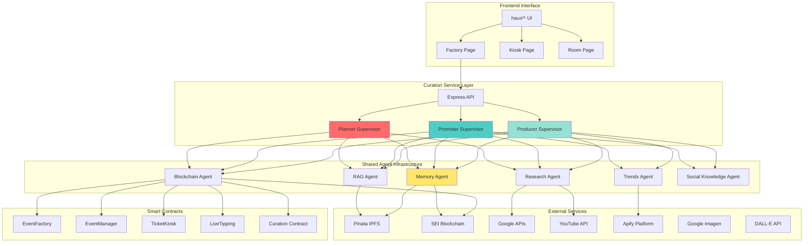
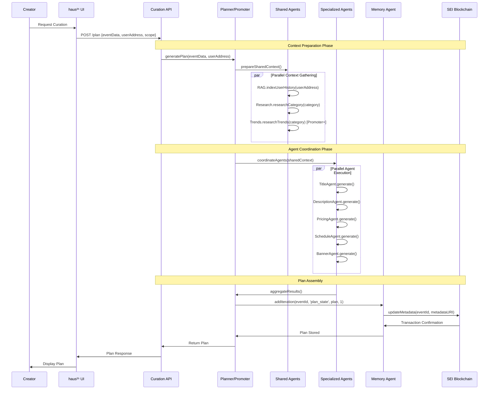
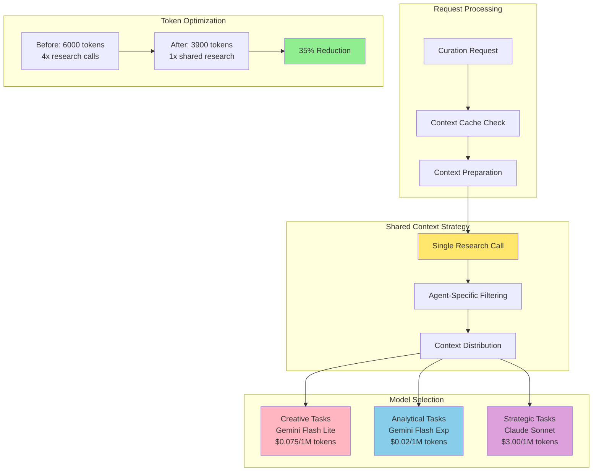

The haus²⁵ curation system implements complex multi-agent workflows with hierarchical coordination patterns. These diagrams illustrate the interconnections between services, agents, and data flows across the entire autonomous representation agency.

## Overall System Architecture

## Curation Request Flow

## Multi-Agent Coordination Pattern

```mermaid
graph TB
    subgraph "Supervisor Layer"
        PS[Planner Supervisor]
        PRS[Promoter Supervisor] 
        PDS[Producer Supervisor]
    end
    
    subgraph "Shared Context"
        SC[Shared Context Pool]
        RC[Research Cache]
        UC[User Context]
        TC[Trends Cache]
    end
    
    subgraph "Planner Agents"
        TA[Title Agent<br/>Gemini Flash]
        DA[Description Agent<br/>Gemini Flash]
        PA[Pricing Agent<br/>Gemini Lite]
        SA[Schedule Agent<br/>Gemini Lite]
        BA[Banner Agent<br/>Imagen/DALL-E]
    end
    
    subgraph "Promoter Agents"
        CM[Content Manager<br/>Claude Sonnet]
        XA[X Agent<br/>Claude Sonnet]
        EB[EventBrite Agent<br/>Claude Sonnet]
        FB[Facebook Agent<br/>Claude Sonnet]
        IG[Instagram Agent<br/>Claude/GPT-4o]
    end
    
    subgraph "Producer Agents"
        EA[Enhancement Agent<br/>Planned]
        HA[Highlight Agent<br/>Planned]
        DOC[Documentation Agent<br/>Planned]
    end
    
    PS --> SC
    PRS --> SC
    PDS --> SC
    
    SC --> RC & UC & TC
    
    PS --> TA & DA & PA & SA & BA
    PRS --> TA & DA & PA & SA & BA
    PRS --> CM & XA & EB & FB & IG
    PDS --> TA & DA & PA & SA & BA
    PDS --> CM & XA & EB & FB & IG
    PDS --> EA & HA & DOC
    
    style PS fill:#ff6b6b
    style PRS fill:#4ecdc4
    style PDS fill:#95e1d3
    style SC fill:#ffe66d
```

## Cost Optimization Flow

## Integration Points

The curation system integrates with multiple haus²⁵ services through well-defined interfaces:

### Frontend Integration
- **Factory Page**: Event creation with curation options
- **Kiosk Page**: Curated event discovery and filtering  
- **Room Page**: Live curation status and real-time optimization

### Blockchain Integration
- **EventFactory**: Event creation with curation metadata
- **EventManager**: Iteration storage and metadata updates
- **Curation Contract**: Scope-specific fee management and proxy delegation

### Infrastructure Integration
- **Storage Service**: Video processing coordination for Producer scope
- **Streaming Service**: Real-time optimization during live events
- **XMTP Service**: Community engagement strategy coordination

