The haus²⁵ autonomous curation system represents the first fully operational multi-agent representation agency for live performers. Built using LangChainJS modules and LangGraphJS patterns, it provides AI-powered event optimization from planning to promotion to post-production.

## Architecture Overview

The curation system implements a hierarchical multi-agent architecture where specialized agents are coordinated by supervisor agents across three distinct scopes.

```mermaid
graph TB
    subgraph "Curation Service"
        API[Express API Layer]
        PS[Planner Supervisor]
        PrS[Promoter Supervisor]
        PdS[Producer Supervisor]
    end
    
    subgraph "Shared Agents"
        RAG[RAG Agent<br/>LangChain VectorStore]
        RES[Research Agent<br/>Google + YouTube APIs]
        MEM[Memory Agent<br/>On-Chain Storage]
        BC[Blockchain Agent<br/>SEI Integration]
        TR[Trends Agent<br/>Apify + Summarization]
        SK[Social Knowledge Agent<br/>Platform Specifications]
    end
    
    subgraph "Specialized Agents"
        TA[Title Agent<br/>Gemini Flash]
        DA[Description Agent<br/>Gemini Flash]
        PA[Pricing Agent<br/>Gemini Lite]
        SA[Schedule Agent<br/>Gemini Lite]
        BA[Banner Agent<br/>Imagen + DALL-E]
        
        CM[Content Manager<br/>Claude Sonnet]
        XA[X Agent<br/>Claude Sonnet]
        EB[EventBrite Agent<br/>Claude Sonnet]
        FB[Facebook Agent<br/>Claude Sonnet]
        IG[Instagram Agent<br/>Claude + GPT-4o-mini]
    end
    
    subgraph "Storage & Blockchain"
        IPFS[Pinata IPFS<br/>Metadata Storage]
        EF[EventFactory<br/>Smart Contract]
        EM[EventManager<br/>Smart Contract]
        PM[Proxy Management<br/>Delegation Pattern]
    end
    
    API --> PS
    API --> PrS
    API --> PdS
    
    PS --> RAG & RES & MEM & BC
    PS --> TA & DA & PA & SA & BA
    
    PrS --> RAG & RES & MEM & BC & TR & SK
    PrS --> CM & XA & EB & FB & IG
    
    MEM --> IPFS
    MEM --> EM
    BC --> EF
    BC --> PM
    
    style PS fill:#ff6b6b
    style PrS fill:#4ecdc4
    style MEM fill:#ffe66d
    style BC fill:#a8e6cf
```

## Core Innovations

### 1. LangChainJS Module Integration

The system leverages multiple LangChainJS modules for cost-efficient operations:

**Embedding and Vector Storage**: GoogleGenerativeAIEmbeddings with MemoryVectorStore for user history indexing and contextual retrieval.

**Summarization Chains**: TokenTextSplitter combined with LoadSummarizationChain using "refine" type for cost reduction on large social media datasets.

**Multi-Model Orchestration**:
- **Gemini 2.5 Flash Lite**: Creative tasks (titles, descriptions)
- **Gemini 2.0 Flash Exp**: Analytical tasks (pricing, scheduling) 
- **Claude 3.5 Sonnet**: High-quality content strategy
- **GPT-4o-mini**: Specific platform optimizations

### 2. On-Chain Iteration System

Unlike traditional agentic frameworks that use expensive vector databases or inconsistent local storage, haus²⁵ implements the first on-chain iteration system for AI memory and RAG operations.

**Technical Advantages**:
- **100x cost reduction** compared to traditional vector storage
- **Immutable single source of truth** prevents cache inconsistencies
- **Persistent across deployments** eliminates data loss risks
- **Transparent audit trail** for all AI decisions

**Implementation Pattern**: Each iteration contains aspect type, iteration number, original/proposed values, AI rationale, confidence score, timestamp, and source. Storage flows through EventManager contract updates with Pinata IPFS metadata uploads.

### 3. Supervisor Orchestration Pattern

Based on LangGraphJS StateGraph patterns but simplified for production efficiency. PlannerSupervisor coordinates agents through two-phase execution: shared context preparation (user history indexing, category research) followed by parallel specialized agent execution (title, description, pricing, schedule, banner generation).

## Service Scopes

### Scope 1: Planner (3% fee)

**Specialized Agents**:
- **Title Agent**: Gemini Flash for creative title generation
- **Description Agent**: Gemini Flash for compelling descriptions  
- **Pricing Agent**: Gemini Lite for numerical optimization
- **Schedule Agent**: Gemini Lite for data-driven timing
- **Banner Agent**: Google Imagen + DALL-E fallback for visual content

**Services**:
- Enhanced event descriptions with engagement optimization
- Optimal scheduling recommendations based on audience data
- Reserve price optimization for maximum community participation
- Custom banner generation using AI art tools

### Scope 2: Promoter (7% fee)

**Inherits**: All Planner capabilities plus specialized promotional agents

**Specialized Agents**:
- **Content Manager**: Claude Sonnet for comprehensive strategy planning
- **X Agent**: Claude Sonnet for Twitter/X content creation
- **EventBrite Agent**: Claude Sonnet for event listing optimization
- **Facebook Agent**: Claude Sonnet for community-focused content
- **Instagram Agent**: Claude Sonnet + GPT-4o-mini for visual strategy

**Services**:
- Comprehensive promotional campaign development
- Social media content creation and scheduling
- Cross-platform promotion (Twitter, Instagram, Facebook, EventBrite)
- Community building and audience development strategies

### Scope 3: Producer (10% fee)

**Status**: Architecture designed, implementation pending

**Planned Services**:
- No-compression video storage for maximum quality preservation
- AI-powered video enhancement and post-processing
- Comprehensive event highlight reels and documentation
- Professional-grade metadata compilation and presentation

## Related Documentation

- [On-Chain Iteration System](/curation/on-chain-iteration-system) - Technical implementation details
- [Shared Agents](/curation/shared-agents) - RAG, Research, Memory, and Blockchain agents
- [StateGraph Pattern](/curation/stategraph-pattern) - LangGraphJS integration patterns
