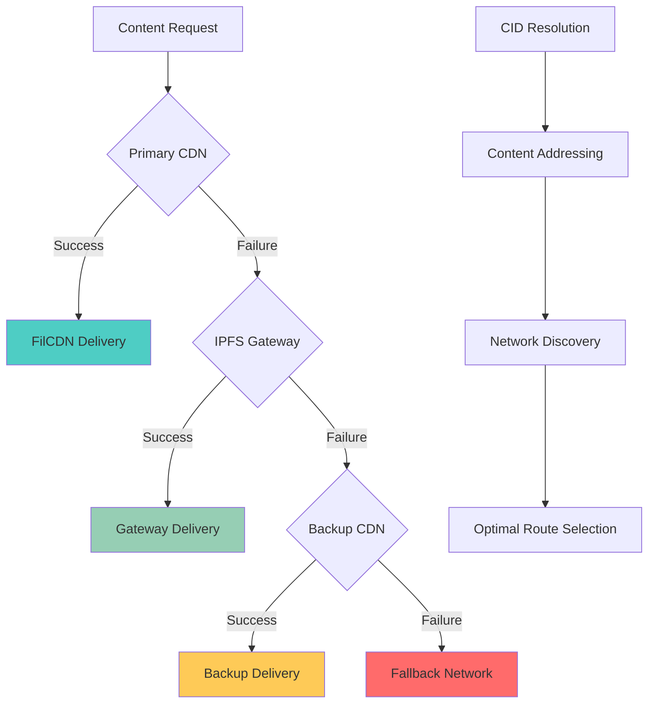

The content retrieval system ensures permanent access to stored performance videos through multiple redundant pathways, combining IPFS gateways, CDN distribution, and fallback mechanisms for reliable content delivery.

## Retrieval Architecture

### Multi-Path Strategy



### Retrieval Hierarchy

**Priority Order**:
1. **FilCDN** - Fast, Storacha-optimized delivery
2. **Primary IPFS Gateways** - Reliable public infrastructure
3. **Backup Gateways** - Additional redundancy
4. **Direct IPFS Network** - Decentralized fallback

## URL Generation Strategy

### Multi-URL Creation

**Multi-URL Creation**: generateRetrievalUrls function creates primary FilCDN URL, gateway arrays (w3s.link, Pinata, ipfs.io, Cloudflare), backup CDNs, and raw CID for direct IPFS access.

### Smart URL Selection

**Geographic Optimization**:
```typescript
async function selectOptimalGateway(
  urls: string[], 
  userLocation?: string
): Promise<string> {
  const regionalPreferences = {
    'US': ['w3s.link', 'gateway.pinata.cloud'],
    'EU': ['ipfs.io', 'cloudflare-ipfs.com'],
    'ASIA': ['dweb.link', 'gateway.ipfs.io'],
    'DEFAULT': ['w3s.link', 'ipfs.io']
  }
  
  const preferred = regionalPreferences[userLocation || 'DEFAULT']
  
  // Try preferred gateways first
  for (const preference of preferred) {
    const url = urls.find(u => u.includes(preference))
    if (url && await testGatewaySpeed(url)) {
      return url
    }
  }
  
  // Fallback to fastest responding gateway
  return await raceGateways(urls)
}
```

## Intelligent Fallback System

### Automatic Failover

**Progressive Degradation**:
```typescript
class RetrievalService {
  async fetchChunkWithFallback(
    cid: string, 
    timeout = 10000
  ): Promise<Blob> {
    const urls = generateRetrievalUrls(cid)
    
    // Try primary CDN first
    try {
      return await this.fetchWithTimeout(urls.primary, timeout)
    } catch (error) {
      console.warn('Primary CDN failed, trying gateways')
    }
    
    // Race between multiple gateways
    try {
      return await this.raceMultipleUrls(urls.gateways, timeout)
    } catch (error) {
      console.warn('IPFS gateways failed, trying backups')
    }
    
    // Final attempt with backup CDNs
    try {
      return await this.raceMultipleUrls(urls.backups, timeout * 2)
    } catch (error) {
      throw new Error(`All retrieval methods failed for CID: ${cid}`)
    }
  }
  
  private async raceMultipleUrls(
    urls: string[], 
    timeout: number
  ): Promise<Blob> {
    return Promise.race(
      urls.map(url => this.fetchWithTimeout(url, timeout))
    )
  }
}
```

### Health Monitoring

**Gateway Performance Tracking**:
```typescript
interface GatewayMetrics {
  url: string
  responseTime: number
  successRate: number
  lastChecked: number
  isHealthy: boolean
}

class GatewayMonitor {
  private metrics = new Map<string, GatewayMetrics>()
  
  async updateGatewayHealth(url: string) {
    const startTime = Date.now()
    
    try {
      const response = await fetch(url, { 
        method: 'HEAD',
        signal: AbortSignal.timeout(5000)
      })
      
      const responseTime = Date.now() - startTime
      const existing = this.metrics.get(url)
      
      this.metrics.set(url, {
        url,
        responseTime,
        successRate: existing ? 
          (existing.successRate * 0.9 + 0.1) : 1.0,
        lastChecked: Date.now(),
        isHealthy: response.ok && responseTime < 3000
      })
    } catch (error) {
      const existing = this.metrics.get(url)
      this.metrics.set(url, {
        url,
        responseTime: Infinity,
        successRate: existing ? existing.successRate * 0.8 : 0,
        lastChecked: Date.now(),
        isHealthy: false
      })
    }
  }
  
  getHealthyGateways(): string[] {
    return Array.from(this.metrics.values())
      .filter(m => m.isHealthy)
      .sort((a, b) => a.responseTime - b.responseTime)
      .map(m => m.url)
  }
}
```

## Caching Strategy

### Browser-Level Caching

**Cache Headers Optimization**:
```typescript
const cacheHeaders = {
  // Long-term caching for immutable content
  'Cache-Control': 'public, max-age=31536000, immutable',
  'ETag': `"${cid}"`,  // CID as ETag for perfect validation
  'Expires': new Date(Date.now() + 365 * 24 * 60 * 60 * 1000).toUTCString()
}
```

**Service Worker Caching**:
```typescript
// Service worker for offline-first content delivery
self.addEventListener('fetch', (event) => {
  if (event.request.url.includes('/ipfs/')) {
    event.respondWith(
      caches.match(event.request).then((cachedResponse) => {
        if (cachedResponse) {
          return cachedResponse
        }
        
        return fetch(event.request).then((response) => {
          const responseClone = response.clone()
          caches.open('ipfs-cache').then((cache) => {
            cache.put(event.request, responseClone)
          })
          return response
        })
      })
    )
  }
})
```

### CDN Edge Caching

**FilCDN Configuration**:
```typescript
const cdnConfig = {
  caching: {
    ttl: 31536000,        // 1 year TTL
    staleWhileRevalidate: 86400, // 24 hours
    edgeLocations: 'global',
    compressionEnabled: true
  },
  
  optimization: {
    imageOptimization: false,  // Preserve original video quality
    minification: false,       // Don't modify video files
    brotliCompression: true    // Compress manifests only
  }
}
```

## Progressive Loading

### Chunk-Based Streaming

**Sequential Loading**:
```typescript
class VideoStreamLoader {
  async loadEventChunks(eventId: string): Promise<VideoChunk[]> {
    const manifest = await this.loadEventManifest(eventId)
    const chunks: VideoChunk[] = []
    
    // Load first chunk immediately
    const firstChunk = await this.loadChunk(manifest.chunks[0])
    chunks.push(firstChunk)
    
    // Preload next few chunks
    const preloadPromises = manifest.chunks
      .slice(1, 4)
      .map(chunk => this.loadChunk(chunk))
    
    // Load remaining chunks on demand
    Promise.all(preloadPromises).then(preloadedChunks => {
      chunks.push(...preloadedChunks)
    })
    
    return chunks
  }
  
  private async loadChunk(chunkInfo: ChunkInfo): Promise<VideoChunk> {
    const urls = generateRetrievalUrls(chunkInfo.cid)
    const blob = await this.retrievalService.fetchChunkWithFallback(
      chunkInfo.cid
    )
    
    return {
      id: chunkInfo.chunkId,
      blob,
      duration: chunkInfo.duration,
      url: URL.createObjectURL(blob)
    }
  }
}
```

### Adaptive Quality

**Bandwidth-Aware Loading**:
```typescript
async function selectChunkQuality(
  availableQualities: QualityOption[],
  connectionSpeed: number
): Promise<QualityOption> {
  const speedThresholds = {
    high: 5000,    // 5 Mbps
    medium: 2000,  // 2 Mbps
    low: 500       // 500 kbps
  }
  
  if (connectionSpeed >= speedThresholds.high) {
    return availableQualities.find(q => q.quality === 'high') || 
           availableQualities[0]
  }
  
  if (connectionSpeed >= speedThresholds.medium) {
    return availableQualities.find(q => q.quality === 'medium') || 
           availableQualities[0]
  }
  
  return availableQualities.find(q => q.quality === 'low') || 
         availableQualities[availableQualities.length - 1]
}
```

## Content Verification

### Integrity Checking

**CID Validation**:
```typescript
async function verifyContentIntegrity(
  blob: Blob, 
  expectedCID: string
): Promise<boolean> {
  try {
    // Calculate hash of retrieved content
    const arrayBuffer = await blob.arrayBuffer()
    const hashBuffer = await crypto.subtle.digest('SHA-256', arrayBuffer)
    const hashArray = Array.from(new Uint8Array(hashBuffer))
    const calculatedHash = hashArray
      .map(b => b.toString(16).padStart(2, '0'))
      .join('')
    
    // Compare with CID (simplified - actual CID validation more complex)
    return expectedCID.includes(calculatedHash.substring(0, 16))
  } catch (error) {
    console.error('Content verification failed:', error)
    return false
  }
}
```

### Authenticity Verification

**PDP Receipt Validation**:
```typescript
async function verifyStorageProof(cid: string): Promise<StorageProof> {
  try {
    const proofUrl = `https://api.web3.storage/status/${cid}`
    const response = await fetch(proofUrl)
    const proofData = await response.json()
    
    return {
      verified: proofData.dagSize > 0,
      deals: proofData.deals || [],
      pins: proofData.pins || [],
      created: proofData.created
    }
  } catch (error) {
    return { verified: false, deals: [], pins: [], created: null }
  }
}
```

## Performance Optimization

### Parallel Retrieval

**Concurrent Chunk Loading**:
```typescript
async function loadChunksConcurrently(
  chunkInfos: ChunkInfo[],
  maxConcurrency = 3
): Promise<VideoChunk[]> {
  const chunks: VideoChunk[] = []
  const semaphore = new Semaphore(maxConcurrency)
  
  const loadPromises = chunkInfos.map(async (chunkInfo, index) => {
    await semaphore.acquire()
    
    try {
      const chunk = await loadSingleChunk(chunkInfo)
      chunks[index] = chunk
    } finally {
      semaphore.release()
    }
  })
  
  await Promise.all(loadPromises)
  return chunks.filter(chunk => chunk !== undefined)
}
```

### Request Optimization

**HTTP/2 Multiplexing**:
```typescript
// Optimize for HTTP/2 multiplexing
const fetchOptions = {
  headers: {
    'Accept': 'video/mp4,video/*;q=0.9,*/*;q=0.8',
    'Accept-Encoding': 'gzip, deflate, br',
    'Cache-Control': 'max-age=31536000'
  },
  cache: 'force-cache' as RequestCache,
  priority: 'high' as RequestPriority
}
```

## Error Recovery

### Retry Mechanisms

**Exponential Backoff**:
```typescript
async function fetchWithRetry(
  url: string,
  maxRetries = 3,
  baseDelay = 1000
): Promise<Response> {
  for (let attempt = 1; attempt <= maxRetries; attempt++) {
    try {
      const response = await fetch(url, {
        signal: AbortSignal.timeout(10000)
      })
      
      if (response.ok) return response
      
      if (response.status >= 500 && attempt < maxRetries) {
        // Server error - retry with backoff
        const delay = baseDelay * Math.pow(2, attempt - 1)
        await new Promise(resolve => setTimeout(resolve, delay))
        continue
      }
      
      throw new Error(`HTTP ${response.status}: ${response.statusText}`)
    } catch (error) {
      if (attempt === maxRetries) throw error
      
      const delay = baseDelay * Math.pow(2, attempt - 1)
      await new Promise(resolve => setTimeout(resolve, delay))
    }
  }
  
  throw new Error('Max retries exceeded')
}
```

### Graceful Degradation

**Quality Fallback**:
```typescript
async function loadWithQualityFallback(
  chunkInfo: ChunkInfo
): Promise<VideoChunk> {
  const qualities = ['high', 'medium', 'low']
  
  for (const quality of qualities) {
    try {
      const qualityUrl = getQualityUrl(chunkInfo.cid, quality)
      const blob = await fetchWithTimeout(qualityUrl, 15000)
      
      return {
        id: chunkInfo.chunkId,
        blob,
        quality,
        duration: chunkInfo.duration
      }
    } catch (error) {
      console.warn(`Failed to load ${quality} quality:`, error)
    }
  }
  
  throw new Error('All quality options failed')
}
```

## Analytics & Monitoring

### Retrieval Metrics

**Performance Tracking**:
```typescript
interface RetrievalMetrics {
  totalRequests: number
  successfulRetrievals: number
  averageLoadTime: number
  gatewayPerformance: Map<string, GatewayMetrics>
  errorRates: Map<string, number>
  bandwidthUsage: number
}

class RetrievalAnalytics {
  trackRetrieval(url: string, success: boolean, duration: number) {
    this.metrics.totalRequests++
    
    if (success) {
      this.metrics.successfulRetrievals++
      this.updateAverageLoadTime(duration)
    }
    
    this.updateGatewayMetrics(url, success, duration)
  }
  
  generateReport(): RetrievalReport {
    return {
      successRate: this.metrics.successfulRetrievals / this.metrics.totalRequests,
      averageSpeed: this.metrics.averageLoadTime,
      topPerformingGateways: this.getTopGateways(),
      recommendations: this.generateRecommendations()
    }
  }
}
```

## Integration Points

### Frontend Video Player

**Seamless Playback**:
```typescript
class RTAVideoPlayer {
  async loadEvent(eventId: string) {
    const manifest = await this.retrievalService.loadEventManifest(eventId)
    
    // Load first chunk for immediate playback
    const firstChunk = await this.retrievalService.loadChunk(
      manifest.chunks[0]
    )
    
    this.videoElement.src = firstChunk.url
    
    // Preload remaining chunks
    this.preloadRemainingChunks(manifest.chunks.slice(1))
  }
  
  private async preloadRemainingChunks(chunks: ChunkInfo[]) {
    for (const chunkInfo of chunks) {
      const chunk = await this.retrievalService.loadChunk(chunkInfo)
      this.chunkBuffer.push(chunk)
    }
  }
}
```

### NFT Metadata Integration

**Dynamic Metadata Updates**:
```typescript
async function enrichNFTMetadata(tokenId: number): Promise<NFTMetadata> {
  const baseMetadata = await getTokenMetadata(tokenId)
  const retrievalUrls = generateRetrievalUrls(baseMetadata.videoCID)
  
  return {
    ...baseMetadata,
    animation_url: retrievalUrls.primary,
    animation_url_backup: retrievalUrls.gateways,
    properties: {
      ...baseMetadata.properties,
      storage_verified: await verifyStorageProof(baseMetadata.videoCID),
      retrieval_urls: retrievalUrls
    }
  }
}
```

## Related Documentation

- [Storage](/infra/storage) - How content gets stored before retrieval
- [Compression](/infra/compression) - Video optimization before storage
- [Room](/core/room) - How retrieved content plays back in live rooms
