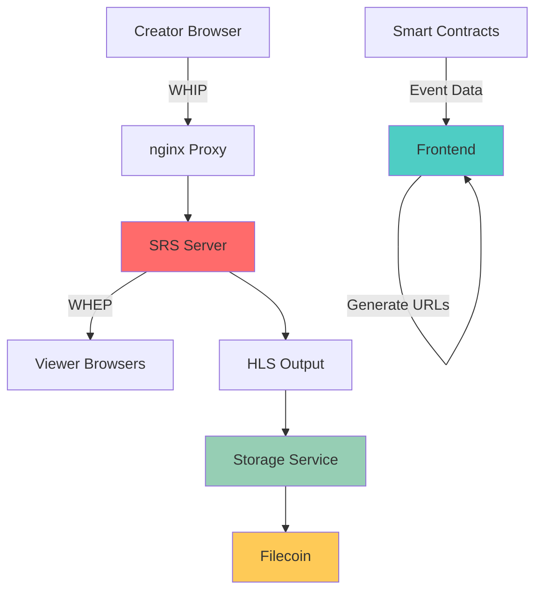
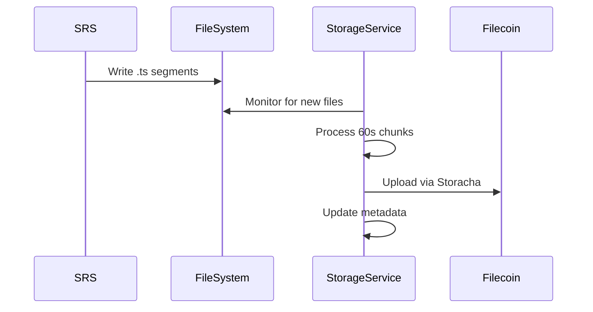

haus²⁵ uses Simple Realtime Server (SRS) as the core streaming infrastructure, providing WebRTC-based live streaming with sub-second latency for real-time audience interaction.

The architecture eliminates traditional backend dependencies by generating streaming URLs deterministically on the frontend.

## Architecture Overview

### Component Stack



### Protocol Flow

**Publishing (Creator)**:
1. Frontend generates WHIP URL from `eventId`
2. WebRTC connection established to SRS
3. Browser captures media stream
4. SRS distributes to subscribers

**Viewing (Audience)**:
1. Frontend generates WHEP URL from `eventId`
2. WebRTC connection established to SRS  
3. SRS delivers stream to browser
4. Real-time interaction enabled

## SRS Configuration

### Core Settings

**SRS Configuration**: Listen on port 1935, 1000 max connections, file logging with trace level. HTTP API on port 1985 with crossdomain enabled, HTTP server on 8080, RTC server on 8000 with candidate configuration.

### WebRTC Configuration

**WHIP/WHEP Support**: Default vhost with RTC enabled, RTMP-to-RTC bidirectional conversion, HTTP remux for FLV streaming, HLS output with 10-second fragments and 60-second window.

### API Endpoints

**Stream Monitoring**:
- `GET /api/v1/streams/` - List active streams
- `GET /api/v1/clients/` - Connected client information
- `POST /api/v1/clients/{id}` - Client management operations

**WebRTC Endpoints**:
- `POST /rtc/v1/whip/` - Publishing endpoint
- `POST /rtc/v1/whep/` - Subscription endpoint
- `OPTIONS /rtc/v1/*` - CORS preflight handling

## URL Generation Strategy

### Deterministic URLs

Frontend generates all streaming URLs using direct onchain scheduling, without backend coordination:

```typescript
function generateStreamUrls(eventId: string) {
  return {
    streamUrl: `rtmp://room.haus25.live:1935/live/${eventId}`,
    playUrl: `https://room.haus25.live:8080/live/${eventId}.flv`,
    whipUrl: `https://room.haus25.live/rtc/v1/whip/?app=live&stream=${eventId}`,
    whepUrl: `https://room.haus25.live/rtc/v1/whep/?app=live&stream=${eventId}`,
    roomUrl: `https://haus25.live/room/${eventId}`
  }
}
```

### Benefits of Deterministic Generation

- **No backend coordination** required for URL management
- **Immediate availability** after event creation
- **Persistent URLs** that work across restarts
- **Simplified debugging** with predictable endpoints
- **Reduced infrastructure** complexity and costs

### Performance Metrics

**Latency Tracking**:
- WebRTC typically achieves **sub-500ms** end-to-end latency
- SRS optimizations reduce buffering to **sub-100ms**
- Real-time interaction feels **instantaneous** for audiences

**Scalability**:
- Single SRS instance handles **100+ concurrent streams**
- nginx proxy distributes load across multiple SRS instances
- Filecoin storage removes local storage constraints

## HLS Output Integration

### Storage Service Integration

SRS outputs HLS segments that trigger the storage service:



### Chunk Processing

**Segment Aggregation**:
- SRS outputs **10-second** HLS segments
- Storage service combines **6 segments** into 60-second chunks
- FFmpeg processes and optimizes video quality
- Filecoin storage provides permanent preservation

## Security Considerations

### Access Control

**Stream Publishing**:
- Only event creators can publish to their `eventId` stream
- Frontend validates creator status before allowing publish attempts
- SRS configuration can add IP-based restrictions if needed

**Stream Viewing**:
- Ticket ownership verified before generating WHEP URLs
- Room-level access control prevents unauthorized viewing
- WebRTC encryption provides secure transmission

### Browser Optimization

**Connection Management**:
- Reuse WebRTC connections when possible
- Implement connection pooling for multiple events
- Graceful degradation for connection failures

**Bandwidth Adaptation**:
- Automatic quality adjustment based on connection speed
- Manual quality selection for user preference
- Fallback to lower bitrates during congestion

## Related Documentation

- [Storage](/infra/storage) - Video chunk processing and Filecoin integration
- [Room](/core/room) - User experience built on streaming infrastructure
- [Factory](/core/factory) - Event creation that generates streaming endpoints
