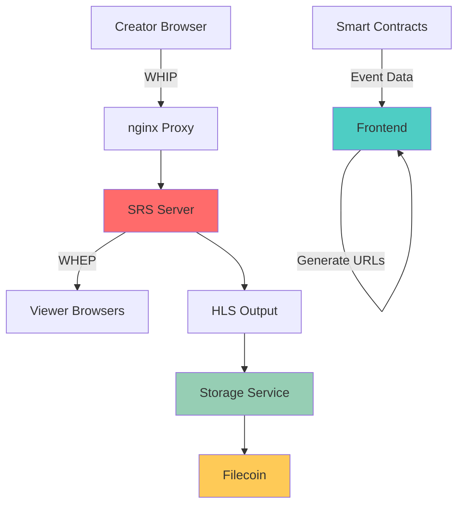
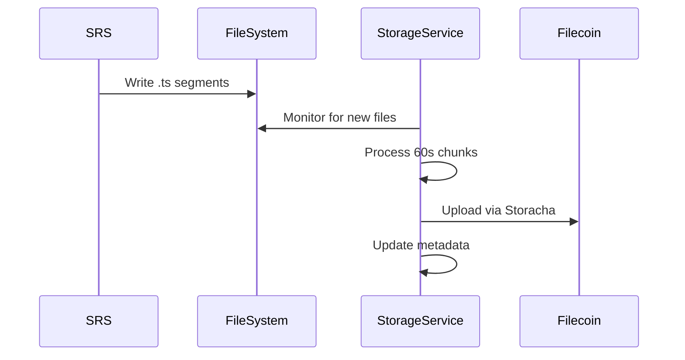

haus²⁵ uses Simple Realtime Server (SRS) as the core streaming infrastructure, providing WebRTC-based live streaming with sub-second latency for real-time audience interaction.

The architecture eliminates traditional backend dependencies by generating streaming URLs deterministically on the frontend.

## Architecture Overview

### Component Stack



### Protocol Flow

**Publishing (Creator)**:
1. Frontend generates WHIP URL from `eventId`
2. WebRTC connection established to SRS
3. Browser captures media stream
4. SRS distributes to subscribers

**Viewing (Audience)**:
1. Frontend generates WHEP URL from `eventId`
2. WebRTC connection established to SRS  
3. SRS delivers stream to browser
4. Real-time interaction enabled

## SRS Configuration

### Core Settings

**SRS Configuration**: Listen on port 1935, 1000 max connections, file logging with trace level. HTTP API on port 1985 with crossdomain enabled, HTTP server on 8080, RTC server on 8000 with candidate configuration.

### WebRTC Configuration

**WHIP/WHEP Support**: Default vhost with RTC enabled, RTMP-to-RTC bidirectional conversion, HTTP remux for FLV streaming, HLS output with 10-second fragments and 60-second window.

### API Endpoints

**Stream Monitoring**:
- `GET /api/v1/streams/` - List active streams
- `GET /api/v1/clients/` - Connected client information
- `POST /api/v1/clients/{id}` - Client management operations

**WebRTC Endpoints**:
- `POST /rtc/v1/whip/` - Publishing endpoint
- `POST /rtc/v1/whep/` - Subscription endpoint
- `OPTIONS /rtc/v1/*` - CORS preflight handling

## URL Generation Strategy

### Deterministic URLs

Frontend generates all streaming URLs without backend coordination:

```typescript
class StreamingService {
  generateStreamUrls(eventId: string): StreamSession {
    const sessionId = `event_${eventId}_${Date.now()}`
    
    return {
      // WebRTC publishing (creator)
      whipUrl: `https://room.haus25.live/rtc/v1/whip/?app=live&stream=${eventId}`,
      
      // WebRTC viewing (audience)  
      whepUrl: `https://room.haus25.live/rtc/v1/whep/?app=live&stream=${eventId}`,
      
      // Fallback RTMP (OBS/streaming software)
      streamUrl: `rtmp://room.haus25.live:1935/live/${eventId}`,
      
      // HTTP-FLV fallback viewing
      playUrl: `https://room.haus25.live:8080/live/${eventId}.flv`,
      
      sessionId
    }
  }
}
```

### Benefits of Deterministic Generation

- **No backend coordination** required for URL management
- **Immediate availability** after event creation
- **Persistent URLs** that work across restarts
- **Simplified debugging** with predictable endpoints
- **Reduced infrastructure** complexity and costs

## nginx Proxy Configuration

### Reverse Proxy Setup

```nginx
server {
    listen 443 ssl http2;
    server_name room.haus25.live;
    
    # WebRTC endpoints
    location /rtc/ {
        proxy_pass http://127.0.0.1:8000;
        proxy_http_version 1.1;
        proxy_set_header Upgrade $http_upgrade;
        proxy_set_header Connection "upgrade";
        proxy_set_header Host $host;
        proxy_set_header X-Real-IP $remote_addr;
    }
    
    # SRS API endpoints
    location /srs-api/ {
        proxy_pass http://127.0.0.1:1985/api/;
        proxy_set_header Host $host;
        add_header Access-Control-Allow-Origin *;
        add_header Access-Control-Allow-Methods "GET, POST, OPTIONS";
        add_header Access-Control-Allow-Headers "Content-Type";
    }
    
    # HLS streaming
    location /live/ {
        proxy_pass http://127.0.0.1:8080/live/;
        add_header Access-Control-Allow-Origin *;
    }
    
    # Event room redirects
    location ~ ^/(\d+)$ {
        return 302 https://haus25.live/room/$1;
    }
}
```

### SSL/TLS Configuration

WebRTC requires HTTPS for browser media access:

```nginx
ssl_certificate /etc/letsencrypt/live/room.haus25.live/fullchain.pem;
ssl_certificate_key /etc/letsencrypt/live/room.haus25.live/privkey.pem;
ssl_protocols TLSv1.2 TLSv1.3;
ssl_ciphers ECDHE-RSA-AES128-GCM-SHA256:ECDHE-RSA-AES256-GCM-SHA384;
```

## WebRTC Implementation

### Publisher Setup (Creator)

```typescript
async function startPublishing(eventId: string, constraints: MediaStreamConstraints) {
  // 1. Get user media
  const stream = await navigator.mediaDevices.getUserMedia(constraints)
  
  // 2. Create peer connection
  const pc = new RTCPeerConnection({
    iceServers: [{ urls: 'stun:stun.l.google.com:19302' }]
  })
  
  // 3. Add tracks to connection
  stream.getTracks().forEach(track => {
    pc.addTrack(track, stream)
  })
  
  // 4. Create offer
  const offer = await pc.createOffer()
  await pc.setLocalDescription(offer)
  
  // 5. Send to WHIP endpoint
  const response = await fetch(generateStreamUrls(eventId).whipUrl, {
    method: 'POST',
    headers: { 'Content-Type': 'application/sdp' },
    body: offer.sdp
  })
  
  // 6. Set remote description
  const answer = await response.text()
  await pc.setRemoteDescription({ type: 'answer', sdp: answer })
  
  return { sessionId: `event_${eventId}`, stream, pc }
}
```

### Subscriber Setup (Viewer)

```typescript
async function startPlaying(eventId: string, videoElement: HTMLVideoElement) {
  // 1. Create peer connection
  const pc = new RTCPeerConnection({
    iceServers: [{ urls: 'stun:stun.l.google.com:19302' }]
  })
  
  // 2. Set up track handling
  pc.ontrack = (event) => {
    videoElement.srcObject = event.streams[0]
  }
  
  // 3. Create offer for WHEP
  pc.addTransceiver('video', { direction: 'recvonly' })
  pc.addTransceiver('audio', { direction: 'recvonly' })
  
  const offer = await pc.createOffer()
  await pc.setLocalDescription(offer)
  
  // 4. Send to WHEP endpoint
  const response = await fetch(generateStreamUrls(eventId).whepUrl, {
    method: 'POST', 
    headers: { 'Content-Type': 'application/sdp' },
    body: offer.sdp
  })
  
  // 5. Set remote description
  const answer = await response.text()
  await pc.setRemoteDescription({ type: 'answer', sdp: answer })
  
  return { sessionId: `event_${eventId}`, pc }
}
```

## Monitoring and Analytics

### Stream Health Monitoring

```typescript
async function getViewerCount(eventId: string): Promise<number> {
  try {
    const response = await fetch('https://room.haus25.live/srs-api/v1/streams')
    const data = await response.json()
    
    const stream = data.streams?.find((s: any) => 
      s.app === 'live' && s.stream === eventId
    )
    
    return stream?.clients || 0
  } catch {
    return 0
  }
}

async function checkStreamStatus(eventId: string) {
  const connectionState = peerConnection?.connectionState || 'closed'
  const viewerCount = await getViewerCount(eventId)
  
  return {
    isLive: connectionState === 'connected',
    viewerCount,
    connectionHealth: connectionState
  }
}
```

### Performance Metrics

**Latency Tracking**:
- WebRTC typically achieves **sub-500ms** end-to-end latency
- SRS optimizations reduce buffering to **sub-100ms**
- Real-time interaction feels **instantaneous** for audiences

**Scalability**:
- Single SRS instance handles **100+ concurrent streams**
- nginx proxy distributes load across multiple SRS instances
- Filecoin storage removes local storage constraints

## HLS Output Integration

### Storage Service Integration

SRS outputs HLS segments that trigger the storage service:



### Chunk Processing

**Segment Aggregation**:
- SRS outputs **10-second** HLS segments
- Storage service combines **6 segments** into 60-second chunks
- FFmpeg processes and optimizes video quality
- Filecoin storage provides permanent preservation

## Security Considerations

### Access Control

**Stream Publishing**:
- Only event creators can publish to their `eventId` stream
- Frontend validates creator status before allowing publish attempts
- SRS configuration can add IP-based restrictions if needed

**Stream Viewing**:
- Ticket ownership verified before generating WHEP URLs
- Room-level access control prevents unauthorized viewing
- WebRTC encryption provides secure transmission

### Network Security

**CORS Configuration**:
```nginx
add_header Access-Control-Allow-Origin "https://haus25.live";
add_header Access-Control-Allow-Methods "GET, POST, OPTIONS";
add_header Access-Control-Allow-Headers "Content-Type, Authorization";
```

**Rate Limiting**:
```nginx
limit_req_zone $binary_remote_addr zone=api:10m rate=10r/s;
limit_req zone=api burst=20 nodelay;
```

## Performance Optimization

### SRS Tuning

**Memory Management**:
```nginx
# Optimize for concurrent connections
worker_connections 10000;
mr_enabled off;  # Disable memory reduction for performance
```

**Network Optimization**:
```nginx
# TCP optimizations
tcp_nodelay on;
tcp_nopush on;
sendfile on;
```

### Browser Optimization

**Connection Management**:
- Reuse WebRTC connections when possible
- Implement connection pooling for multiple events
- Graceful degradation for connection failures

**Bandwidth Adaptation**:
- Automatic quality adjustment based on connection speed
- Manual quality selection for user preference
- Fallback to lower bitrates during congestion

## Deployment Architecture

### Container Setup

```dockerfile
# SRS container configuration
FROM ossrs/srs:5.0.89

COPY srs.conf /usr/local/srs/conf/
EXPOSE 1935 8080 1985 8000/udp

CMD ["./objs/srs", "-c", "conf/srs.conf"]
```

### Orchestration

```yaml
# docker-compose.yml
version: '3.8'
services:
  srs:
    image: ossrs/srs:5.0.89
    ports:
      - "1935:1935"
      - "8080:8080"
      - "1985:1985"
      - "8000:8000/udp"
    volumes:
      - ./srs.conf:/usr/local/srs/conf/srs.conf
      - ./hls-output:/usr/local/srs/objs/nginx/html
    restart: unless-stopped
```

## Troubleshooting

### Common Issues

**WebRTC Connection Failures**:
- Check HTTPS requirements for media access
- Verify STUN/TURN server accessibility
- Confirm firewall settings for UDP traffic

**Stream Quality Issues**:
- Monitor CPU usage on SRS server
- Check network bandwidth availability
- Verify browser WebRTC codec support

**CORS Problems**:
- Ensure proper nginx header configuration
- Verify origin whitelist includes frontend domain
- Check for preflight request handling

### Debugging Tools

**SRS API Monitoring**:
```bash
# Check active streams
curl https://room.haus25.live/srs-api/v1/streams/

# Monitor specific stream
curl https://room.haus25.live/srs-api/v1/streams/ | jq '.streams[] | select(.stream=="123")'
```

**WebRTC Debugging**:
- Use `chrome://webrtc-internals/` for connection analysis
- Monitor browser console for WebRTC errors
- Check ICE candidate exchange success

## Related Documentation

- [Storage](/infra/storage) - Video chunk processing and Filecoin integration
- [Room](/core/room) - User experience built on streaming infrastructure
- [Factory](/core/factory) - Event creation that generates streaming endpoints
