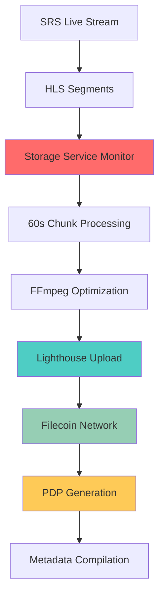

The Lighthouse Storage monitors live streams and automatically uploads video content to permanent decentralized storage, ensuring performances are preserved forever without relying on centralized platforms.

Built on Lighthouse, it processes video streams into 60-second chunks and provides verifiable Proof of Data Possession (PDP) receipts.

## Architecture Overview

### Storage Pipeline



### Component Integration

**Real-time Processing**:
- **HLS Monitor**: Watches SRS output directory using `chokidar`
- **Video Processor**: Combines segments into optimized chunks
- **Upload Service**: Handles Lighthouse communication and retry logic
- **Metadata Service**: Compiles manifests and creates IPFS backups

## Service Architecture

### Core Components

**StorageService**: Initializes HLSMonitor, VideoProcessor, Lighthouse, and MetadataService. startLivestreamStorage method configures monitoring and processing pipeline for specified eventId and creator with storage space preparation.

### HLS Monitoring

**File System Watching**: HLSMonitor class with chokidar watcher on event-specific hlsPath, processes .ts segments, buffers 6 segments (60 seconds) before triggering chunk creation via videoProcessor.

## Video Processing Pipeline

### Chunk Creation

**FFmpeg Integration**:
```typescript
class VideoProcessor {
  async createChunk(eventId: string, segments: string[]) {
    const chunkId = `${eventId}_chunk_${this.chunkCount++}`
    const outputPath = `./chunks/${chunkId}.mp4`
    
    // Create segment list file for FFmpeg
    const segmentList = segments.join('\n')
    await fs.writeFile(`./tmp/${chunkId}_segments.txt`, segmentList)
    
    // FFmpeg command for optimization
    const ffmpegArgs = [
      '-f', 'concat',
      '-safe', '0',
      '-i', `./tmp/${chunkId}_segments.txt`,
      '-c:v', 'libx264',
      '-preset', 'fast',
      '-crf', '26',
      '-c:a', 'aac',
      '-b:a', '128k',
      '-movflags', 'faststart',
      outputPath
    ]
    
    await this.runFFmpeg(ffmpegArgs)
    await this.uploadChunk(chunkId, outputPath)
  }
}
```

### Quality Optimization

**Encoding Presets**:
```typescript
const qualityPresets = {
  high: {
    bitrate: '2000k',
    crf: 23,
    preset: 'medium'
  },
  medium: {
    bitrate: '1000k', 
    crf: 26,
    preset: 'fast'
  },
  low: {
    bitrate: '500k',
    crf: 30,
    preset: 'faster'
  }
}
```

**Adaptive Processing**:
- **CPU usage monitoring** to adjust encoding presets
- **File size optimization** for efficient storage costs
- **Format standardization** for consistent playback
- **Metadata preservation** during transcoding

## Metadata Management

### Chunk Metadata Structure

```typescript
interface ChunkMetadata {
  chunkId: string
  cid: string
  size: number
  filcdnUrl: string
  backupUrls: string[]
  duration: number
  chunkIndex: number
  timestamp: number
  pdpVerified: boolean
  dealCount: number
  uploadReceipt: any
}
```

## API Interface

### Storage Control Endpoints

**Start Monitoring**:
```http
POST /api/livestream/start
Content-Type: application/json

{
  "eventId": "123",
  "creator": "0x...",
  "startTime": 1640995200000,
  "resolution": "1920x1080",
  "bitrate": "2000k"
}
```

**Status Monitoring**:
```http
GET /api/livestream/123/status

Response:
{
  "eventId": "123",
  "status": "active",
  "totalChunks": 3,
  "uploadedChunks": 3,
  "uploadProgress": 100,
  "totalSizeMB": 150,
  "duration": 180,
  "chunks": [...],
  "playbackUrls": {...}
}
```

**Stop Processing**:
```http
POST /api/livestream/stop
Content-Type: application/json

{
  "eventId": "123"
}
```

### Real-time Status Updates

```typescript
// Polling service for active events
class PollingService {
  startPolling() {
    this.interval = setInterval(async () => {
      const { activeEvents } = lighthouseService.getState()
      
      for (const [eventId, eventStatus] of activeEvents.entries()) {
        if (eventStatus.status === 'active') {
          await this.updateEventStatus(eventId)
        }
      }
    }, 10000) // Poll every 10 seconds
  }
}
```

## Performance Considerations

### Scalability Metrics

**Processing Capacity**:
- **Single instance**: Handles 10-15 concurrent streams
- **CPU utilization**: ~70% during peak encoding
- **Memory usage**: ~2GB for video buffer management
- **Disk I/O**: Sequential writes optimized for SSD

**Network Optimization**:
- **Upload batching**: Multiple chunks uploaded in parallel
- **Retry logic**: Exponential backoff for failed uploads
- **Bandwidth management**: Adaptive upload speeds based on available bandwidth

### Cost Optimization

**Storage Efficiency**:
- **Compression ratios**: 60-70% size reduction through optimization
- **Deduplication**: Identical chunks stored once across events
- **Lifecycle management**: Automatic cleanup of temporary files

**Filecoin Economics**:
- **Storage costs**: ~$0.10 per GB per year
- **Retrieval costs**: Minimal for CDN-cached content
- **Deal optimization**: Batch uploads for better pricing

**Stream Interruption**:
- **Graceful handling** of mid-stream disconnections
- **Partial chunk processing** for incomplete segments
- **Recovery mechanisms** for resumed streams
- **Manual intervention** tools for edge cases


### Monitoring Dashboard

**Key Metrics**:
- **Active streams** being processed
- **Upload queue** length and processing time
- **Storage usage** and available capacity
- **Error rates** and retry statistics
- **Network bandwidth** utilization

## Related Documentation

- [SRS](/infra/srs) - Streaming infrastructure that feeds the storage service
- [Room](/core/room) - How stored content integrates with live experiences
- [Compression](/infra/compression) - Video optimization techniques used in processing
