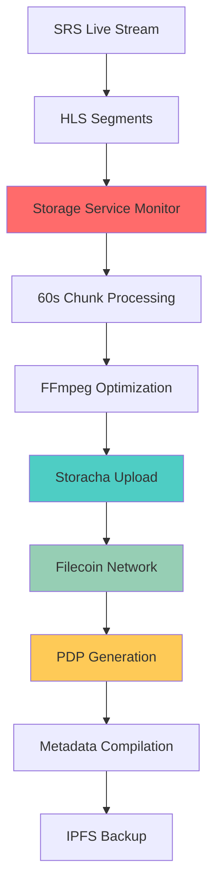

The Filecoin Storage Service monitors live streams and automatically uploads video content to permanent decentralized storage, ensuring performances are preserved forever without relying on centralized platforms.

Built on Storacha (formerly web3.storage), it processes video streams into 60-second chunks and provides verifiable Proof of Data Possession (PDP) receipts.

## Architecture Overview

### Storage Pipeline



### Component Integration

**Real-time Processing**:
- **HLS Monitor**: Watches SRS output directory using `chokidar`
- **Video Processor**: Combines segments into optimized chunks
- **Upload Service**: Handles Storacha communication and retry logic
- **Metadata Service**: Compiles manifests and creates IPFS backups

## Service Architecture

### Core Components

**StorageService**: Initializes HLSMonitor, VideoProcessor, StorachaClient, and MetadataService. startLivestreamStorage method configures monitoring and processing pipeline for specified eventId and creator with storage space preparation.

### HLS Monitoring

**File System Watching**: HLSMonitor class with chokidar watcher on event-specific hlsPath, processes .ts segments, buffers 6 segments (60 seconds) before triggering chunk creation via videoProcessor.

## Video Processing Pipeline

### Chunk Creation

**FFmpeg Integration**:
```typescript
class VideoProcessor {
  async createChunk(eventId: string, segments: string[]) {
    const chunkId = `${eventId}_chunk_${this.chunkCount++}`
    const outputPath = `./chunks/${chunkId}.mp4`
    
    // Create segment list file for FFmpeg
    const segmentList = segments.join('\n')
    await fs.writeFile(`./tmp/${chunkId}_segments.txt`, segmentList)
    
    // FFmpeg command for optimization
    const ffmpegArgs = [
      '-f', 'concat',
      '-safe', '0',
      '-i', `./tmp/${chunkId}_segments.txt`,
      '-c:v', 'libx264',
      '-preset', 'fast',
      '-crf', '26',
      '-c:a', 'aac',
      '-b:a', '128k',
      '-movflags', 'faststart',
      outputPath
    ]
    
    await this.runFFmpeg(ffmpegArgs)
    await this.uploadChunk(chunkId, outputPath)
  }
}
```

### Quality Optimization

**Encoding Presets**:
```typescript
const qualityPresets = {
  high: {
    bitrate: '2000k',
    crf: 23,
    preset: 'medium'
  },
  medium: {
    bitrate: '1000k', 
    crf: 26,
    preset: 'fast'
  },
  low: {
    bitrate: '500k',
    crf: 30,
    preset: 'faster'
  }
}
```

**Adaptive Processing**:
- **CPU usage monitoring** to adjust encoding presets
- **File size optimization** for efficient storage costs
- **Format standardization** for consistent playback
- **Metadata preservation** during transcoding

## Storacha Integration

### Client Configuration

```typescript
class StorachaClient {
  async initialize() {
    // Initialize w3up client with email authentication
    this.client = await Client.create()
    
    // Login with configured email
    await this.client.login(process.env.STORACHA_EMAIL)
    
    // Set working space
    await this.client.setCurrentSpace(process.env.BUCKET_KEY)
    
    console.log('Storacha client initialized successfully')
  }
  
  async uploadChunk(chunkId: string, filePath: string) {
    try {
      // Read file for upload
      const file = fs.readFileSync(filePath)
      
      // Upload to Storacha with metadata
      const cid = await this.client.uploadFile(file, {
        name: `${chunkId}.mp4`,
        metadata: {
          eventId: this.extractEventId(chunkId),
          chunkIndex: this.extractChunkIndex(chunkId),
          duration: 60,
          uploadTime: Date.now()
        }
      })
      
      // Generate CDN URLs
      const filcdnUrl = `https://w3s.link/ipfs/${cid}`
      const backupUrls = [
        `https://${cid}.ipfs.w3s.link`,
        `https://ipfs.io/ipfs/${cid}`
      ]
      
      return { cid, filcdnUrl, backupUrls }
    } catch (error) {
      console.error('Upload failed:', error)
      throw error
    }
  }
}
```

### Proof of Data Possession

**Automatic PDP Generation**:
```typescript
async function generatePDPReceipt(cid: string) {
  // Storacha automatically generates PDP receipts
  const receipts = await client.getReceipts(cid)
  
  return {
    storageReceipt: receipts.storage,
    shardInfo: receipts.shards,
    dealCount: receipts.deals?.length || 0,
    pdpVerified: receipts.storage?.status === 'verified'
  }
}
```

## Metadata Management

### Chunk Metadata Structure

```typescript
interface ChunkMetadata {
  chunkId: string
  cid: string
  size: number
  filcdnUrl: string
  backupUrls: string[]
  duration: number
  chunkIndex: number
  timestamp: number
  pdpVerified: boolean
  dealCount: number
  uploadReceipt: any
}
```

### Event Compilation

**Manifest Creation**:
```typescript
class MetadataService {
  async compileEventMetadata(eventId: string) {
    const chunks = this.getEventChunks(eventId)
    
    const manifest = {
      eventId,
      totalChunks: chunks.length,
      totalDuration: chunks.length * 60,
      totalSize: chunks.reduce((sum, chunk) => sum + chunk.size, 0),
      createdAt: Date.now(),
      chunks: chunks.map(chunk => ({
        chunkId: chunk.chunkId,
        cid: chunk.cid,
        url: chunk.filcdnUrl,
        backupUrls: chunk.backupUrls,
        duration: chunk.duration,
        pdpVerified: chunk.pdpVerified
      })),
      playbackUrls: {
        chunks: chunks.map(chunk => chunk.filcdnUrl),
        manifestUrl: `https://haus.mypinata.cloud/ipfs/${this.manifestCid}`
      }
    }
    
    // Backup to Pinata IPFS
    await this.backupToPinata(manifest)
    
    return manifest
  }
}
```

## API Interface

### Storage Control Endpoints

**Start Monitoring**:
```http
POST /api/livestream/start
Content-Type: application/json

{
  "eventId": "123",
  "creator": "0x...",
  "startTime": 1640995200000,
  "resolution": "1920x1080",
  "bitrate": "2000k"
}
```

**Status Monitoring**:
```http
GET /api/livestream/123/status

Response:
{
  "eventId": "123",
  "status": "active",
  "totalChunks": 3,
  "uploadedChunks": 3,
  "uploadProgress": 100,
  "totalSizeMB": 150,
  "duration": 180,
  "chunks": [...],
  "playbackUrls": {...}
}
```

**Stop Processing**:
```http
POST /api/livestream/stop
Content-Type: application/json

{
  "eventId": "123"
}
```

## Integration with Frontend

### Lighthouse Service Hook

```typescript
// Frontend service integration
const lighthouseService = useLighthouseService()

// Start storage when creator begins streaming
async function startLivestream(eventId: string, creator: string) {
  const storageStarted = await lighthouseService.startLivestreamStorage(
    eventId, 
    creator
  )
  
  if (storageStarted) {
    console.log('Video storage started successfully')
    startPolling() // Begin status updates
  }
}

// Monitor upload progress
async function pollStorageStatus(eventId: string) {
  const status = await lighthouseService.getEventStorageStatus(eventId)
  
  if (status) {
    updateUI({
      chunksUploaded: status.uploadedChunks,
      totalSize: status.totalSizeMB,
      progress: status.uploadProgress
    })
  }
}
```

### Real-time Status Updates

```typescript
// Polling service for active events
class PollingService {
  startPolling() {
    this.interval = setInterval(async () => {
      const { activeEvents } = lighthouseService.getState()
      
      for (const [eventId, eventStatus] of activeEvents.entries()) {
        if (eventStatus.status === 'active') {
          await this.updateEventStatus(eventId)
        }
      }
    }, 10000) // Poll every 10 seconds
  }
}
```

## Performance Considerations

### Scalability Metrics

**Processing Capacity**:
- **Single instance**: Handles 10-15 concurrent streams
- **CPU utilization**: ~70% during peak encoding
- **Memory usage**: ~2GB for video buffer management
- **Disk I/O**: Sequential writes optimized for SSD

**Network Optimization**:
- **Upload batching**: Multiple chunks uploaded in parallel
- **Retry logic**: Exponential backoff for failed uploads
- **Bandwidth management**: Adaptive upload speeds based on available bandwidth

### Cost Optimization

**Storage Efficiency**:
- **Compression ratios**: 60-70% size reduction through optimization
- **Deduplication**: Identical chunks stored once across events
- **Lifecycle management**: Automatic cleanup of temporary files

**Filecoin Economics**:
- **Storage costs**: ~$0.10 per GB per year
- **Retrieval costs**: Minimal for CDN-cached content
- **Deal optimization**: Batch uploads for better pricing

## Error Handling & Recovery

### Failure Scenarios

**Upload Failures**:
```typescript
async function uploadWithRetry(chunk: ChunkData, maxRetries = 3) {
  for (let attempt = 1; attempt <= maxRetries; attempt++) {
    try {
      return await this.storageClient.uploadChunk(chunk)
    } catch (error) {
      if (attempt === maxRetries) throw error
      
      const delay = Math.pow(2, attempt) * 1000 // Exponential backoff
      await new Promise(resolve => setTimeout(resolve, delay))
    }
  }
}
```

**Stream Interruption**:
- **Graceful handling** of mid-stream disconnections
- **Partial chunk processing** for incomplete segments
- **Recovery mechanisms** for resumed streams
- **Manual intervention** tools for edge cases

### Monitoring & Alerting

**Health Checks**:
```typescript
async function checkStorageHealth() {
  return {
    storageClient: await this.storageClient.ping(),
    diskSpace: await this.checkDiskSpace(),
    activeUploads: this.getActiveUploadCount(),
    queueLength: this.getProcessingQueueLength()
  }
}
```

## Deployment & Operations

### Docker Configuration

```dockerfile
FROM node:18-alpine

RUN apk add --no-cache ffmpeg

WORKDIR /app
COPY package*.json ./
RUN npm ci --only=production

COPY . .

CMD ["node", "app.js"]
```

### Environment Configuration

```bash
# Core settings
PORT=3001
NODE_ENV=production

# Storacha configuration
STORACHA_EMAIL=storage@haus25.live
BUCKET_ALIAS=haus
BUCKET_KEY=did:key:...

# IPFS backup
PINATA_JWT=eyJhbGc...
PINATA_GATEWAY=haus.mypinata.cloud

# Processing paths
HLS_INPUT_PATH=/app/hls-input
CHUNK_OUTPUT_PATH=/app/chunks
TMP_PATH=/app/tmp
```

### Monitoring Dashboard

**Key Metrics**:
- **Active streams** being processed
- **Upload queue** length and processing time
- **Storage usage** and available capacity
- **Error rates** and retry statistics
- **Network bandwidth** utilization

## Related Documentation

- [SRS](/infra/srs) - Streaming infrastructure that feeds the storage service
- [Room](/core/room) - How stored content integrates with live experiences
- [Compression](/infra/compression) - Video optimization techniques used in processing
