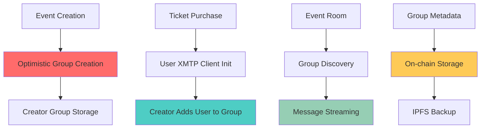

haus²⁵ integrates XMTP protocol to provide secure, decentralized chat functionality for event communities. Each event gets a dedicated group chat accessible only to ticket holders and creators.

The integration uses XMTP's browser SDK with optimistic group creation patterns to minimize blockchain interactions while maintaining security.

## Architecture Overview

### XMTP Integration Pattern



### Protocol Flow

**Group Lifecycle**:
1. **Creation**: Creator creates optimistic group at event minting
2. **Population**: Ticket purchases trigger member additions
3. **Activation**: Event start enables real-time messaging
4. **Persistence**: Group ID stored in event metadata for discovery

## XMTP Client Management

### Client Initialization

```typescript
class XMTPManager {
  private clients: Map<string, Client> = new Map()
  
  private async getClientForUser(
    walletClient: WalletClient, 
    userAddress: string
  ): Promise<Client> {
    const normalizedAddress = userAddress.toLowerCase()
    
    if (this.clients.has(normalizedAddress)) {
      return this.clients.get(normalizedAddress)!
    }
    
    // Create XMTP signer from wallet client
    const signer: Signer = {
      type: "EOA",
      getIdentifier: () => ({
        identifier: normalizedAddress,
        identifierKind: "Ethereum"
      }),
      signMessage: async (message: string) => {
        const signature = await walletClient.signMessage({
          account: userAddress as `0x${string}`,
          message
        })
        return this.hexToBytes(signature)
      }
    }
    
    // Build or create client with stable DB path
    const clientOptions = {
      env: "dev" as const,
      appVersion: "haus/1.0.0",
      dbPath: `xmtp-${normalizedAddress}`
    }
    
    let client: Client
    try {
      client = await Client.build(identifier, clientOptions)
    } catch {
      client = await Client.create(signer, clientOptions)
    }
    
    this.clients.set(normalizedAddress, client)
    return client
  }
}
```

### Database Management

**Persistent Storage**:
- Each user gets **dedicated database** (`xmtp-${userAddress}`)
- **No database conflicts** between different wallet connections
- **Stable client state** across browser sessions
- **Reduced worker spawning** with consistent DB paths

## Group Creation Pattern

### Optimistic Group Creation

**Creator Workflow** (at event creation):
```typescript
async function createEventGroup(
  eventId: string, 
  creatorWallet: WalletClient, 
  creatorAddress: string
) {
  const creatorClient = await this.getClientForUser(creatorWallet, creatorAddress)
  
  // Create optimistic group (local until first member added)
  const group = await creatorClient.conversations.newGroupOptimistic({
    name: `haus-event-${eventId}`,
    description: `Event #${eventId} Chat`
  })
  
  await group.updateConsentState(ConsentState.Allowed)
  
  // Store in creator's local storage
  CREATOR_GROUPS.set(eventId, group)
  
  // Persist group metadata for later discovery
  localStorage.setItem(`xmtp-creator-group-${eventId}`, JSON.stringify({
    eventId,
    groupId: group.id,
    creatorAddress,
    creatorInboxId: creatorClient.inboxId
  }))
  
  return { groupId: group.id }
}
```

### Member Addition Process

**Ticket Purchase Integration**:
```typescript
async function addParticipantToGroup(eventId: string, buyerAddress: string) {
  const meta = GROUP_METADATA.get(eventId)
  if (!meta?.creatorAddress) throw new Error('group_not_local')
  
  const creatorClient = this.clients.get(meta.creatorAddress.toLowerCase())
  if (!creatorClient) throw new Error('group_not_local')
  
  // Check if participant is reachable on XMTP
  const canMessageMap = await Client.canMessage([{
    identifier: buyerAddress,
    identifierKind: 'Ethereum'
  }])
  
  if (!canMessageMap.get(buyerAddress)) {
    console.warn('Participant not reachable on XMTP yet')
    return false // Retry later
  }
  
  // Resolve participant's inbox ID
  const inboxIdMap = await creatorClient.findInboxIdByIdentities([
    { identifier: buyerAddress, identifierKind: 'Ethereum' }
  ])
  
  const inboxId = inboxIdMap.get(buyerAddress)
  if (!inboxId) return false
  
  // Add member to group
  const group = await creatorClient.conversations.getConversationById(meta.groupId)
  await group.addMembers([inboxId])
  
  return true
}
```

## Group Discovery & Access

### Blockchain-Based Discovery

**Group ID Storage**:
Groups are discoverable through event metadata stored on-chain:

```typescript
async function getGroupIdFromChain(eventId: string): Promise<string> {
  // Get event metadata URI from EventFactory
  const eventData = await publicClient.readContract({
    address: CONTRACT_ADDRESSES.EVENT_FACTORY,
    abi: EVENT_FACTORY_ABI,
    functionName: 'getEvent',
    args: [BigInt(eventId)]
  })
  
  // Fetch metadata from IPFS
  const metadataUrl = eventData.metadataURI.replace(
    'ipfs://', 
    `https://${PINATA_GATEWAY}/ipfs/`
  )
  const response = await fetch(metadataUrl)
  const metadata = await response.json()
  
  return metadata.xmtpGroupId
}
```

### Room Integration

**Chat Initialization** in event rooms:
```typescript
async function joinEventGroup(
  eventId: string,
  wallet: WalletClient,
  address: string,
  onMessage: (message: any) => void
) {
  const client = await this.getClientForUser(wallet, address)
  const groupId = await this.getGroupIdFromChain(eventId)
  
  // Get conversation by ID
  const group = await client.conversations.getConversationById(groupId)
  if (!group) throw new Error('not_invited_yet')
  
  // Update consent and sync
  await group.updateConsentState(ConsentState.Allowed)
  await client.conversations.syncAll([ConsentState.Allowed])
  
  // Start message streaming
  const controller = await client.conversations.streamAllMessages({
    consentStates: [ConsentState.Allowed],
    onValue: (msg) => {
      if (msg.conversationId === groupId) {
        onMessage(msg)
      }
    }
  })
  
  return {
    group,
    stop: () => controller?.return?.()
  }
}
```

## Message Handling

### Real-time Messaging

**Send Messages**:
```typescript
async function sendMessage(
  eventId: string, 
  content: string, 
  userAddress: string
) {
  const client = this.clients.get(userAddress.toLowerCase())
  if (!client) throw new Error('User client not initialized')
  
  const groupId = await this.getGroupIdFromChain(eventId)
  const group = await client.conversations.getConversationById(groupId)
  
  await group.send(content)
}
```

**Message Streaming**:
```typescript
// Frontend integration
const { joinEventGroup } = XMTP

useEffect(() => {
  if (!userProfile?.address || !walletClient) return
  
  const initializeChat = async () => {
    try {
      const { group, stop } = await joinEventGroup(
        eventId,
        walletClient,
        userProfile.address,
        (message) => {
          setChatMessages(prev => [...prev, {
            id: message.id,
            content: message.content,
            sender: message.senderAddress,
            timestamp: message.sentAt
          }])
        }
      )
      
      // Store cleanup function
      return stop
    } catch (error) {
      console.error('Chat initialization failed:', error)
    }
  }
  
  initializeChat()
}, [eventId, userProfile, walletClient])
```

### Message History

**Loading Past Messages**:
```typescript
async function getMessages(
  eventId: string,
  userAddress: string,
  opts?: { limit?: number }
): Promise<any[]> {
  const client = this.clients.get(userAddress.toLowerCase())
  if (!client) return []
  
  const groupId = await this.getGroupIdFromChain(eventId)
  const group = await client.conversations.getConversationById(groupId)
  if (!group) return []
  
  // Sync before reading messages
  await group.sync()
  
  // Load messages with BigInt limit (XMTP requirement)
  const limit = BigInt(opts?.limit || 50)
  return await group.messages({ limit })
}
```

## Integration Points

### Ticket Purchase Flow

**Automatic Chat Access**:
```typescript
// In ticket purchase service
async function purchaseTicket(eventId: number, userAddress: string) {
  // 1. Purchase ticket on-chain
  const txHash = await ticketKiosk.purchaseTicket({ value: ticketPrice })
  await waitForTransaction(txHash)
  
  // 2. Initialize XMTP client for new participant
  await XMTP.initializeParticipantForEvent(walletClient, userAddress)
  
  // 3. Add participant to group (called from creator's context)
  // This happens via backend service or creator client
  await XMTP.addParticipantToGroup(eventId.toString(), userAddress)
  
  return { ticketId, txHash }
}
```

### Event Creation Flow

**Group Setup During Minting**:
```typescript
// In event creation service
async function createEvent(formData: EventFormData, userAddress: string) {
  // 1. Upload metadata and create event on-chain
  const { eventId, metadataURI } = await createEventOnChain(formData)
  
  // 2. Create XMTP group for community
  const { groupId } = await XMTP.createEventGroup(
    eventId.toString(),
    walletClient,
    userAddress
  )
  
  // 3. Update metadata with group ID and re-upload
  const updatedMetadata = {
    ...originalMetadata,
    xmtpGroupId: groupId
  }
  await updateEventMetadata(eventId, updatedMetadata)
  
  return { eventId, groupId }
}
```

## Security & Privacy

### Access Control

**Ticket-Based Permissions**:
- Only **ticket holders** can join group chats
- **Creator verification** before group creation
- **Real-time access revocation** for refunded tickets

**Message Privacy**:
- **End-to-end encryption** via XMTP protocol
- **Decentralized storage** prevents platform censorship
- **User-controlled data** with client-side key management

### Consent Management

**Explicit Consent Model**:
```typescript
// All groups require explicit consent
await group.updateConsentState(ConsentState.Allowed)

// Sync only allowed conversations
await client.conversations.syncAll([ConsentState.Allowed])

// Stream messages from consented groups only
const controller = await client.conversations.streamAllMessages({
  consentStates: [ConsentState.Allowed],
  onValue: handleMessage
})
```

## Performance Optimizations

### Client Lifecycle

**Connection Pooling**:
- **Single client per wallet** across all events
- **Persistent connections** avoid repeated initialization
- **Efficient memory usage** with shared client instances

**Database Optimization**:
- **Stable DB paths** prevent worker respawning
- **Incremental sync** reduces bandwidth usage
- **Local caching** for message history

### Scalability Considerations

**Group Size Limits**:
- **XMTP groups** handle hundreds of participants efficiently
- **Message throughput** scales with group size
- **Bandwidth optimization** through selective syncing

**Network Efficiency**:
- **Message batching** during high activity periods
- **Selective sync** for active conversations only
- **Lazy loading** for message history

## Error Handling

### Common Failure Scenarios

**User Not On XMTP**:
```typescript
// Graceful handling for users without XMTP
const canMessage = await Client.canMessage([userIdentifier])
if (!canMessage.get(userAddress)) {
  // Retry mechanism for later addition
  scheduleRetry(() => addParticipantToGroup(eventId, userAddress))
  return false
}
```

**Group Access Issues**:
```typescript
// Handle missing group invitations
try {
  const group = await client.conversations.getConversationById(groupId)
  if (!group) {
    throw new Error('not_invited_yet')
  }
} catch (error) {
  if (error.message === 'not_invited_yet') {
    showTicketPurchasePrompt()
  }
}
```

### Recovery Mechanisms

**Client Recovery**:
- **Automatic reconnection** for dropped connections
- **State recovery** from persistent storage
- **Fallback modes** for degraded functionality

## Related Documentation

- [Room](/core/room) - How chat integrates with live event experience
- [Factory](/core/factory) - Group creation during event minting
- [Kiosk](/core/kiosk) - Ticket purchase flow that grants chat access
