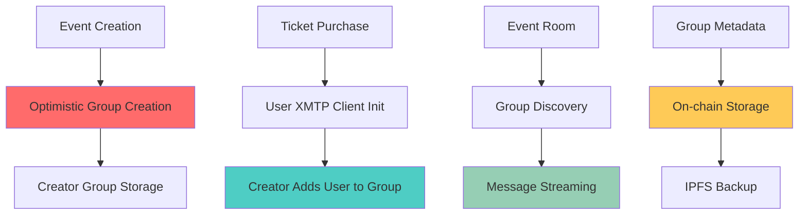

haus²⁵ integrates XMTP protocol to provide secure, decentralized chat functionality for event communities. Each event gets a dedicated group chat accessible only to ticket holders and creators.

The integration uses XMTP's browser SDK with optimistic group creation patterns to minimize blockchain interactions while maintaining security.

## Architecture Overview

### XMTP Integration Pattern



### Protocol Flow

**Group Lifecycle**:
1. **Creation**: Creator creates optimistic group at event minting
2. **Population**: Ticket purchases trigger member additions (_Optimistic Group Creation_)
3. **Activation**: Event start enables real-time messaging
4. **Persistence**: Group ID stored in event metadata for discovery

### Database Management

**Persistent Storage**:
- Each user gets **dedicated database** (`xmtp-${userAddress}`)
- **No database conflicts** between different wallet connections
- **Stable client state** across browser sessions
- **Reduced worker spawning** with consistent DB paths

## Security & Privacy

### Access Control

**Ticket-Based Permissions**:
- Only **ticket holders** can join group chats
- **Creator verification** before group creation
- **Real-time access revocation** for refunded tickets

**Message Privacy**:
- **End-to-end encryption** via XMTP protocol
- **Decentralized storage** prevents platform censorship
- **User-controlled data** with client-side key management

### Consent Management

**Explicit Consent Model**:
```typescript
// All groups require explicit consent
await group.updateConsentState(ConsentState.Allowed)

// Sync only allowed conversations
await client.conversations.syncAll([ConsentState.Allowed])

// Stream messages from consented groups only
const controller = await client.conversations.streamAllMessages({
  consentStates: [ConsentState.Allowed],
  onValue: handleMessage
})
```

## Performance Optimizations

### Client Lifecycle

**Connection Pooling**:
- **Single client per wallet** across all events
- **Persistent connections** avoid repeated initialization
- **Efficient memory usage** with shared client instances

**Database Optimization**:
- **Stable DB paths** prevent worker respawning
- **Incremental sync** reduces bandwidth usage
- **Local caching** for message history

### Recovery Mechanisms

**Client Recovery**:
- **Automatic reconnection** for dropped connections
- **State recovery** from persistent storage
- **Fallback modes** for degraded functionality

## Related Documentation

- [Room](/core/room) - How chat integrates with live event experience
- [Factory](/core/factory) - Group creation during event minting
- [Kiosk](/core/kiosk) - Ticket purchase flow that grants chat access
